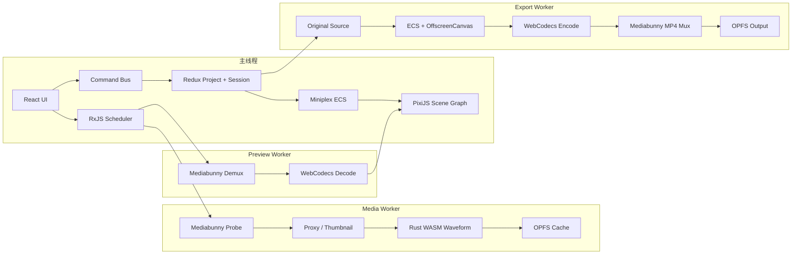

# Web 视频编辑器 Agent 指南

本文是项目的技术方案、架构边界和验证手册。修改代码前先确认所属层级，完成后按风险选择验证范围。

## 1. 项目目标

这是一个纯浏览器端音视频编辑学习 Demo，覆盖：

```text
本地视频导入
  -> 流式探测
  -> 540p 级代理、缩略图、关键帧、波形
  -> 时间线编辑、文字、变换、滤镜
  -> 低分辨率实时预览
  -> 重新读取原素材
  -> 高分辨率 H.264/AAC MP4 导出
```

核心原则：

- Project Document 是可序列化的唯一事实来源。
- 代理仅服务预览，最终导出必须读取原素材。
- UI 状态、媒体运行对象和二进制数据分层管理。
- 大文件按需读取，不转 Base64，不整体放入 Redux。
- 每个异步任务必须可取消、可追踪并有明确资源生命周期。
- 性能结论必须来自日志或测试，不写未经测量的固定倍数。

## 2. 固定工具链

| 工具       | 版本/选择                      |
| ---------- | ------------------------------ |
| Node       | `22.17.0`                      |
| pnpm       | `10.13.1`                      |
| Rust       | `1.92.0`                       |
| wasm-pack  | 本机验证版本 `0.15.0`          |
| UI         | React 19、TypeScript 6、Vite 8 |
| 文档       | VitePress 1.6                  |
| 单元测试   | Vitest 4                       |
| 浏览器测试 | Playwright 1.62、Chromium      |

安装和启动：

```bash
corepack enable
pnpm install --frozen-lockfile
pnpm build:wasm
pnpm dev:editor
pnpm dev:docs
```

- 编辑器：`http://localhost:5173`
- 文档站：`http://localhost:5174`
- 必须通过 HTTP 访问，`file://` 不具备 COOP/COEP 响应头。

## 3. 技术选型

| 层级         | 技术                | 职责                                |
| ------------ | ------------------- | ----------------------------------- |
| UI           | React               | 页面、面板、时间线和交互            |
| 工程状态     | Redux Toolkit       | Project Document、Editor Session    |
| 修改入口     | Command Bus         | 事务、Undo/Redo、不变量和 revision  |
| 响应式对照   | MobX                | 独立实验页，不写正式工程状态        |
| 异步调度     | RxJS                | Seek 取消、任务并发、背压和进度     |
| 媒体容器     | Mediabunny          | 按需读取、Demux、Mux、样本访问      |
| 编解码       | WebCodecs           | Video/Audio Decoder 和 Encoder      |
| 运行时       | Miniplex ECS        | 当前时间可见实体和 System 求值      |
| 合成         | PixiJS v8           | Scene Graph、文字、变换和滤镜       |
| 后台执行     | Module Web Worker   | 探测、代理、预览解码和导出          |
| 大文件缓存   | OPFS                | 代理、缓存和导出临时文件            |
| 小型持久化   | IndexedDB           | Project JSON                        |
| CPU 密集算法 | Rust + wasm-bindgen | 时间换算、PCM 波形和二进制摘要      |
| 可观察性     | 共享日志包          | UI、Console、Worker、WASM、CLI 日志 |

### 为什么不使用单一状态方案

- Redux 不保存 `File`、`VideoFrame`、Decoder、纹理等运行对象。
- ECS 不作为工程文件，否则迁移、Undo/Redo 和引用完整性会变复杂。
- RxJS 只表达异步流，不作为可查询的工程数据库。
- MobX 仅用于对照实验，避免与 Redux 形成双写。
- FFmpeg/WASM 不进入实时主路径；WebCodecs 可使用浏览器硬件编解码。

## 4. 总体架构



### 数据所有权

| 数据                                 | 所有者                 | 禁止事项                |
| ------------------------------------ | ---------------------- | ----------------------- |
| Project、Track、Clip、Text、Effect   | Redux + Command Bus    | 不包含浏览器运行对象    |
| 选择、缩放、面板和播放头 UI 状态     | Redux Session          | 不作为导出事实来源      |
| File、Blob、媒体句柄                 | Media Runtime/Worker   | 不放入 Redux            |
| ArrayBuffer、TypedArray、PCM、Packet | Worker/WASM            | 不转普通 JS Number 数组 |
| 代理和中间文件                       | OPFS                   | 不依赖内存长期持有      |
| VideoFrame、AudioData                | Preview/Export Runtime | 消费后必须 `close()`    |
| Pixi Sprite、Text、Texture           | Preview Runtime        | 不反向写入 Project      |
| Decoder、Encoder、Worker             | 各任务 Runtime         | 取消或结束后必须释放    |

Command Bus 和 Redux 必须同步。IndexedDB 恢复工程时，也必须同步 Command Bus 的当前文档，后续命令不能从旧状态继续执行。

## 5. 关键管线

### 5.1 导入

1. `MediaPanel` 提交 File、Blob 或测试素材 URL。
2. Import `BoundedTaskQueue` 控制并发和高水位。
3. Media Worker 使用 Mediabunny `BlobSource`、`UrlSource` 或 `CustomSource` 按需读取。
4. 选择主视频/音频轨，排除 `test_1`、`test_2` 的 MJPEG 封面轨。
5. 计算稳定素材指纹，只把 JSON 元数据写入 Project。
6. 首次导入竖屏素材时按 display size 初始化画布；后续素材不重置已有画布。

CLI：

```bash
pnpm media:probe -- test_assets/test_1.mp4
pnpm media:probe -- --json test_assets/test_1.mp4
```

### 5.2 代理和缓存

- 代理约束：最长边不超过 960，画面高度不超过 540，尺寸保持偶数。
- `test_1` 实际代理为 540×540。
- `test_3` 竖屏预览为 304×540，工程画布为 1080×1920。
- 同时生成封面、固定间隔缩略图、关键帧索引和 WASM 波形。
- 缓存键包含素材指纹和全部代理参数。
- OPFS 使用临时目录和最后提交的 manifest；取消后不能残留 `.tmp-*`。
- 进度按媒体时间节流，禁止逐帧或逐 PCM block 触发 React 更新。

### 5.3 Seek 和预览

```text
playhead/revision
  -> ECS 求值 assetId + sourceTime
  -> RxJS switchMap 取消旧 Seek
  -> Preview Worker Demux/Decode
  -> 校验 requestId/revision/generation
  -> PixiJS 呈现
  -> VideoFrame.close()
```

- System 固定顺序：timeline → animation → transform → video → effect → render。
- 预览 Worker 的应用解码队列有并发/HWM/背压指标。
- Mediabunny 内部 codec queue 不可见时必须明确显示 N/A，不能伪装为真实 `decodeQueueSize`。
- 快速 Seek 只允许最新结果呈现；过期帧必须关闭并计数。
- 预览滤镜包括 none、grayscale、vintage、adjustments。

### 5.4 音视频同步

- 有音频时使用 Web Audio clock 作为主时钟。
- 无音频时回退到单调 `performance` clock。
- Seek、暂停或 revision 变化会增加 generation，使旧音频缓冲失效。
- 视频按 timestamp 选择或丢弃，并记录 drift、drop 和 resync 原因。
- SharedArrayBuffer + Atomics 只用于时钟/环形缓冲实验；不满足 cross-origin isolation 时回退消息传递。

### 5.5 编辑

所有正式修改通过 Command：

- 添加、移动、裁剪、分割和删除 Clip
- 标题文本、字号、颜色、位置、缩放、旋转、起止时间
- 滤镜和参数
- 连续拖动合并为一个 Undo Transaction

Project Document 必须保持纯 JSON，并通过 Zod schema、引用完整性和非重叠约束。

### 5.6 导出

1. Export Worker 按输出 FPS 遍历工程时间。
2. 使用共享 ECS 语义求值片段、文字、变换和滤镜。
3. 始终重新读取 original source，不使用 proxy。
4. 使用 WebCodecs 编码 H.264/AAC。
5. 使用 Mediabunny 流式 Mux 为 MP4。
6. 写入 OPFS 临时输出，完成后提交并允许下载。

导出前必须调用 `VideoEncoder.isConfigSupported` 和 `AudioEncoder.isConfigSupported`。日志、UI 和结果均应能证明 `source=original`。

## 6. 目录职责

```text
apps/editor/
  src/store/          Redux、Command Bus、IndexedDB
  src/media/          导入与代理 UI、Media Worker
  src/preview/        预览面板与 Preview Worker
  src/audio/          A/V 同步调试
  src/timeline/       时间线交互
  src/inspector/      标题、变换、滤镜属性
  src/export/         Export Worker 和导出 UI
  src/logs/           日志面板
  src/mobx/           隔离的 MobX 实验
  e2e/                Chromium 端到端测试

apps/docs/            中文 VitePress 文档站
packages/domain/      Project schema、命令、迁移、序列化
packages/media-runtime/
                      Worker 协议、调度、探测、代理、缓存、同步
packages/media-wasm/  Rust crate、WASM 包装和 benchmark
packages/observability/
                      日志 schema、字典、序列化和 sinks
packages/preview-runtime/
                      ECS、Runtime Adapter、PixiJS renderer
scripts/              统一验证和文档源码生成
test_assets/          只读固定测试素材
```

## 7. 日志约定

统一日志字段按场景包含：

```text
timestamp level marker scope event requestId projectRevision
input output durationMs error
```

主要 marker：

```text
[CAPABILITY] [COMMAND] [IMPORT] [PROXY] [SEEK] [DEMUX]
[DECODE] [WASM] [ECS] [RENDER] [EXPORT]
```

规则：

- capability、Worker、WASM、CLI 都必须经过 `@web-video-editor/observability` schema。
- 错误使用序列化对象，不传 `error: null`。
- 大二进制只记录类型、长度、摘要和所有权，不打印原始内容。
- 同一请求使用相同 requestId 串联跨线程事件。
- 新事件必须先加入事件字典，并通过文档事件检查。

## 8. 固定测试素材

| 素材         | 主视频                | 音频            | 重点                           |
| ------------ | --------------------- | --------------- | ------------------------------ |
| `test_1.mp4` | H.264 720×720 30fps   | AAC 48kHz 2ch   | 快速回归、完整代理和导出       |
| `test_2.mp4` | H.264 1920×1080 30fps | AAC 44.1kHz 2ch | 约 911MB，流式读取、取消和缓存 |
| `test_3.mp4` | H.264 1080×1920 30fps | AAC 48kHz 2ch   | 竖屏画布和 contain/fit         |

`test_1`、`test_2` 包含 MJPEG 附加轨，测试必须确认未误选为主视频轨。

## 9. 测试分层

### 9.1 修改时的最小验证

```bash
pnpm format:check
pnpm lint
pnpm typecheck
pnpm test
```

Rust/WASM 改动额外执行：

```bash
pnpm verify:wasm
```

文档改动额外执行：

```bash
pnpm docs:check
pnpm --filter @web-video-editor/docs build
```

### 9.2 默认合入门禁

```bash
pnpm verify
```

`scripts/verify.mjs` 串行执行：

1. 文档结构、源码链接、日志事件、命令和 Mermaid 检查
2. Prettier
3. ESLint
4. TypeScript
5. Rust fmt
6. Rust clippy
7. Cargo tests
8. Chrome WASM tests
9. Vitest
10. WASM、编辑器和文档生产构建
11. 核心 Playwright

验证脚本动态分配 E2E 端口，不依赖 4173 空闲。成功标志：

```text
[VERIFY] ALL PASS <seconds>s
```

### 9.3 浏览器扩展验证

```bash
pnpm test:e2e:extended
```

重点用例：

| 文件                     | 验证内容                           |
| ------------------------ | ---------------------------------- |
| `capabilities.spec.ts`   | COOP/COEP、能力检测和禁用策略      |
| `proxy.spec.ts`          | 完整代理、缩略图、波形和缓存       |
| `preview.spec.ts`        | 真实代理帧、播放和 Seek            |
| `sync.spec.ts`           | 三素材 A/V 时钟、Seek 和缓冲失效   |
| `task10.spec.ts`         | 双素材编辑、标题、滤镜和 Undo/Redo |
| `task11.spec.ts`         | 原素材短工程导出、取消和重导入     |
| `task14-runtime.spec.ts` | 120 秒 Seek、背压和滤镜像素        |
| `task17.spec.ts`         | 冷代理、竖屏、逐帧和标题像素       |
| `task18-export.spec.ts`  | 双片段、变换、滤镜、音频导出       |

直接运行单个 E2E 时建议使用独立端口：

```bash
E2E_PORT=43173 pnpm exec playwright test apps/editor/e2e/task17.spec.ts --workers=1
```

涉及代理稳定性的测试应使用生产构建/preview 模式，避免 Vite HMR 在 WASM 产物更新时终止 Media Worker：

```bash
pnpm build
E2E_SERVER_MODE=preview E2E_PORT=43173 \
  pnpm exec playwright test apps/editor/e2e/task17.spec.ts --workers=1
```

### 9.4 911MB 手动性能测试

该测试不进入默认门禁：

```bash
pnpm test:e2e:test2
```

必须验证：

- 探测只读取文件的一小部分，`fullFileRead=false`。
- UI 持续输出读取进度。
- 取消代理后 OPFS 临时项为 0。
- 相同参数第二次命中缓存。
- 不把完整文件复制成单个 ArrayBuffer。

## 10. 资源和性能验收

不能只看 JS heap。至少同时检查：

1. `ResourceLifecycleTracker` 的 created/released/active/peak。
2. import、proxy、decode、export 队列的 active/queued/HWM/backpressure。
3. WebCodecs encoder 的真实 queue size 和峰值。
4. `performance.memory` 可用时的 usedJSHeapSize。
5. `navigator.storage.estimate()` 和 OPFS 使用量。
6. 取消后是否残留 `.tmp-*`。

两分钟播放或 Seek 压测结束后：

- VideoFrame、AudioData active 回到 0。
- decoder application queue 回到 0。
- 旧请求只增加 stale/dropped，不覆盖最新帧。
- Worker、codec、Blob URL 和音频节点全部释放。

## 11. 修改后的验证流程

1. 确定改动属于 Domain、Media、Preview、Export、UI、WASM 或 Docs。
2. 先运行所属包的定向测试。
3. 运行 `pnpm format:check && pnpm lint && pnpm typecheck`。
4. 涉及浏览器行为时运行对应 Playwright 文件，使用独立端口。
5. 涉及大文件时运行 `pnpm test:e2e:test2`，不要放入默认 CI。
6. 最后运行 `pnpm verify`。
7. 只有真实通过的检查才能标记完成；不要用静态占位或伪造媒体结果绕过测试。

## 12. 常见风险

- **恢复状态分叉**：Redux 更新后必须同步 Command Bus。
- **HMR 中断代理**：完整代理测试使用 production preview。
- **高频进度拖慢转码**：按媒体时间节流，禁止逐帧 React setState。
- **codec 能力差异**：导入、预览和导出按钮必须依据能力结果禁用并说明原因。
- **内部队列不可见**：明确标记 N/A，只报告真实可观测的应用队列。
- **Frame 泄漏**：所有成功、过期、取消和异常路径都要关闭帧。
- **代理误用于导出**：导出日志和测试必须断言 `source=original`。
- **文档漂移**：新增日志事件、命令或源码链接后运行 `pnpm docs:check`。
- **并行浏览器争抢硬件编码器**：重媒体 E2E 串行执行，使用 `--workers=1`。
