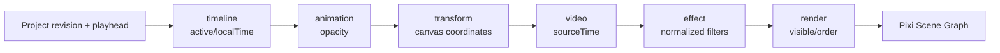

# ECS System 与 PixiJS Scene Graph

领域模型回答“工程里有什么”，ECS 回答“当前 revision、当前播放头要运行什么”。
`ProjectRuntimeAdapter` 把 Clip/Text 编译成 Miniplex Entity，并按固定顺序执行：



Project revision、quality profile 尺寸不变时复用 Entity；revision 变化时更新、创建或释放。
Scene Graph 只保留当前运行对象：一个视频 Sprite、可见 Text 节点和效果 Filter，不反向写
Project。预览 profile 最大 `960×540`；导出 profile 使用 Project exportSettings，但复用
同一 ECS 求值和效果归一化。

PixiJS v8 当前明确选择 `preference: "webgl"`。Worker 返回的 VideoFrame 先绘入主线程
frame canvas，再更新 Pixi Texture；消费后由 PreviewRuntime 的 `finally` 调用
`decoded.release()`，最终触发 `VideoFrame.close()`。

## 复现与预期输出

```bash
pnpm --filter @web-video-editor/editor build
pnpm test
```

导入 `test_1.mp4`，加标题和复古滤镜，拖动播放头进入标题范围：

```text
UI: Canvas data-preview-canvas="pixi-v8"，标题/滤镜随时间显示
UI: Preview 指标 Presented Frames 增长，Active Resources 回落
Console: [ECS] revision.rebuilt -> [ECS] evaluate -> [RENDER] present
CLI: editor build 与 runtime-adapter 单测通过
```

## 源码证据

- Entity 编译与 revision rebuild：[packages/preview-runtime/src/runtime-adapter.ts](/source/packages/preview-runtime/src/runtime-adapter.ts.txt)
- 六个 System 的固定顺序：[packages/preview-runtime/src/systems.ts](/source/packages/preview-runtime/src/systems.ts.txt)
- Pixi Scene Graph 与 Filter：[packages/preview-runtime/src/pixi-renderer.ts](/source/packages/preview-runtime/src/pixi-renderer.ts.txt)
- preview/export profile：[packages/preview-runtime/src/quality.ts](/source/packages/preview-runtime/src/quality.ts.txt)
- 生命周期闭环：[packages/preview-runtime/src/preview-runtime.ts](/source/packages/preview-runtime/src/preview-runtime.ts.txt)
