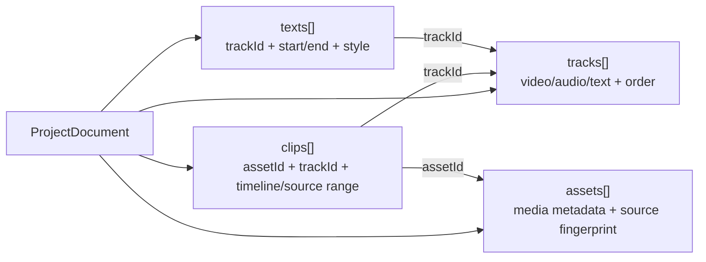
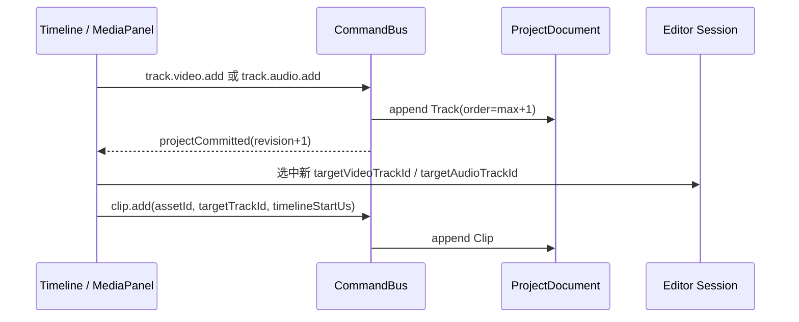
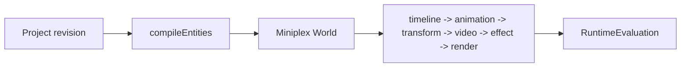
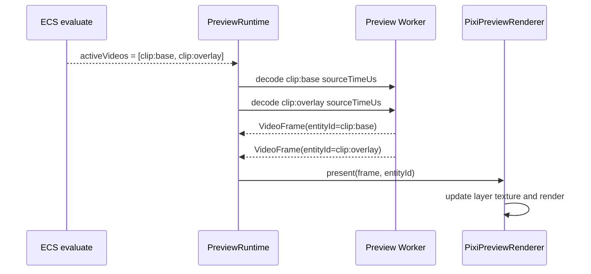
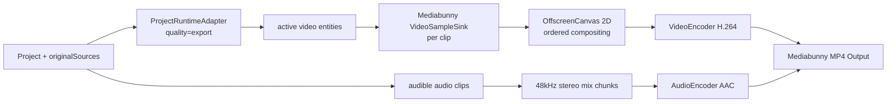

# 多轨道编辑的实现与原理

多轨道编辑不是“把时间线 UI 画成多行”这么简单。它真正改变的是工程模型到运行时的映射：
同一工程时间上可能同时存在多个视频层、多个音频片段和标题层，因此预览和导出都必须从
“选中一个片段”变成“求出当前时间所有 active entity，再按轨道语义处理”。

当前实现里，导入变化相对小：素材仍然只作为 `Asset` 进入 Project，并在运行时保存原始
`File/Blob/URL` 与 proxy/source fallback。多轨的主要增量发生在编辑状态、ECS 运行时、
预览解码调度和导出 worker。

## 数据模型

`ProjectDocument` 的 `tracks` 是有序数组，轨道只表达容器语义：

| 字段     | 作用                                   |
| -------- | -------------------------------------- |
| `id`     | Clip/Text 引用的稳定 ID                |
| `kind`   | `video`、`audio` 或 `text`             |
| `order`  | 时间线显示顺序，也是画面合成顺序       |
| `muted`  | 当前只参与音频播放和音频导出判断       |
| `locked` | 预留给轨道锁定，当前还不是完整编辑约束 |

媒体片段都存在 `clips` 中，通过 `trackId` 指向 video/audio 轨。标题单独存在 `texts` 中，
也通过 `trackId` 指向 text 轨。默认工程仍创建 `video-track`、`audio-track`、`text-track`，
旧单轨工程天然等价于 V1/A1/T1。

文字轨可以动态新增。新增后 UI 会把该轨设为当前目标文字轨，“添加标题”会在当前播放头向目标
文字轨写入新的 TextItem；同一文字轨内的文字时间段仍不能重叠，不同文字轨允许同一工程时间叠放。
TextItem 持久化的样式字段包括 `fontSize`、`color`、`strokeColor`、`strokeWidth`、
`backgroundColor`、`backgroundOpacity` 和 `fontFamily`。旧工程缺少描边、背景或字体字段时，
schema 默认值会补成无描边、无可见背景和默认字体栈。

`ProjectDocument.timeline` 保存工程级时间线配置。`durationUs` 是用户设置的总长，命令层会保证它
不短于最长 Clip/Text 末尾；预览和导出使用 `max(durationUs, 内容末尾)`，时间线 UI 显示边界再叠加
最小显示时长。`defaultScale.pixelsPerSecond` 是初始缩放密度，编辑器内缩放只影响像素和滚动宽度，
不写回 Clip/Text 的微秒时间。



不变量的关键点是“同轨不重叠，跨轨允许重叠”。校验会把 clips 按 `trackId` 分组，只在同一
媒体轨内部比较相邻片段边界；因此 V1 和 V2 可以在同一工程时间叠放，A1 和 A2 也可以在同一
工程时间混音。同一个素材也可以被重复添加到多个轨道或同一音频轨的不同时间段。

## 编辑入口

时间线按 `track.order` 排序渲染，再按类型显示为 V、A、T。新增视频轨和新增音频轨走正式
Command：`track.video.add` / `track.audio.add`。命令生成新的轨道 ID、名称和递增的
`order`，然后通过 Command Bus 提交，revision 仍然只由合法命令递增。



“添加到时间线”不会改变素材导入结构，只是多了目标轨选择：

1. 导入阶段产生 `Asset`、探测结果、原始 source、预览 source。
2. 添加阶段根据按钮语义选择 video 或 audio。
3. 根据当前 session 的目标轨决定 `trackId`。
4. `placement=playhead` 时落在当前播放头；`placement=append` 时只追加到当前目标轨尾。

拖动、裁剪和追加都只看当前 Clip 所在轨道或目标轨道的相邻片段，不会因为别的轨道上有重叠素材而
阻止移动。这是多轨剪辑的核心：横向时间约束局部化，纵向轨道叠加交给运行时和导出处理。
跨轨拖动只允许同类型轨道：视频到视频、音频到音频、文字到文字；目标轨道冲突时会夹紧到最近合法
位置，并用同一个 `transactionId` 合并为一个 Undo 步骤。

文字属性面板提供内容、开始/结束/持续时长、字号、颜色、描边、背景和字体编辑。字体先给出常用
CSS 字体栈预设；浏览器支持 `queryLocalFonts()` 且用户授权时可以追加系统字体，否则保留手动
字体名输入。预览和导出都只保存并消费最终 `fontFamily` 字符串，实际字体缺失时交给浏览器或
Canvas 字体栈降级。

轨道头支持拖拽重排。`track.reorder` 要求提交完整轨道 ID 列表，并把 order 归一化为 `0..N-1`。
删除空轨道直接执行；删除含 Clip/Text 的轨道需要确认并通过 `track.delete(cascade=true)` 级联删除
内容；最后一条同类型轨道会被拒绝。删除成功后 UI 会清空失效选区，并把目标视频/音频轨切换到仍
存在的首条同类型轨道。

## 运行时编译

预览运行时不会直接渲染 Project JSON。`ProjectRuntimeAdapter` 会在 revision 或质量档变化时
把 Project 编译为 Miniplex ECS entity：



视频 Clip 会生成 `kind: "video"` entity，包含：

- `timeline`：工程时间范围、局部时间和源入点。
- `video`：`assetId` 与当前请求的 `sourceTimeUs`。
- `transform`：位置、缩放、旋转，按 preview/export 质量档缩放。
- `effects`：滤镜定义和规范化后的效果。
- `render.order`：来自轨道 `order`。

标题生成 `kind: "text"` entity，也走同一套 timeline、transform、render order。音频 Clip
不进入 ECS 画面 entity；它们由音频播放器和导出混音路径单独消费。
adapter 只编译仍指向现存同类型轨道的 video/text 内容；删轨后的级联内容不会保留 entity，外部导入
造成的孤儿 track 引用也不会进入预览画面。
文字 entity 会携带字体、字号、文字颜色、描边颜色/宽度、背景色/透明度；Pixi 预览和导出
OffscreenCanvas 使用同一套 ECS 时间范围、轨道 order 和样式字段，因此 `[startUs, endUs)` 外
不会渲染该文字，范围内的预览与导出语义保持一致。

每次 seek/playback tick 时，系统按固定顺序运行：

| 系统        | 多轨相关职责                                               |
| ----------- | ---------------------------------------------------------- |
| `timeline`  | 判断每个 entity 当前是否 active                            |
| `animation` | 当前仅把 active 映射为 opacity 1，否则 0                   |
| `transform` | 约束视频缩放等渲染参数                                     |
| `video`     | 把工程时间转换成每层独立的 source time                     |
| `effect`    | 过滤 disabled effect 并规范化参数                          |
| `render`    | 取所有 active entity，按 `render.order` 排序后同步给渲染器 |

这意味着多视频轨不是特殊分支，而是同一时间点可能返回多个 active video entity。预览快照中的
`activeVideoLayers` 就来自这次 evaluation。

## 预览合成

预览画面拆成两层：视频层和文字层。每个 active video entity 对应一个独立的 Pixi sprite，
sprite 背后有一张 canvas/texture；Preview Worker 为每个 active video entity 解出该层需要的
`VideoFrame`，主线程按 `entityId` 写入对应 sprite 的 canvas，再触发 Pixi render。



音频播放不是 Pixi 的一部分。`PreviewRuntime.play()` 会收集所有未静音 audio track 上的 Clip，
传给 `MediabunnyAudioPlayback`。播放器按播放窗口解码多个音频片段，再以同一个 AudioContext
时间轴调度，因此重叠音频轨会同时发声。当前实现里，视频轨的 `muted` 不会让视频画面消失；
只有音频轨的 `muted` 会被预览播放和导出混音过滤。

## 导出调整

多轨对导出的影响最大，因为最终 MP4 仍只有一个视频轨和一个混音后的音频轨。导出 worker 需要
把多条编辑轨“烧录”为单路成片：



视频导出按目标帧率遍历工程时间。每一帧先用 `ProjectRuntimeAdapter({ quality: "export" })`
求 active entities，再为每个 active video entity 从原素材读取对应 `VideoSample`。
`composeFrame()` 先清背景，再按 `render.order` 逐层绘制视频和标题：低 order 先画，高 order
后画，所以 V2 覆盖 V1。每层独立应用 transform、opacity 和滤镜，编码后立即释放
`VideoFrame`/`VideoSample`。

音频导出不通过 ECS。worker 先找出所有未静音音频轨上的有效 Clip，按各自源区间解码
`AudioSample`，把源时间归一化到工程时间，再线性重采样到 48kHz 双声道 chunk。多个音频轨在
同一 chunk 中直接累加，写入 `AudioData` 前限幅到 `[-1, 1]`，最后编码为 AAC。

导出仍只允许原素材 source。proxy 是预览优化产物，不能作为最终导出的质量来源；缺少任一仍挂在
现存视频/音频轨道上的 Clip 原始 source 时，导出会直接失败并说明“代理文件禁止用于导出”。删除
轨道后的级联内容不会进入 source 收集、视频 sample 读取或音频混音。

## 导入为什么变化不大

导入阶段面对的是“媒体文件里有哪些流”，不是“工程里会放到哪几条编辑轨”。因此多轨不需要把
探测、proxy、缩略图或 waveform 改造成多实例：

- `Asset` 仍保存素材级元数据、主视频轨、主音频轨和被排除的视频轨。
- 运行时 source 仍按 `assetId` 注册一次，同一素材被多个 Clip 引用时复用同一个 source。
- proxy 仍是素材级缓存；V1/V2/A1/A2 只是不同 Clip 读取同一素材的不同源时间。
- 真正新增的是 `clip.add` 的目标轨选择，以及同一素材允许生成多个 Clip 引用。

除非后续要支持“导入一个文件里的多路摄像机轨、用户可选择容器内部音视频轨”，导入层才需要
扩展为多 source track 选择。当前多轨编辑的主要工作不在导入，而在 Project 不变量、预览调度、
音频调度和导出合成。

## 已验证行为

```bash
pnpm test
pnpm test:e2e:core
```

```text
Unit: 跨视频轨/音频轨允许重叠，同轨重叠被拒绝
Unit: Runtime evaluate 会返回所有 active video entity，并按轨道 order 排序
Unit: 播放只调度未静音音频轨，静音视频轨仍保留画面
E2E: 同一素材可添加到 V1/V2/A1/A2，预览 activeVideoLayers=2
E2E: 导出文件包含底层视频、上层 transformed 视频、标题和 AAC 混音
Console: [ECS] evaluate -> [RENDER] present -> [EXPORT] started/progress/completed
```

## 后续扩展点

1. 轨道锁定：需要让 Timeline 拖动、裁剪、删除和 Command 校验都识别 `locked`。
2. 视频轨静音/隐藏：需要明确 `muted` 是否同时承担画面隐藏，或新增 `visible` 字段。
3. 轨道级效果：建议挂在 Track 上，再在 ECS 编译期合并 Clip effect 和 Track effect。
4. 轨道锁定在 Command 层的强约束：当前 UI 尚未把 `locked` 扩展为完整编辑保护。
5. 容器内多路流选择：这才会显著改动导入，让 Asset 记录用户选择的视频/音频源轨。

## 源码证据

- Project schema：[packages/domain/src/schema.ts](/source/packages/domain/src/schema.ts.txt)
- 默认轨道：[packages/domain/src/project.ts](/source/packages/domain/src/project.ts.txt)
- Command 与新增轨道：[packages/domain/src/commands.ts](/source/packages/domain/src/commands.ts.txt)
- 同轨重叠校验：[packages/domain/src/validation.ts](/source/packages/domain/src/validation.ts.txt)
- 时间线目标轨与拖拽边界：[apps/editor/src/timeline/Timeline.tsx](/source/apps/editor/src/timeline/Timeline.tsx.txt)
- 追加和移动计算：[apps/editor/src/timeline/timelineMath.ts](/source/apps/editor/src/timeline/timelineMath.ts.txt)
- 导入 source 与目标轨选择：[apps/editor/src/App.tsx](/source/apps/editor/src/App.tsx.txt)
- ECS 编译与评估：[packages/preview-runtime/src/runtime-adapter.ts](/source/packages/preview-runtime/src/runtime-adapter.ts.txt)
- ECS 系统顺序：[packages/preview-runtime/src/systems.ts](/source/packages/preview-runtime/src/systems.ts.txt)
- Pixi 多视频层：[packages/preview-runtime/src/pixi-renderer.ts](/source/packages/preview-runtime/src/pixi-renderer.ts.txt)
- 音频播放调度：[packages/media-runtime/src/audio-playback.ts](/source/packages/media-runtime/src/audio-playback.ts.txt)
- 多轨导出合成与混音：[apps/editor/src/export/export-pipeline.ts](/source/apps/editor/src/export/export-pipeline.ts.txt)
- 预览多轨 E2E：[apps/editor/e2e/preview.spec.ts](/source/apps/editor/e2e/preview.spec.ts.txt)
- 导出多轨 E2E：[apps/editor/e2e/task18-export.spec.ts](/source/apps/editor/e2e/task18-export.spec.ts.txt)
- 文字轨预览与导出 E2E：[apps/editor/e2e/text-tracks.spec.ts](/source/apps/editor/e2e/text-tracks.spec.ts.txt)
