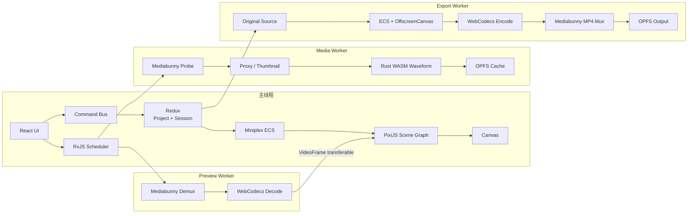
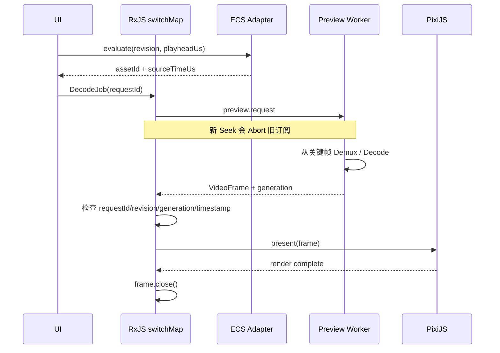

# 总体架构与线程图

## 所有权分层



Project Document 是纯 JSON 唯一事实来源；运行时对象按 revision 编译。代理和大文件属于
Worker/OPFS，`VideoFrame` 属于预览运行时，Pixi 节点属于主线程渲染器，最终文件属于
Export Worker 的 OPFS 目录。

## 一次 Seek 的线程时序



实际边界很重要：预览解码在 `preview.worker.ts`，但 PixiJS 和 Canvas 呈现在主线程；
导出则在 `export.worker.ts` 内用 `OffscreenCanvas` 合成。不能把“支持 OffscreenCanvas”
误写成“正式预览完全离开主线程”。

## 复现与预期输出

```bash
pnpm test:e2e:core
```

```text
UI: 快速连续 Seek 后 presentedPlayheadUs 等于最后一个输入
UI: Decode Queue 0，VideoFrame active 0
Console: 同一 preview-seek-* 可见 [ECS] evaluate、[DEMUX]、[DECODE]、[RENDER]
CLI: 1 passed（耗时随机器变化）
```

## 源码证据

- 主线程装配：[apps/editor/src/App.tsx](/source/apps/editor/src/App.tsx.txt)
- 预览运行时与 RxJS Seek：[packages/preview-runtime/src/preview-runtime.ts](/source/packages/preview-runtime/src/preview-runtime.ts.txt)
- 预览 Worker：[apps/editor/src/preview/preview.worker.ts](/source/apps/editor/src/preview/preview.worker.ts.txt)
- 导出 Worker：[apps/editor/src/export/export.worker.ts](/source/apps/editor/src/export/export.worker.ts.txt)
- 资源所有权计数：[packages/media-runtime/src/lifecycle.ts](/source/packages/media-runtime/src/lifecycle.ts.txt)
