# Project Document、Redux、Command 与 Undo/Redo

## 四层职责

1. `ProjectDocument` 保存 schemaVersion、revision、Asset、Track、Clip、Text、Canvas、Timeline 和导出设置。
2. Zod schema 负责形状，领域校验负责引用、边界、轨道 order、ID 唯一和同轨不重叠。
3. `CommandBus` 是正式工程唯一写入口，命令前后都校验，成功后 revision `+1`。
4. Redux 保存已提交的 Project 和短期 Editor Session；IndexedDB 只持久化序列化 JSON。

```mermaid
flowchart LR
  INPUT["UI edit"] --> COMMAND["ProjectCommand"]
  COMMAND --> CHECK1["validate before"]
  CHECK1 --> CLONE["structuredClone"]
  CLONE --> APPLY["apply command"]
  APPLY --> REV["revision + 1"]
  REV --> CHECK2["validate after"]
  CHECK2 --> HISTORY["transaction history"]
  HISTORY --> REDUX["projectCommitted"]
  REDUX --> IDB["250ms autosave JSON"]
```



连续拖动复用同一个 `transactionId`。`CommandBus` 保留第一次 `before` 和最后一次
`after`，因此数十次 pointer move 只产生一个 Undo 步骤。Undo/Redo 恢复历史快照，
不是执行猜测性的反命令。

## 多音视频轨道

`ProjectDocument.timeline.durationUs` 保存用户配置的工程总时长，预览和导出边界取
`max(timeline.durationUs, 内容末尾)`；命令层会阻止总时长小于最长内容末尾。时间线控件会额外保留
一个最小显示宽度，方便短工程操作，但这个 UI 下限不参与导出。`timeline.defaultScale.pixelsPerSecond`
是默认缩放密度，当前时间线缩放只改变像素换算和横向滚动，不改写 Clip/Text 的工程时间。

`ProjectDocument.tracks` 可以保存多个 `kind: "video"`、`kind: "audio"` 和 `kind: "text"` 轨道。
主编辑器分别维护当前目标视频轨道和当前目标音频轨道；点击“新增视频轨”或“新增音频轨”通过
`track.video.add` / `track.audio.add` 写入正式 Command，然后把后续“添加到时间线”生成的
Clip 放到对应目标轨道。时间线按 `track.order` 渲染 V1、A1、T1、V2/A2...，同一个素材可以
重复添加为多个视频或音频 Clip。`track.reorder` 必须提交完整轨道 ID 列表，并把 order 归一化为
`0..N-1`；预览和导出只看 order，不依赖数组位置或固定轨道 ID。

非重叠约束只在同一个媒体轨道内部生效。不同视频轨道或不同音频轨道上的 Clip 可以在同一工程
时间重叠，这是叠加画面与混合声音的正常编辑方式。拖动、裁剪、append 位置也只参考当前 Clip
所在轨道的相邻片段；跨轨拖动只允许视频到视频、音频到音频、文字到文字。目标轨道有时间冲突时，
UI 会把片段夹紧到最近合法位置并沿用同一个拖动事务，Undo/Redo 仍是一次连续操作。

添加素材默认使用当前播放头作为 `timelineStartUs`；“追加视频到目标轨尾”和“追加音频到目标轨尾”
只计算当前目标轨道的末尾，不会因为其他轨道上存在重叠片段而强制串联。删轨通过
`track.delete` 完成：空轨道可直接删除，含内容轨道需要 UI 确认后级联删除 Clip/Text，最后一条
同类型轨道会被命令层拒绝。删除后 Editor Session 会清空失效选区并把目标视频/音频轨 retarget 到
仍存在的首条同类型轨道，因此预览、音频播放和导出不会继续引用已删除轨道上的内容。旧工程中的
默认 `video-track`、`audio-track`、`text-track` 保持有效，分别作为 V1、A1、T1；没有新增轨道的
工程在行为上仍等价于旧单轨工程。

## 不进入 Redux 的对象

`File`、`Blob`、ArrayBuffer/TypedArray、VideoFrame、AudioData、codec、Worker、
Canvas、GPU/Pixi 对象均不进入 Project。Project 只保留素材指纹、轨 ID 和小型元数据；
刷新后若原始 File 不可恢复，导出入口会报告“缺少原素材 source”。

## 复现与预期输出

```bash
pnpm test
```

在 UI 导入素材并拖动片段，然后点一次 Undo：

```text
UI: REV 每次合法 Command 递增；Undo 恢复该事务前的 revision 快照
UI: Project JSON 可 JSON.stringify，且不出现 File/Blob/VideoFrame
Console: {"marker":"[COMMAND]","event":"execution.completed",
          "input":{"transactionId":"drag-..."},
          "output":{"beforeRevision":2,"afterRevision":3}}
CLI: Vitest 中 commands/document/store/persistence 用例通过
```

## 源码证据

- Project 默认值和三条轨：[packages/domain/src/project.ts](/source/packages/domain/src/project.ts.txt)
- schema 类型：[packages/domain/src/schema.ts](/source/packages/domain/src/schema.ts.txt)
- 引用与非重叠校验：[packages/domain/src/validation.ts](/source/packages/domain/src/validation.ts.txt)
- 命令实现：[packages/domain/src/commands.ts](/source/packages/domain/src/commands.ts.txt)
- 事务、Undo/Redo：[packages/domain/src/command-bus.ts](/source/packages/domain/src/command-bus.ts.txt)
- Redux 适配：[apps/editor/src/store/commandController.ts](/source/apps/editor/src/store/commandController.ts.txt)
- IndexedDB 自动保存：[apps/editor/src/store/persistence.ts](/source/apps/editor/src/store/persistence.ts.txt)
- 拖动事务 ID：[apps/editor/src/timeline/Timeline.tsx](/source/apps/editor/src/timeline/Timeline.tsx.txt)
