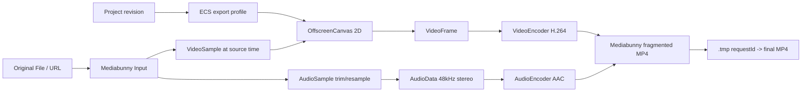

# 原素材高质量导出

导出入口只接收 `originalSources`。每个时间线 Asset 缺少原始 File/Blob/URL 时立即失败，
错误明确写“代理文件禁止用于导出”；OPFS proxy 不会作为回退源。



视频按 export frameRate 遍历工程时间，ECS 找到当前 Clip/Title/Effect，原素材 sample 在
OffscreenCanvas 合成；每个 VideoFrame 编码后立即 close。音频按 Clip 源区间裁剪，线性
重采样到 48kHz 双声道，时间戳归一到工程时间。codec 队列高水位为 8。

成功后先 finalize Mux，再把临时文件复制为 `export-<requestId>.mp4` 并删除 `.tmp-`。
取消会 cancel Output、关闭 codec/Input、删除临时和未完成 final；下载 URL 在替换或组件
卸载时 revoke。

## 真实自动化证据

核心 E2E 构造 1 秒工程并断言：1920×1080、30 帧、`source=original`、输出大于 10KB；
30 个 VideoFrame 全部释放，AudioData active 为 0，音视频队列 peak 不超过 8，导出文件
可由 `<video>` 再解码且 OPFS 无 `.tmp-`。

扩展 E2E 还验证取消后重启、2 秒/60 帧、标题亮像素、复古滤镜红蓝差、AAC 音频和重新导入。
这些是断言，不是固定导出耗时。

## 复现与预期输出

```bash
pnpm test:e2e:core
```

```text
UI: source=original；stage capability -> video -> audio -> mux -> completed
UI: 30/30 帧、VF/AD 0/0、下载 MP4
Console: [EXPORT] started/progress/completed，input.source=original
CLI: task12-core 1 passed；输出文件可重新读取为 1920×1080、约 1 秒
```

## 源码证据

- Export Worker 注册：[apps/editor/src/export/export.worker.ts](/source/apps/editor/src/export/export.worker.ts.txt)
- 原素材、ECS、WebCodecs、Mux：[apps/editor/src/export/export-pipeline.ts](/source/apps/editor/src/export/export-pipeline.ts.txt)
- UI 能力/进度/取消：[apps/editor/src/export/ExportPanel.tsx](/source/apps/editor/src/export/ExportPanel.tsx.txt)
- OPFS 文件读取/临时枚举：[apps/editor/src/export/export-opfs.ts](/source/apps/editor/src/export/export-opfs.ts.txt)
- 核心证据：[apps/editor/e2e/task12-core.spec.ts](/source/apps/editor/e2e/task12-core.spec.ts.txt)
- 取消、画面、重导入证据：[apps/editor/e2e/task11.spec.ts](/source/apps/editor/e2e/task11.spec.ts.txt)
