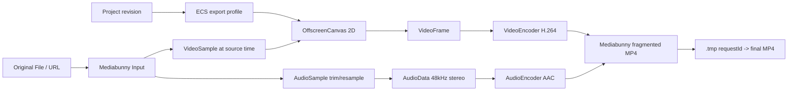

# 原素材高质量导出

导出入口只接收 `originalSources`。每个时间线 Asset 缺少原始 File/Blob/URL 时立即失败，
错误明确写“代理文件禁止用于导出”；OPFS proxy 不会作为回退源。



导出总时长使用工程语义总长：`max(Project.timeline.durationUs, 内容末尾)`。时间线 UI 的最小显示
时长只用于让短工程可操作，不参与导出帧数、时间戳或音频混音计算；缩放也只影响编辑器像素密度和
横向滚动。

视频按 export frameRate 遍历工程时间，ECS 找到当前所有 active video Clip、Title 和 Effect。
Export Worker 为每个 active video entity 从原素材读取对应 `VideoSample`，再按
`activeEntities` 的 render order 在 OffscreenCanvas 上合成；order 小的轨道先画，order 大的
轨道后画，因此 V2 会叠在 V1 之上。render order 来自 Track `order`，不会使用数组位置或固定轨道
ID 推断叠放层级。每个视频层独立应用自己的位置、缩放、旋转、滤镜和 opacity；每个 VideoFrame
编码后立即 close。

文字也由同一次 ECS export profile 求值决定是否 active。导出只在 TextItem 的 `[startUs, endUs)`
范围内绘制文字，并使用 `fontFamily`、`fontSize`、`color`、`strokeColor`、`strokeWidth`、
`backgroundColor` 和 `backgroundOpacity`。字体名称按 Canvas 字体栈解析；本机字体枚举只是编辑器
选择能力，导出不会依赖浏览器必须暴露系统字体列表。文字背景先按透明度绘制到文字包围盒后方，再画
描边和文字填充，这与 PixiJS 预览使用同一 Project Document 语义。

音频按所有仍挂在现存、未静音音频轨上的 Clip 的源区间裁剪，线性重采样到 48kHz 双声道后按工程
时间写入固定编码 chunk。不同音频轨可以在同一时间重叠，样本会加和混合并在写入 `AudioData` 前
限幅到 `[-1, 1]`；静音音频轨、不含音频的素材、以及已删除轨道遗留的 Clip 不会进入混音。
codec 队列高水位为 8。

导出仍只允许原素材 source。proxy 是预览优化产物，不能作为最终导出的质量来源；仍被现存视频/音频
轨道引用的任一 Clip 缺少原始 source 时，导出会直接失败并说明“代理文件禁止用于导出”。删除轨道
后的级联内容不会再参与 source 收集、视频 sample 读取或音频混音。

成功后先 finalize Mux，再把临时文件复制为 `export-<requestId>.mp4` 并删除 `.tmp-`。
取消会 cancel Output、关闭 codec/Input、删除临时和未完成 final；下载 URL 在替换或组件
卸载时 revoke。

## 真实自动化证据

核心 E2E 构造 1 秒工程并断言：1920×1080、30 帧、`source=original`、输出大于 10KB；
30 个 VideoFrame 全部释放，AudioData active 为 0，音视频队列 peak 不超过 8，导出文件
可由 `<video>` 再解码且 OPFS 无 `.tmp-`。

扩展 E2E 还验证取消后重启、2 秒/60 帧、标题亮像素、复古滤镜红蓝差、AAC 音频和重新导入。
Task 18 导出用例构造 V1/V2 重叠视频轨道，并通过关键帧像素对比证明同一帧同时包含底层画面、
上层 transformed 画面和标题；同时构造 A1/A2 重叠音频轨道，使用偏移的 A2 尾部约束导出时长
和音频 packet 末端时间，证明多轨混音结果进入 MP4。用例还断言 `[EXPORT] started/completed`
worker 日志的输入仍为 `source=original`。
文字轨 E2E 额外构造 T1/T2 重叠标题，导出后重新用 `<video>` 解码 MP4，在文字范围内检查文字填充、
描边和背景颜色像素，在范围前后检查这些文字特征消失。
这些是断言，不是固定导出耗时。

## 复现与预期输出

```bash
pnpm test:e2e:core
```

```text
UI: source=original；stage capability -> video -> audio -> mux -> completed
UI: 30/30 帧、VF/AD 0/0、下载 MP4
Console: [EXPORT] started/progress/completed，input.source=original
CLI: task12-core 1 passed；输出文件可重新读取为 1920×1080、约 1 秒
```

## 源码证据

- Export Worker 注册：[apps/editor/src/export/export.worker.ts](/source/apps/editor/src/export/export.worker.ts.txt)
- 原素材、ECS、WebCodecs、Mux：[apps/editor/src/export/export-pipeline.ts](/source/apps/editor/src/export/export-pipeline.ts.txt)
- UI 能力/进度/取消：[apps/editor/src/export/ExportPanel.tsx](/source/apps/editor/src/export/ExportPanel.tsx.txt)
- OPFS 文件读取/临时枚举：[apps/editor/src/export/export-opfs.ts](/source/apps/editor/src/export/export-opfs.ts.txt)
- 核心证据：[apps/editor/e2e/task12-core.spec.ts](/source/apps/editor/e2e/task12-core.spec.ts.txt)
- 取消、画面、重导入证据：[apps/editor/e2e/task11.spec.ts](/source/apps/editor/e2e/task11.spec.ts.txt)
- 文字轨导出证据：[apps/editor/e2e/text-tracks.spec.ts](/source/apps/editor/e2e/text-tracks.spec.ts.txt)
