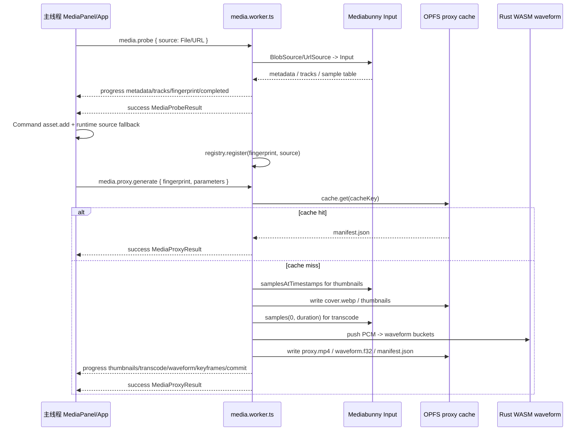
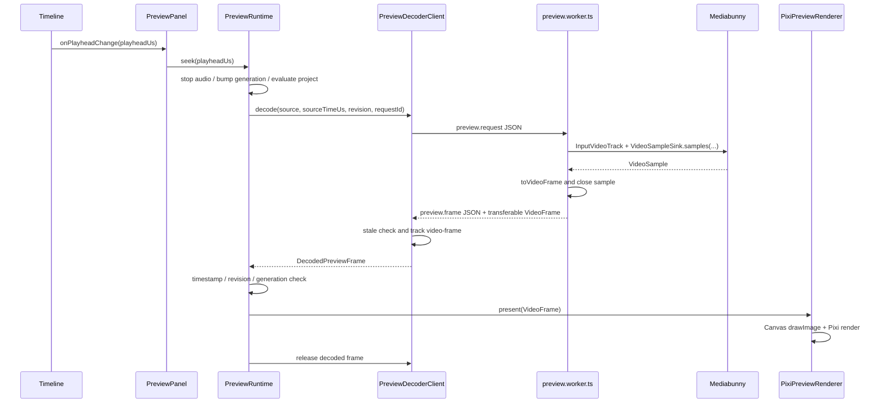

# Mediabunny 与 WebCodecs 数据流学习笔记

这篇文章解释项目中为什么同时使用 Mediabunny 和 WebCodecs，以及 MP4、buffer、sample、
`VideoFrame`、`AudioData`、encoded packet、OPFS（Origin Private File System）manifest
在每一层的输入输出形态。

OPFS 是浏览器给当前站点 origin 隔离出来的一块私有文件系统。它更像“浏览器托管的目录和文件”，
不是 KV 存储器：代码通过 `navigator.storage.getDirectory()` 拿到根目录，再创建目录、写
`proxy.mp4`、`manifest.json`、`waveform.f32`、缩略图等文件。它也不是一个单独的 2GB `Blob`；
容量由浏览器 storage quota 管理，数据不能被普通操作系统路径直接访问。

核心结论：

- **Mediabunny 负责容器层**：读取 MP4/File/Blob/URL/OPFS，解析轨道、时间戳、关键帧、sample table，并按时间吐出视频/音频 sample；输出阶段也负责把 encoded packet mux 回 MP4。
- **WebCodecs 负责 codec 层**：把压缩视频/音频交给浏览器原生硬件优先解码，得到 `VideoFrame` / `AudioData`；导出时把 `VideoFrame` / `AudioData` 编码成 `EncodedVideoChunk` / `EncodedAudioChunk`。
- **PixiJS / Canvas 负责渲染合成层**：接收 `VideoFrame` 或 Mediabunny `VideoSample`，和文字、滤镜、变换一起画到画布。
- **线程由项目决定，不是库自动决定**：Mediabunny 本身是 JS 库，运行在调用它的上下文里。本项目把 probe/proxy/preview decode/export 放到 Worker；预览呈现仍在主线程 PixiJS，导出合成才在 Worker `OffscreenCanvas`。
- **Mediabunny 支持按需读取，但不是所有阶段都只读少量字节**：probe 和 seek 可以利用 `BlobSource` / `UrlSource` 按需读；proxy 生成和导出需要遍历有效时长，会持续读取、解码和编码。

```mermaid
flowchart LR
  MP4["MP4 / File / URL / OPFS"] --> SOURCE["Mediabunny Source<br/>BlobSource / UrlSource / CustomSource"]
  SOURCE --> INPUT["Mediabunny Input<br/>container metadata / tracks"]
  INPUT --> DEMUX["Demux<br/>VideoSample / AudioSample"]
  DEMUX --> DECODE["WebCodecs Decode<br/>via sample API"]
  DECODE --> FRAME["VideoFrame / AudioData"]
  FRAME --> RENDER["PixiJS / OffscreenCanvas"]
  RENDER --> ENCODE["WebCodecs Encode<br/>EncodedChunk"]
  ENCODE --> PACKET["Mediabunny EncodedPacket"]
  PACKET --> MUX["Mediabunny Output<br/>MP4 mux"]
  MUX --> OPFS["OPFS File"]
```



## 0. 先澄清三个边界

### VideoFrame 是统一对象，不是统一内存格式

`VideoFrame` 是 WebCodecs 定义的浏览器原生对象。支持 WebCodecs 的浏览器都认识这个接口：

```ts
type VideoFrameShape = {
  displayWidth: number;
  displayHeight: number;
  timestamp: number;
  duration: number | null;
  format: VideoPixelFormat | null;
  colorSpace: VideoColorSpace;
  copyTo(
    destination: BufferSource,
    options?: VideoFrameCopyToOptions,
  ): Promise<PlaneLayout[]>;
  close(): void;
};
```

但统一的是 API 语义，不是底层像素内存。一个 `VideoFrame` 背后可能是 `NV12`、`I420`、
`RGBA`，也可能是浏览器或硬件解码器持有的资源。项目可以把它交给 Canvas/PixiJS 渲染，也可以
通过 `copyTo()` 显式复制成 buffer；预览路径为了减少复制，直接 transfer `VideoFrame`。

### Mediabunny 做容器和 sample 重活，不是 JS H.264 解码器

Mediabunny 在项目里的重活是：

- 识别 MP4 容器、track、duration、codec 参数和 sample table。
- 按时间从容器里取 `VideoSample` / `AudioSample`。
- 记录或产出 keyframe 信息。
- 把 WebCodecs encoder 输出的 encoded packet mux 回 MP4。
- 适配 `BlobSource`、`UrlSource`、OPFS file 和输出 stream。

真正的 H.264/AAC 解码和编码仍然主要交给浏览器 WebCodecs 或浏览器媒体栈。比如预览里
`sample.toVideoFrame()` 返回的是 WebCodecs `VideoFrame`；导出里项目直接创建 `VideoEncoder`。

### OffscreenCanvas 只在导出和 proxy 图片生成路径里后台使用

本项目要分清两条路径：

```text
预览:
preview.worker 解码 -> transfer VideoFrame -> 主线程 PixiPreviewRenderer -> document canvas

导出:
export.worker -> OffscreenCanvas 2D 合成 -> new VideoFrame(canvas) -> VideoEncoder -> MP4
```

所以“OffscreenCanvas 在 Worker 里做完再交给主线程”不是当前预览实现。当前预览 Worker 只负责
取样和解码，主线程负责 PixiJS 呈现；导出 Worker 才在后台用 `OffscreenCanvas` 合成并直接编码，
不会把每帧交给主线程显示。

## 1. MP4 容器输入

MP4 不是一组图片。它是一个容器，内部包含多个 box、轨道和 sample 表。项目不直接手写
MP4 parser，而是把容器读取交给 Mediabunny。

### 输入：浏览器素材源

项目统一用 `BrowserMediaSource` 描述用户选择的文件、固定测试素材或 URL。

```ts
type BrowserMediaSource =
  | {
      kind: "blob" | "file";
      blob: Blob;
      name: string;
      lastModified?: number;
    }
  | {
      kind: "test-asset" | "url";
      name: string;
      url: string;
    };
```

样例：

```json
{
  "kind": "test-asset",
  "name": "test_2.mp4",
  "url": "/test_assets/test_2.mp4"
}
```

### Mediabunny Source 适配

| 输入来源         | 项目适配器                                | 用途                                        |
| ---------------- | ----------------------------------------- | ------------------------------------------- |
| 本地 File / Blob | `BlobSource`                              | 用户手动选择素材                            |
| 测试资源 / URL   | `UrlSource`                               | `/test_assets/*.mp4`，支持按需 Range 读取   |
| Node CLI         | `CustomSource`                            | `pnpm media:probe` 在 Node 环境按需读取文件 |
| OPFS proxy       | `BlobSource(await getOpfsProxyFile(...))` | 预览 Worker 读取已生成的代理 MP4            |

Mediabunny `Input` 的形态：

```ts
const input = new Input({
  formats: ALL_FORMATS,
  source: new UrlSource("/test_assets/test_2.mp4", {
    maxCacheSize: 16 * 1024 * 1024,
    parallelism: 2,
  }),
});
```

### 是否流式读取大文件

可以把 Mediabunny 的读取理解为**按需随机读取**，不是先把完整 MP4 全部读进内存。项目给
Source 配了 cache 上限：

```ts
new BlobSource(fileOrBlob, { maxCacheSize: 8 * 1024 * 1024 });

new UrlSource(url, {
  maxCacheSize: 8 * 1024 * 1024,
  parallelism: 2,
});
```

预览 Worker 读取 OPFS proxy 时 cache 更大一些：

```ts
new BlobSource(await getOpfsProxyFile(cacheKey, "proxy.mp4"), {
  maxCacheSize: 16 * 1024 * 1024,
});
```

这带来三个结论：

- **probe 阶段通常只读元数据、track 和必要索引**。如果 MP4 的 `moov`、sample table、
  codec description 等信息能快速定位，就不会把 900MB 文件完整读完。
- **seek 阶段会按目标时间附近的 sample 范围读取**。有 proxy keyframe manifest 时，从目标时间
  前最近关键帧开始；没有 manifest 时，本项目对原素材 fallback 使用 2 秒 lookback。
- **proxy 生成和导出不是少量读取**。proxy 要生成缩略图、低分 MP4、keyframes、waveform；
  导出要按工程时间线逐帧读原素材并编码，都会持续遍历有效时长。

本地文件和线上文件的区别：

| 来源                | Source                                    | 读取方式                                      | 关键限制                                                                    |
| ------------------- | ----------------------------------------- | --------------------------------------------- | --------------------------------------------------------------------------- |
| 本地 File / Blob    | `BlobSource`                              | 浏览器对 `Blob.slice()` / File 做本地随机读取 | 无 HTTP Range；受本地文件句柄和浏览器内存/cache 策略影响                    |
| 测试资源 / 线上 URL | `UrlSource`                               | HTTP 按需请求，项目设置 `parallelism: 2`      | 需要服务器支持 Range、CORS、正确 MIME/响应头；网络延迟会直接影响 probe/seek |
| OPFS proxy          | `BlobSource(await getOpfsProxyFile(...))` | 从浏览器 Origin 私有文件系统读取已生成 proxy  | 依赖 proxy 已 commit；适合预览 seek，分辨率和码率低于原素材                 |

因此“线上文件”和“本地文件”在上层都是 `BrowserMediaSource`，但 I/O 成本不同。线上 URL 真正高效
依赖 Range 请求；本地 File 没有网络往返，但仍然不会自动把整个文件塞进 Redux 或主线程状态。

### 输出：素材探测结果

`Input` 解析 MP4 后输出可序列化元数据，写入 UI 和 Project Document。

```ts
type MediaProbeResult = {
  version: 1;
  audioTracks: AudioTrackMetadata[];
  container: {
    format: string;
    mimeType: string;
  };
  durationSec: number;
  excludedVideoTracks: ExcludedVideoTrack[];
  fingerprint: string;
  primaryAudioTrackId: number | null;
  primaryVideoTrackId: number;
  read: MediaReadMetrics;
  source: {
    kind: "blob" | "file" | "test-asset" | "url" | "path";
    lastModified?: number;
    name: string;
    size: number;
  };
  videoTracks: VideoTrackMetadata[];
};
```

样例：

```json
{
  "version": 1,
  "container": {
    "format": "MPEG-4",
    "mimeType": "video/mp4"
  },
  "durationSec": 62.4,
  "fingerprint": "sha256:...",
  "primaryVideoTrackId": 1,
  "primaryAudioTrackId": 2,
  "source": {
    "kind": "test-asset",
    "name": "test_2.mp4",
    "size": 955000000
  },
  "read": {
    "adapter": "UrlSource",
    "mode": "on-demand",
    "uniqueBytesRead": 1835008,
    "fileSize": 955000000,
    "readRatio": 0.0019,
    "fullFileRead": false
  }
}
```

注意：这里输出的是**元数据和索引信息**，不是完整视频帧。这样 Redux 中仍然只保存纯 JSON，
不会把 `Blob`、`ArrayBuffer` 或 codec 对象塞进状态树。

## 2. Demux：从容器中按时间取 sample

Demux 的意思是 demultiplex：从 MP4 这个复合容器中拆出某条视频轨或音频轨的压缩样本。

### 输入：时间点和轨道

预览 Worker 接收主线程发来的请求：

```ts
type PreviewDecodeRequest = {
  cacheKey: string;
  diagnosticLogs: boolean;
  frameRate: number;
  generation: number;
  keyframes: readonly ProxyKeyframe[];
  mediaUrl?: string;
  operation: "decode";
  projectRevision: number;
  requestId: string;
  sourceTimeUs: number;
  type: "preview.request";
  version: 1;
};
```

样例：

```json
{
  "type": "preview.request",
  "version": 1,
  "operation": "decode",
  "requestId": "preview-seek-42",
  "projectRevision": 8,
  "generation": 3,
  "cacheKey": "proxy-a1b2",
  "sourceTimeUs": 12500000,
  "frameRate": 30,
  "diagnosticLogs": false,
  "keyframes": [
    {
      "timestampSec": 10,
      "durationSec": 0.033,
      "byteLength": 18432,
      "sequenceNumber": 300
    },
    {
      "timestampSec": 12,
      "durationSec": 0.033,
      "byteLength": 19320,
      "sequenceNumber": 360
    }
  ]
}
```

### 处理：找关键帧再取样

预览路径先根据 `sourceTimeUs` 找最近的上一个关键帧，再用 Mediabunny `VideoSampleSink`
取目标时间附近的 sample。

```ts
const sink = new VideoSampleSink(track);
for await (const sample of sink.samples(decodeFromUs / 1_000_000, endSec)) {
  selected = sample;
}
```

为什么要从关键帧开始：H.264 这类压缩视频通常不是每帧都自包含。P/B 帧依赖前后的参考帧，
随机跳到非关键帧通常无法独立解码。代理 manifest 记录了关键帧时间，预览就能从更近的位置开始。

没有 proxy keyframe manifest 时，项目对原素材直预览使用一个短 lookback 窗口，避免大文件 seek
退化为从 0 秒扫到目标时间。

### 输出：Mediabunny VideoSample

概念形态：

```ts
type VideoSampleLike = {
  timestamp: number; // 秒
  duration: number; // 秒
  microsecondTimestamp: number;
  type?: "key" | "delta";
  byteLength?: number;
  close(): void;
  toVideoFrame(): VideoFrame;
};
```

样例：

```json
{
  "timestamp": 12.5,
  "duration": 0.033333,
  "microsecondTimestamp": 12500000,
  "type": "delta",
  "byteLength": 12876
}
```

这里的 sample 仍然是媒体运行时对象，不进入 Redux，也不应该长期保存。消费完成必须
`sample.close()`。

## 3. WebCodecs Decode：从 sample 到 VideoFrame

Mediabunny sample API 内部会使用浏览器解码能力，项目拿到的是可直接渲染的 `VideoFrame`。
`VideoFrame` 是浏览器原生对象，通常关联 GPU/解码器资源，不是普通 JSON。

### 输入：VideoSample

```ts
const frame = sample.toVideoFrame();
sample.close();
```

### 输出：PreviewDecodeResponse

预览 Worker 把 `VideoFrame` transfer 给主线程。

```ts
type PreviewDecodeResponse =
  | {
      type: "preview.frame";
      version: 1;
      requestId: string;
      projectRevision: number;
      generation: number;
      decodeFromUs: number;
      requestedSourceTimeUs: number;
      sourceTimeUs: number;
      decodeQueue: number;
      decoderQueue: CodecQueueObservation;
      frame: VideoFrame;
    }
  | {
      type: "preview.dropped";
      version: 1;
      requestId: string;
      reason: "cancelled" | "superseded";
      decodeQueue: number;
      decoderQueue: CodecQueueObservation;
    };
```

样例，省略不可 JSON 化的 `frame` 本体：

```json
{
  "type": "preview.frame",
  "version": 1,
  "requestId": "preview-seek-42",
  "projectRevision": 8,
  "generation": 3,
  "decodeFromUs": 12000000,
  "requestedSourceTimeUs": 12500000,
  "sourceTimeUs": 12500000,
  "decodeQueue": 0,
  "decoderQueue": {
    "implementation": "mediabunny",
    "codec": "VideoDecoder",
    "applicationQueue": {
      "active": 1,
      "queued": 0,
      "concurrency": 1,
      "highWatermark": 1
    }
  },
  "frame": "[VideoFrame transferable]"
}
```

### VideoFrame 数据格式

`VideoFrame` 不是项目自定义结构，来自浏览器 WebCodecs。常用可观察字段如下：

```ts
type VideoFrameShape = {
  codedWidth: number;
  codedHeight: number;
  displayWidth: number;
  displayHeight: number;
  duration: number | null; // 微秒
  timestamp: number; // 微秒
  format: VideoPixelFormat | null; // 例如 "I420"、"NV12"、"RGBA"
  colorSpace: VideoColorSpace;
  allocationSize(options?: VideoFrameCopyToOptions): number;
  copyTo(
    destination: BufferSource,
    options?: VideoFrameCopyToOptions,
  ): Promise<PlaneLayout[]>;
  close(): void;
};
```

样例：

```json
{
  "codedWidth": 960,
  "codedHeight": 540,
  "displayWidth": 960,
  "displayHeight": 540,
  "timestamp": 12500000,
  "duration": 33333,
  "format": "NV12"
}
```

生命周期规则：

- 预览 Worker transfer 后不能继续使用同一个 frame。
- 主线程呈现后要释放 lease，最终调用 `VideoFrame.close()`。
- 如果 revision/generation/requestId 过期，直接 `frame.close()`，避免旧 seek 覆盖新画面。

这一段的逐层输入输出和真实协议结构见
[预览 Worker 解码链路](/pipeline/preview-worker-decode)。

## 4. Buffer、ArrayBuffer 与 Transferable

项目里有三种容易混淆的二进制形态。

| 形态            | 例子                          | 是否可转移                                 | 用途                              |
| --------------- | ----------------------------- | ------------------------------------------ | --------------------------------- |
| `Blob` / `File` | 用户选择的 MP4                | 不直接转移所有权                           | 作为 Mediabunny `BlobSource` 输入 |
| `ArrayBuffer`   | Worker payload、WASM 输入输出 | 可以作为 Transferable                      | 大块二进制跨线程传递              |
| `TypedArray`    | `Uint8Array`、`Float32Array`  | view 本身不可 detached，底层 buffer 可转移 | PCM、waveform、packet bytes       |

### ArrayBuffer 样例

```ts
const bytes = new Uint8Array([0x00, 0x00, 0x00, 0x20]);
const buffer = bytes.buffer;

worker.postMessage({ requestId: "x", buffer }, [buffer]);
// postMessage 成功后，发送方 buffer.byteLength 变成 0。
```

项目用 `TransferOwnershipLedger` 记录 transfer 前的 `byteLength`，并在发送后检查
`ArrayBuffer` 是否 detached，防止后续误用。

### Waveform Float32Array 样例

代理生成会把音频 sample 转成 mono PCM，再由 Rust WASM 聚合成波形桶。输出文件是
`waveform.f32`，语义是连续 `Float32Array`：

```text
[min bucket 0..N-1][max bucket 0..N-1][rms bucket 0..N-1]
```

512 桶时：

```ts
const data = new Float32Array(arrayBuffer);
const min = data.subarray(0, 512);
const max = data.subarray(512, 1024);
const rms = data.subarray(1024, 1536);
```

## 5. OPFS Proxy Manifest：预览的低成本索引

大文件不适合每次预览都从原始 900MB MP4 解码。项目会生成低分辨率 proxy 并写入 OPFS。
manifest 是可序列化索引，告诉预览 Worker 代理在哪里、分辨率是多少、关键帧在哪里。

```ts
type ProxyManifest = {
  cacheKey: string;
  createdAt: string;
  fingerprint: string;
  keyframes: ProxyKeyframe[];
  parameters: ProxyGenerationParameters;
  proxy: {
    byteLength: number;
    durationSec: number;
    frameRate: number;
    height: number;
    mimeType: string;
    path: "proxy.mp4";
    width: number;
  };
  source: {
    durationSec: number;
    height: number;
    width: number;
  };
  thumbnails: ProxyImageArtifact[];
  waveform: {
    bucketCount: number;
    byteLength: number;
    mimeType: "application/x-float32";
    path: "waveform.f32";
    sampleCount: number;
  };
  version: 1;
};
```

样例：

```json
{
  "version": 1,
  "cacheKey": "proxy-e7c4...",
  "fingerprint": "sha256:...",
  "proxy": {
    "path": "proxy.mp4",
    "mimeType": "video/mp4",
    "byteLength": 52428800,
    "durationSec": 62.4,
    "frameRate": 30,
    "width": 960,
    "height": 540
  },
  "keyframes": [
    {
      "timestampSec": 0,
      "durationSec": 0.033,
      "byteLength": 21033,
      "sequenceNumber": 0
    },
    {
      "timestampSec": 2,
      "durationSec": 0.033,
      "byteLength": 18455,
      "sequenceNumber": 60
    }
  ],
  "waveform": {
    "path": "waveform.f32",
    "mimeType": "application/x-float32",
    "bucketCount": 512,
    "sampleCount": 2995200,
    "byteLength": 6144
  }
}
```

`keyframes` 是预览 seek 性能的关键。没有它，Worker 只能靠时间窗口或从较早位置找 sample；
有它，就能快速定位到目标时间附近的可解码起点。

### OPFS 里到底写了什么

OPFS 不会给视频的**每个关键帧**都预渲染一张图片。当前 pipeline 写入的是两类不同的东西：

| 产物                     | 是否每个关键帧都有                 | 生成方式                                                                    | 用途                           |
| ------------------------ | ---------------------------------- | --------------------------------------------------------------------------- | ------------------------------ |
| `proxy.mp4`              | 否，是一条完整低分辨率视频流       | 从原视频 `VideoSample` 重新编码成 H.264/AAC MP4                             | 预览 seek/播放时读取的轻量视频 |
| `keyframes[]`            | 是索引，不是图片文件               | proxy 编码时从 encoded packet 里记录 `packet.type === "key"` 的时间戳和大小 | seek 时找最近可解码起点        |
| `cover.webp`             | 否，只有一张封面                   | 按缩略图采样点取第一帧，用 `OffscreenCanvas` 转 WebP                        | 素材封面                       |
| `thumbnail-0000.webp` 等 | 否，按 `thumbnailIntervalSec` 抽样 | `VideoSampleSink.samplesAtTimestamps(...)` 取少量时间点并绘制成 WebP        | 素材列表/时间轴缩略图          |
| `waveform.f32`           | 和关键帧无关                       | 音频 PCM 进入 WASM 聚合为 min/max/rms bucket                                | 波形显示                       |
| `manifest.json`          | 和关键帧无关                       | 写入上述产物的索引和参数                                                    | cache 命中、预览定位和 UI 展示 |

默认参数下缩略图是按时间间隔抽样，例如每 5 秒一张；长视频会放宽为更少的缩略图。关键帧索引通常也可能
每 2 秒一个，但它只是 `manifest.json` 里的结构化数组，不对应一张预渲染图片。

### proxy.mp4 和原始 MP4 的区别

`proxy.mp4` 是为了预览生成的低成本替身，不是原始素材的无损副本。

| 项目      | 原始 MP4                              | OPFS `proxy.mp4`                              |
| --------- | ------------------------------------- | --------------------------------------------- |
| 来源      | 用户文件、测试 URL 或线上 URL         | media worker 后台生成                         |
| 目标      | 最终导出仍使用原素材                  | 只服务预览 seek/播放                          |
| 分辨率    | 保留素材原始分辨率，例如 1920×1080    | 按 proxy 参数缩小，例如 960×540               |
| 帧率      | 保留原始轨道帧率                      | 默认 30fps，长视频可降到 15fps                |
| 编码      | 原文件可能是 H.264/H.265/VP9/MJPEG 等 | 当前 proxy 固定走 H.264 video + AAC audio     |
| 码率/体积 | 可能很大，`test_2.mp4` 接近 GB 级     | 明显更小，便于频繁 seek                       |
| 关键帧    | 原文件结构不可控                      | 生成时按 `keyFrameIntervalSec` 控制并记录索引 |
| 生命周期  | 用户原始素材，导出使用它              | 可删除、可重建的缓存                          |

因此 proxy 的策略是：预览尽量读 `proxy.mp4`，导出仍回到 `originalSources` 读取原素材。

### OPFS 存储结构、写入和释放

当前 OPFS 根目录是：

```text
web-video-editor-media-cache-v1/
```

一次 cache miss 的写入采用事务目录，先写临时目录，再提交成正式目录：

```text
web-video-editor-media-cache-v1/
  .tmp-proxy-<hash>-<uuid>/
    proxy.mp4
    cover.webp
    thumbnail-0000.webp
    thumbnail-0001.webp
    waveform.f32
    manifest.json
```

`commit(manifest)` 时会：

1. 先把 `manifest.json` 写入临时目录。
2. 如果正式目录 `proxy-<hash>/` 已存在，先删除旧目录。
3. 创建正式目录 `proxy-<hash>/`。
4. 把临时目录里的产物复制到正式目录。
5. 在正式目录再写一份 `manifest.json`。
6. 删除 `.tmp-*` 临时目录。

提交后的结构类似：

```text
web-video-editor-media-cache-v1/
  proxy-<hash>/
    proxy.mp4
    cover.webp
    thumbnail-0000.webp
    thumbnail-0001.webp
    waveform.f32
    manifest.json
```

读取时只信任正式目录。`cache.get(key)` 会先解析 `manifest.json`，再检查 manifest 引用的
`proxy.mp4`、`cover.webp`、`waveform.f32`、全部 thumbnail 文件是否存在；如果缺文件或 manifest
非法，会删除这个 cache entry，避免使用半损坏缓存。

释放和清理有三种路径：

- **取消或生成失败**：`generateMediaProxy` 捕获异常后调用 `transaction.abort()`，删除 `.tmp-*`
  临时目录；`finally` 里释放 WASM waveform session，并 `input.dispose()`。
- **启动或统计清理**：`OpfsProxyCache.create()` 会调用 `cleanup()`，删除遗留 `.tmp-*` 目录、
  删除根目录下非目录垃圾项，并清理 manifest 无效的正式目录。
- **用户点击“清理代理缓存”**：UI 调 `media.proxy.cache.clear`，worker 执行 `proxyCache.clear()`，
  删除 `web-video-editor-media-cache-v1/` 下面的所有 entry；本次 UI 也会同步清空左侧 probe 列表。

这里的“释放”主要是删除 OPFS 文件和 dispose 运行时对象。已经返回给 UI 的 JSON 元数据不会自动消失，
所以 UI 层需要同步清空探测列表，避免出现“磁盘缓存已删，但面板还显示旧运行时记录”的错觉。

### 为什么再次点击 3 个测试 MP4 会秒开

如果 proxy 已经生成过，下一次导入相同素材、相同 proxy 参数时，`media.proxy.generate` 会先用
素材 fingerprint 和参数计算 cache key，再查 OPFS proxy cache。命中后直接读取 `manifest.json`
和已提交产物信息，UI 就会显示 `cache HIT`，不会重新转码、抽缩略图或重算 waveform。

缓存位置不是一个“2GB Blob”。项目把产物写到浏览器 Origin Private File System（OPFS）：

```text
OPFS proxy cache
  proxy.mp4
  manifest.json
  waveform.f32
  cover.webp
  thumbnail-0000.webp
  thumbnail-0001.webp
```

浏览器会通过 `navigator.storage.estimate()` 暴露当前 origin 的 `usage/quota`。截图里
`398.7 MiB / 10638.7 MiB` 表示当前站点已用约 399 MiB、可用配额约 10.4 GiB。不同浏览器、
磁盘空间、站点持久化策略下 quota 会变化；这不是项目固定申请的 2 GiB Blob。

## 6. 加载到时间轴之前：probe 与 proxy 后台流程

这里的“加载到时间轴之前”指用户已经选择了视频素材，但还没有点击“添加到时间线”。这时项目已经会做
两类工作：先探测素材，再后台生成 proxy。

### 主线程先排队，不直接解析 MP4

`MediaPanel` 在主线程创建一个 `WorkerClient`，worker 入口是 `apps/editor/src/media/media.worker.ts`。
同一个 media worker 注册了两个任务：

```text
media.probe
media.proxy.generate
```

主线程侧有两个队列：

| 队列          | 操作                   | concurrency | highWatermark | 作用                                    |
| ------------- | ---------------------- | ----------: | ------------: | --------------------------------------- |
| `importQueue` | `media.probe`          |           1 |             2 | 素材探测，产出 `MediaProbeResult`       |
| `proxyQueue`  | `media.proxy.generate` |           1 |             2 | 低分 proxy、缩略图、keyframes、waveform |

主线程发出的 probe 请求是 Worker 协议 JSON：

```ts
type MediaWorkerRequest<TPayload> = {
  type: "request";
  version: 1;
  requestId: string;
  projectRevision: number;
  operation: string;
  payload: TPayload;
};
```

probe payload：

```json
{
  "source": {
    "kind": "file",
    "name": "demo.mp4",
    "blob": "[File object]",
    "lastModified": 178...
  }
}
```

这里 `File` / `Blob` 可以 structured clone 给 Worker；Project JSON 不保存它。真正解析 MP4 的动作在
Worker 里发生。

### media.worker 的 probe 阶段

Worker 收到 `media.probe` 后调用 `probeBrowserMedia(source)`：

```text
BrowserMediaSource
  -> BlobSource / UrlSource
  -> Mediabunny Input
  -> container metadata / tracks / sample tables
  -> primary video/audio selection
  -> fingerprint
  -> MediaProbeResult
```

这一阶段是在理解 MP4 文件结构，但不是把整部视频逐帧渲染出来。它主要读取：

- 容器格式和时长。
- 视频轨、音频轨、codec 参数、profile、分辨率、旋转、帧率。
- sample table / keyframe 等可用于定位的索引信息。
- 首选主视频轨和主音频轨。
- 素材 fingerprint 和读取统计。

probe 进度通过 Worker progress 消息回主线程：

```json
{
  "type": "progress",
  "version": 1,
  "requestId": "probe_asset1",
  "projectRevision": 0,
  "progress": {
    "stage": "tracks",
    "completed": 2,
    "total": 4,
    "ratio": 0.5
  },
  "payload": {
    "stage": "tracks",
    "elapsedMs": 128
  }
}
```

probe 成功后，Worker 还会把原始 `BrowserMediaSource` 注册到 `MediaSourceRegistry`：

```ts
registry.register(result.fingerprint, source);
```

这是后续 proxy 生成的顺序依赖：`media.proxy.generate` 只带 fingerprint，不再重复传大对象；Worker
必须先通过 probe 注册过 source，proxy 才能找到原始素材。

### 主线程收到 probe 结果后做什么

probe 成功后主线程做三件事：

1. 把 `MediaProbeResult` 转成 Project `Asset`，通过 Command Bus 执行 `asset.add`。
2. 把原始素材保存到运行时 `originalSources`，供导出使用。
3. 生成一个直接预览 source，作为 proxy 未完成前的 fallback。

直接预览 source 结构类似：

```json
{
  "preview": {
    "assetId": "asset-123",
    "cacheKey": "source-sha256...",
    "cacheStatus": "miss",
    "frameRate": 30,
    "height": 720,
    "keyframes": [],
    "mediaUrl": "blob:http://localhost:5173/...",
    "width": 1280
  }
}
```

此时素材已经可以添加到时间轴。即使 proxy 还没完成，预览也能走原素材 fallback，只是长视频频繁
seek 可能更慢。

“可立即添加，但当前使用 source fallback” 的意思是：Project clip 可以先创建，预览 Worker 会直接
从原始 `mediaUrl` / `Blob` 取 sample 解码；等后台 proxy 完成后，主线程会把 runtime source 切到
OPFS proxy。fallback 可以保证交互不中断，但长视频原素材通常分辨率更高、码率更大，而且没有已经
生成好的 proxy keyframe manifest，所以频繁 seek 和播放冷启动可能更慢。

### proxy 生成阶段：抽缩略图、转低分 MP4、记录 keyframes

probe 成功后 `MediaPanel` 会自动调 `generateProxy(id, result)`，向同一个 media worker 发：

```json
{
  "operation": "media.proxy.generate",
  "payload": {
    "fingerprint": "sha256:...",
    "parameters": {
      "frameRate": 30,
      "keyFrameIntervalSec": 2,
      "maxWidth": 960,
      "maxHeight": 540,
      "thumbnailIntervalSec": 5,
      "thumbnailWidth": 160,
      "waveformBuckets": 512
    }
  }
}
```

Worker 侧顺序是：

```text
fingerprint -> registry.get(source)
  -> cache.get(cacheKey)
  -> cache hit: 直接返回 manifest
  -> cache miss:
       begin OPFS transaction
       createImages: VideoSampleSink.samplesAtTimestamps -> OffscreenCanvas -> WebP
       transcode: VideoSampleSink.samples(0, duration) -> VideoSampleSource(avc) -> proxy.mp4
       audio: AudioSampleSink.samples -> PCM -> WASM waveform -> waveform.f32
       collect keyframes from encoded packets
       commit manifest.json + artifacts
```

这里有两个容易混淆的点：

- **缩略图是抽帧渲染**：`samplesAtTimestamps` 按 `thumbnailIntervalSec` 取少量帧，用
  `OffscreenCanvas` 转成 WebP。
- **keyframes 不是另一次抽帧渲染**：proxy 编码时，`VideoSampleSource` 的 `onEncodedPacket`
  回调看到 `packet.type === "key"` 就记录时间戳、大小和 sequenceNumber。

proxy pipeline 进度会持续回主线程：

```json
{
  "type": "progress",
  "version": 1,
  "requestId": "proxy_asset1",
  "projectRevision": 0,
  "progress": {
    "stage": "transcode",
    "ratio": 0.42,
    "completed": 0.42,
    "total": 1
  },
  "payload": {
    "stage": "transcode",
    "processedTimeSec": 32.5,
    "durationSec": 62.4,
    "outputBytes": 18420331,
    "cacheStatus": "miss",
    "opfsCommittedBytes": 0,
    "opfsTemporaryBytes": 18512000,
    "temporaryEntries": 1
  }
}
```

完成后的 manifest 会包含具体 keyframe 信息。UI 展示的 keyframe 摘要可以来自这里：

```json
{
  "timestampSec": 12,
  "durationSec": 0.033333,
  "byteLength": 19320,
  "sequenceNumber": 360
}
```

含义是：proxy.mp4 里第 360 个编码包是关键帧，时间戳 12s，帧时长约 33.3ms，压缩后包大小约
19 KiB。预览 seek 到 12.5s 时可以从 12s 这个关键帧附近开始，而不是从文件开头扫起。

proxy 完成后主线程把 runtime source 从 source fallback 更新成 OPFS proxy：

```json
{
  "preview": {
    "assetId": "asset-123",
    "cacheStatus": "hit",
    "manifest": {
      "cacheKey": "proxy-a1b2",
      "proxy": { "path": "proxy.mp4", "width": 960, "height": 540 },
      "keyframes": [{ "timestampSec": 0 }, { "timestampSec": 2 }]
    }
  },
  "audio": {
    "kind": "opfs-proxy",
    "cacheKey": "proxy-a1b2",
    "path": "proxy.mp4"
  }
}
```

如果素材已经在时间轴上，`PreviewPanel` 会通过 `runtime.setSources(sources)` 局部更新 source，
后续 seek 使用 OPFS proxy；如果还没在时间轴上，这个 proxy source 会等待后续添加 clip 时使用。

### 导入前链路时序图



## 7. 添加到时间轴之后：seek 会联动哪些模块

点击“添加到时间线”本身不解码视频。它只通过 Command Bus 往 Project JSON 增加一个 clip：

```json
{
  "type": "clip.add",
  "clip": {
    "assetId": "asset-123",
    "trackId": "video-track",
    "timelineStartUs": 0,
    "sourceStartUs": 0,
    "sourceEndUs": 62400000
  }
}
```

真正开始取帧发生在预览面板收到 playhead 变化或 runtime 初始化时。

### seek 的主线程动作

用户拖动时间轴时，主线程顺序是：

```text
Timeline.onPlayheadChange
  -> Redux session.playheadUs
  -> PreviewPanel props.playheadUs
  -> PreviewRuntime.seek(playheadUs)
```

`PreviewRuntime.seek()` 做这些事：

1. clamp 到工程时长范围。
2. `transportGeneration += 1`，让旧播放/旧 seek 结果自然过期。
3. 停止当前动画帧和音频源：`audio.stop("seek-or-revision")`。
4. 更新播放时钟：`clock.seek(clamped, project.revision)`。
5. 调 `requestFrame(clamped)` 发起一次取帧。

`requestFrame()` 会先用 Runtime Adapter 计算当前项目时间下哪个视频实体可见：

```ts
type RuntimeEvaluation = {
  playheadUs: number;
  revision: number;
  video?: {
    assetId: string;
    entityId: string;
    sourceTimeUs: number;
  };
};
```

如果当前时间没有视频 clip，只同步 UI 状态，不发 Worker decode。若有视频 clip，则构造 decode job：

```ts
type DecodeJob = {
  generation: number;
  origin: "seek" | "playback";
  playheadUs: number;
  projectRevision: number;
  requestId: string;
  source: PreviewSource;
  sourceTimeUs: number;
};
```

### 主线程到 preview.worker 的通信

`PreviewDecoderClient` 把 decode job 转成 `PreviewDecodeRequest`：

```json
{
  "type": "preview.request",
  "version": 1,
  "operation": "decode",
  "requestId": "preview-seek-42",
  "projectRevision": 8,
  "generation": 3,
  "cacheKey": "proxy-a1b2",
  "sourceTimeUs": 12500000,
  "frameRate": 30,
  "diagnosticLogs": false,
  "keyframes": [
    {
      "timestampSec": 12,
      "durationSec": 0.033,
      "byteLength": 19320,
      "sequenceNumber": 360
    }
  ]
}
```

preview worker 内部队列是：

```ts
{
  concurrency: 1,
  highWatermark: 1,
  overflowPolicy: "replace-oldest"
}
```

所以频繁拖动 seek 时，新请求会替换旧请求；旧请求如果已经解出帧，也会因为
`requestId/generation/projectRevision` 不匹配而被关闭，不会覆盖最新画面。

### preview.worker 的取帧动作

Worker 收到请求后顺序是：

```text
PreviewDecodeRequest
  -> nearestKeyframeUs(request)
  -> decoderFor(cacheKey/mediaUrl)
  -> VideoSampleSink.samples(decodeFromUs, target + frameDuration)
  -> select sample near target
  -> sample.toVideoFrame()
  -> sample.close()
  -> postMessage(preview.frame, [frame])
```

如果是 proxy source：

```ts
new BlobSource(await getOpfsProxyFile(cacheKey, "proxy.mp4"), {
  maxCacheSize: 16 * 1024 * 1024,
});
```

如果是 source fallback：

```ts
new UrlSource(mediaUrl, {
  maxCacheSize: 16 * 1024 * 1024,
  parallelism: 2,
});
```

成功响应包含 JSON envelope 和 transferable `VideoFrame`：

```json
{
  "type": "preview.frame",
  "version": 1,
  "requestId": "preview-seek-42",
  "projectRevision": 8,
  "generation": 3,
  "decodeFromUs": 12000000,
  "requestedSourceTimeUs": 12500000,
  "sourceTimeUs": 12500000,
  "decodeQueue": 0,
  "frame": "[VideoFrame transferable]"
}
```

### 主线程收到 VideoFrame 后如何呈现

主线程收到 `preview.frame` 后再次检查：

```text
pending request exists?
requestId still latest?
generation still current?
projectRevision still current?
```

不满足就直接 `frame.close()`。满足则把 frame 包成 lifecycle lease，交给 `PreviewRuntime.present()`。
`present()` 会再做时间戳选择：

- 如果帧相对音频/播放主时钟落后太多，就丢弃并可能请求 resync。
- 如果帧可用，就调用 `PixiPreviewRenderer.present(frame, ...)`。
- 无论呈现还是丢弃，最后都会 `decoded.release()`，实际关闭 `VideoFrame`。

当前预览呈现路径在主线程：

```ts
context.drawImage(frame, x, y, width, height);
frameSource.update();
application.render();
```

所以 seek 的最终链路是：



## 8. AudioSample、AudioData 与 AAC 编码

音频路径和视频类似，但输出对象是 `AudioData`。

### 输入：Mediabunny AudioSample

概念形态：

```ts
type AudioSampleLike = {
  timestamp: number; // 秒
  duration: number; // 秒
  sampleRate: number;
  numberOfChannels: number;
  numberOfFrames: number;
  copyTo(
    destination: Float32Array,
    options: {
      format: "f32-planar";
      planeIndex: number;
    },
  ): void;
  trim(startFrame: number, endFrame: number): AudioSampleLike;
  close(): void;
};
```

样例：

```json
{
  "timestamp": 12.5,
  "duration": 0.021333,
  "sampleRate": 48000,
  "numberOfChannels": 2,
  "numberOfFrames": 1024
}
```

### 输出：WebCodecs AudioData

导出阶段会把 `AudioSample` 归一化到项目 AAC 设置，再构造 `AudioData`：

```ts
const audioData = new AudioData({
  data: pcmInterleavedOrPlanar,
  format: "f32-planar",
  numberOfChannels: 2,
  numberOfFrames,
  sampleRate: 48_000,
  timestamp: timestampUs,
});
```

概念样例：

```json
{
  "format": "f32-planar",
  "numberOfChannels": 2,
  "numberOfFrames": 1024,
  "sampleRate": 48000,
  "timestamp": 12500000,
  "data": "[Float32Array planes]"
}
```

`AudioData` 进入 `AudioEncoder.encode(audioData)` 后也必须释放，不能长期保留。

## 9. 导出：VideoFrame / AudioData 到 MP4

导出不使用 proxy。它重新读取原素材，按工程时间线逐帧取原始 sample，合成到
`OffscreenCanvas`，再创建 `VideoFrame` 交给 `VideoEncoder`。

### 输入：ProjectDocument + 原素材

```ts
type MediaExportRequest = {
  project: ProjectDocument;
  sources: {
    assetId: string;
    source: BrowserMediaSource;
  }[];
};
```

样例：

```json
{
  "project": {
    "revision": 8,
    "canvas": { "width": 1920, "height": 1080, "backgroundColor": "#000000" },
    "exportSettings": { "width": 1920, "height": 1080, "frameRate": 30 },
    "clips": [{ "assetId": "asset-test-2", "timelineStartUs": 0 }]
  },
  "sources": [
    {
      "assetId": "asset-test-2",
      "source": {
        "kind": "test-asset",
        "name": "test_2.mp4",
        "url": "/test_assets/test_2.mp4"
      }
    }
  ]
}
```

### 中间数据：OffscreenCanvas 到 VideoFrame

```ts
const frame = new VideoFrame(canvas, {
  timestamp: timestampUs,
  duration,
});

videoEncoder.encode(frame, {
  keyFrame: frameIndex % Math.round(frameRate * 2) === 0,
});
frame.close();
```

样例：

```json
{
  "timestamp": 333333,
  "duration": 33333,
  "displayWidth": 1920,
  "displayHeight": 1080,
  "source": "OffscreenCanvas composition"
}
```

### WebCodecs 输出：EncodedChunk

WebCodecs encoder 输出压缩 chunk。项目把它转换成 Mediabunny `EncodedPacket` 后交给 MP4 mux。

概念形态：

```ts
type EncodedVideoChunkShape = {
  type: "key" | "delta";
  timestamp: number;
  duration?: number;
  byteLength: number;
  copyTo(destination: BufferSource): void;
};
```

样例：

```json
{
  "type": "key",
  "timestamp": 0,
  "duration": 33333,
  "byteLength": 82491
}
```

### 输出：导出结果

```ts
type MediaExportResult = {
  audioCodec: string | null;
  audioFrames: number;
  bytes: number;
  durationUs: number;
  elapsedMs: number;
  fileName: string;
  frames: number;
  height: number;
  mimeType: "video/mp4";
  opfsPath: string;
  source: "original";
  videoCodec: string;
  width: number;
};
```

样例：

```json
{
  "source": "original",
  "mimeType": "video/mp4",
  "fileName": "export-req_42.mp4",
  "opfsPath": "web-video-editor-exports-v1/export-req_42.mp4",
  "videoCodec": "avc1.640028",
  "audioCodec": "mp4a.40.2",
  "width": 1920,
  "height": 1080,
  "frames": 1800,
  "audioFrames": 2880000,
  "durationUs": 60000000,
  "bytes": 73400320
}
```

## 10. 为什么不能只用其中一个

### 只用 WebCodecs 不够

WebCodecs 不负责：

- 解析 MP4 box。
- 找主轨和音轨。
- 根据时间戳读取某个 sample。
- 管理关键帧索引。
- 把 encoded chunks mux 成 MP4 文件。

因此只用 WebCodecs 会缺少容器层能力。

### 只用 Mediabunny 也不够

Mediabunny 能组织容器和 sample，但高性能编辑器仍然需要浏览器原生媒体对象：

- `VideoFrame` 可以高效进入 Canvas / PixiJS / WebGL 路径。
- `VideoEncoder` / `AudioEncoder` 暴露 queue size，可做背压。
- 浏览器可以使用硬件编解码，避免 JS/WASM 软件解码大文件。
- 原生对象有清晰生命周期，`close()` 后释放底层资源。

所以本项目的边界是：

```text
Mediabunny: container / sample / mux
WebCodecs: decode / encode / VideoFrame / AudioData
PixiJS: scene graph / preview render
Redux: pure JSON state only
OPFS: proxy / waveform / exported mp4 files
```

## 11. 生命周期与性能检查清单

大文件卡顿时优先检查这些点：

| 检查项                 | 观察位置                                | 正常现象                          |
| ---------------------- | --------------------------------------- | --------------------------------- |
| proxy 是否完成         | 媒体面板 `cache HIT/MISS`、OPFS 字节数  | 完成后预览 source 切到 OPFS proxy |
| keyframes 是否存在     | proxy manifest `keyframes.length`       | 大于 0，通常每 2 秒一个           |
| VideoFrame 是否释放    | 预览面板 `activeResources / VideoFrame` | 播放停止后回落                    |
| decoder queue 是否堆积 | 预览面板 `Video Decoder active/queued`  | queued 长期不增长                 |
| encode queue 是否背压  | 导出面板 `videoQueue/audioQueue`        | 有峰值但能 dequeue                |
| 结构化日志是否过量     | 调试区日志开关                          | 大文件排查时可关闭日志减压        |

## 12. 源码证据

- 架构图：[arch.md](/source/arch.md.txt)
- 媒体面板队列与导入回调：[apps/editor/src/media/MediaPanel.tsx](/source/apps/editor/src/media/MediaPanel.tsx.txt)
- 总编辑器素材、时间轴和预览 source 装配：[apps/editor/src/App.tsx](/source/apps/editor/src/App.tsx.txt)
- Media Worker 任务注册：[apps/editor/src/media/media.worker.ts](/source/apps/editor/src/media/media.worker.ts.txt)
- Media Worker 协议与 Host：[packages/media-runtime/src/worker-host.ts](/source/packages/media-runtime/src/worker-host.ts.txt)
- Probe 任务注册和 source registry：[packages/media-runtime/src/media-probe-worker.ts](/source/packages/media-runtime/src/media-probe-worker.ts.txt)
- Proxy 任务注册：[packages/media-runtime/src/media-proxy-worker.ts](/source/packages/media-runtime/src/media-proxy-worker.ts.txt)
- 探测和主轨选择：[packages/media-runtime/src/probe.ts](/source/packages/media-runtime/src/probe.ts.txt)
- 代理、关键帧、波形和 OPFS manifest：[packages/media-runtime/src/proxy-pipeline.ts](/source/packages/media-runtime/src/proxy-pipeline.ts.txt)
- 预览 Worker Demux/Decode：[apps/editor/src/preview/preview.worker.ts](/source/apps/editor/src/preview/preview.worker.ts.txt)
- Preview Runtime seek 与呈现：[packages/preview-runtime/src/preview-runtime.ts](/source/packages/preview-runtime/src/preview-runtime.ts.txt)
- PixiJS 预览呈现：[packages/preview-runtime/src/pixi-renderer.ts](/source/packages/preview-runtime/src/pixi-renderer.ts.txt)
- Preview 请求/响应协议：[packages/preview-runtime/src/decoder.ts](/source/packages/preview-runtime/src/decoder.ts.txt)
- Preview source 和 metrics 类型：[packages/preview-runtime/src/types.ts](/source/packages/preview-runtime/src/types.ts.txt)
- 导出 WebCodecs 编码与 MP4 mux：[apps/editor/src/export/export-pipeline.ts](/source/apps/editor/src/export/export-pipeline.ts.txt)
- 二进制 transfer 语义：[packages/media-runtime/src/transfer.ts](/source/packages/media-runtime/src/transfer.ts.txt)
