```mermaid
flowchart LR
  MP4["MP4 / File / URL / OPFS"] --> SOURCE["Mediabunny Source<br/>BlobSource / UrlSource / CustomSource"]
  SOURCE --> INPUT["Mediabunny Input<br/>container metadata / tracks"]
  INPUT --> DEMUX["Demux<br/>VideoSample / AudioSample"]
  DEMUX --> DECODE["WebCodecs Decode<br/>via sample API"]
  DECODE --> FRAME["VideoFrame / AudioData"]
  FRAME --> RENDER["PixiJS / OffscreenCanvas"]
  RENDER --> ENCODE["WebCodecs Encode<br/>EncodedChunk"]
  ENCODE --> PACKET["Mediabunny EncodedPacket"]
  PACKET --> MUX["Mediabunny Output<br/>MP4 mux"]
  MUX --> OPFS["OPFS File"]
```

# Mediabunny 与 WebCodecs 数据流学习笔记

这篇文章解释项目中为什么同时使用 Mediabunny 和 WebCodecs，以及 MP4、buffer、sample、
`VideoFrame`、`AudioData`、encoded packet、OPFS manifest 在每一层的输入输出形态。

核心结论：

- **Mediabunny 负责容器层**：读取 MP4/File/Blob/URL/OPFS，解析轨道、时间戳、关键帧、sample table，并按时间吐出视频/音频 sample；输出阶段也负责把 encoded packet mux 回 MP4。
- **WebCodecs 负责 codec 层**：把压缩视频/音频交给浏览器原生硬件优先解码，得到 `VideoFrame` / `AudioData`；导出时把 `VideoFrame` / `AudioData` 编码成 `EncodedVideoChunk` / `EncodedAudioChunk`。
- **PixiJS / Canvas 负责渲染合成层**：接收 `VideoFrame` 或 Mediabunny `VideoSample`，和文字、滤镜、变换一起画到画布。



## 1. MP4 容器输入

MP4 不是一组图片。它是一个容器，内部包含多个 box、轨道和 sample 表。项目不直接手写
MP4 parser，而是把容器读取交给 Mediabunny。

### 输入：浏览器素材源

项目统一用 `BrowserMediaSource` 描述用户选择的文件、固定测试素材或 URL。

```ts
type BrowserMediaSource =
  | {
      kind: "blob" | "file";
      blob: Blob;
      name: string;
      lastModified?: number;
    }
  | {
      kind: "test-asset" | "url";
      name: string;
      url: string;
    };
```

样例：

```json
{
  "kind": "test-asset",
  "name": "test_2.mp4",
  "url": "/test_assets/test_2.mp4"
}
```

### Mediabunny Source 适配

| 输入来源 | 项目适配器 | 用途 |
| --- | --- | --- |
| 本地 File / Blob | `BlobSource` | 用户手动选择素材 |
| 测试资源 / URL | `UrlSource` | `/test_assets/*.mp4`，支持按需 Range 读取 |
| Node CLI | `CustomSource` | `pnpm media:probe` 在 Node 环境按需读取文件 |
| OPFS proxy | `BlobSource(await getOpfsProxyFile(...))` | 预览 Worker 读取已生成的代理 MP4 |

Mediabunny `Input` 的形态：

```ts
const input = new Input({
  formats: ALL_FORMATS,
  source: new UrlSource("/test_assets/test_2.mp4", {
    maxCacheSize: 16 * 1024 * 1024,
    parallelism: 2,
  }),
});
```

### 输出：素材探测结果

`Input` 解析 MP4 后输出可序列化元数据，写入 UI 和 Project Document。

```ts
type MediaProbeResult = {
  version: 1;
  audioTracks: AudioTrackMetadata[];
  container: {
    format: string;
    mimeType: string;
  };
  durationSec: number;
  excludedVideoTracks: ExcludedVideoTrack[];
  fingerprint: string;
  primaryAudioTrackId: number | null;
  primaryVideoTrackId: number;
  read: MediaReadMetrics;
  source: {
    kind: "blob" | "file" | "test-asset" | "url" | "path";
    lastModified?: number;
    name: string;
    size: number;
  };
  videoTracks: VideoTrackMetadata[];
};
```

样例：

```json
{
  "version": 1,
  "container": {
    "format": "MPEG-4",
    "mimeType": "video/mp4"
  },
  "durationSec": 62.4,
  "fingerprint": "sha256:...",
  "primaryVideoTrackId": 1,
  "primaryAudioTrackId": 2,
  "source": {
    "kind": "test-asset",
    "name": "test_2.mp4",
    "size": 955000000
  },
  "read": {
    "adapter": "UrlSource",
    "mode": "on-demand",
    "uniqueBytesRead": 1835008,
    "fileSize": 955000000,
    "readRatio": 0.0019,
    "fullFileRead": false
  }
}
```

注意：这里输出的是**元数据和索引信息**，不是完整视频帧。这样 Redux 中仍然只保存纯 JSON，
不会把 `Blob`、`ArrayBuffer` 或 codec 对象塞进状态树。

## 2. Demux：从容器中按时间取 sample

Demux 的意思是 demultiplex：从 MP4 这个复合容器中拆出某条视频轨或音频轨的压缩样本。

### 输入：时间点和轨道

预览 Worker 接收主线程发来的请求：

```ts
type PreviewDecodeRequest = {
  cacheKey: string;
  diagnosticLogs: boolean;
  frameRate: number;
  generation: number;
  keyframes: readonly ProxyKeyframe[];
  mediaUrl?: string;
  operation: "decode";
  projectRevision: number;
  requestId: string;
  sourceTimeUs: number;
  type: "preview.request";
  version: 1;
};
```

样例：

```json
{
  "type": "preview.request",
  "version": 1,
  "operation": "decode",
  "requestId": "preview-seek-42",
  "projectRevision": 8,
  "generation": 3,
  "cacheKey": "proxy-a1b2",
  "sourceTimeUs": 12500000,
  "frameRate": 30,
  "diagnosticLogs": false,
  "keyframes": [
    { "timestampSec": 10, "durationSec": 0.033, "byteLength": 18432, "sequenceNumber": 300 },
    { "timestampSec": 12, "durationSec": 0.033, "byteLength": 19320, "sequenceNumber": 360 }
  ]
}
```

### 处理：找关键帧再取样

预览路径先根据 `sourceTimeUs` 找最近的上一个关键帧，再用 Mediabunny `VideoSampleSink`
取目标时间附近的 sample。

```ts
const sink = new VideoSampleSink(track);
for await (const sample of sink.samples(decodeFromUs / 1_000_000, endSec)) {
  selected = sample;
}
```

为什么要从关键帧开始：H.264 这类压缩视频通常不是每帧都自包含。P/B 帧依赖前后的参考帧，
随机跳到非关键帧通常无法独立解码。代理 manifest 记录了关键帧时间，预览就能从更近的位置开始。

没有 proxy keyframe manifest 时，项目对原素材直预览使用一个短 lookback 窗口，避免大文件 seek
退化为从 0 秒扫到目标时间。

### 输出：Mediabunny VideoSample

概念形态：

```ts
type VideoSampleLike = {
  timestamp: number; // 秒
  duration: number; // 秒
  microsecondTimestamp: number;
  type?: "key" | "delta";
  byteLength?: number;
  close(): void;
  toVideoFrame(): VideoFrame;
};
```

样例：

```json
{
  "timestamp": 12.5,
  "duration": 0.033333,
  "microsecondTimestamp": 12500000,
  "type": "delta",
  "byteLength": 12876
}
```

这里的 sample 仍然是媒体运行时对象，不进入 Redux，也不应该长期保存。消费完成必须
`sample.close()`。

## 3. WebCodecs Decode：从 sample 到 VideoFrame

Mediabunny sample API 内部会使用浏览器解码能力，项目拿到的是可直接渲染的 `VideoFrame`。
`VideoFrame` 是浏览器原生对象，通常关联 GPU/解码器资源，不是普通 JSON。

### 输入：VideoSample

```ts
const frame = sample.toVideoFrame();
sample.close();
```

### 输出：PreviewDecodeResponse

预览 Worker 把 `VideoFrame` transfer 给主线程。

```ts
type PreviewDecodeResponse =
  | {
      type: "preview.frame";
      version: 1;
      requestId: string;
      projectRevision: number;
      generation: number;
      decodeFromUs: number;
      requestedSourceTimeUs: number;
      sourceTimeUs: number;
      decodeQueue: number;
      decoderQueue: CodecQueueObservation;
      frame: VideoFrame;
    }
  | {
      type: "preview.dropped";
      version: 1;
      requestId: string;
      reason: "cancelled" | "superseded";
      decodeQueue: number;
      decoderQueue: CodecQueueObservation;
    };
```

样例，省略不可 JSON 化的 `frame` 本体：

```json
{
  "type": "preview.frame",
  "version": 1,
  "requestId": "preview-seek-42",
  "projectRevision": 8,
  "generation": 3,
  "decodeFromUs": 12000000,
  "requestedSourceTimeUs": 12500000,
  "sourceTimeUs": 12500000,
  "decodeQueue": 0,
  "decoderQueue": {
    "implementation": "mediabunny",
    "codec": "VideoDecoder",
    "applicationQueue": {
      "active": 1,
      "queued": 0,
      "concurrency": 1,
      "highWatermark": 1
    }
  },
  "frame": "[VideoFrame transferable]"
}
```

### VideoFrame 数据格式

`VideoFrame` 不是项目自定义结构，来自浏览器 WebCodecs。常用可观察字段如下：

```ts
type VideoFrameShape = {
  codedWidth: number;
  codedHeight: number;
  displayWidth: number;
  displayHeight: number;
  duration: number | null; // 微秒
  timestamp: number; // 微秒
  format: VideoPixelFormat | null; // 例如 "I420"、"NV12"、"RGBA"
  colorSpace: VideoColorSpace;
  allocationSize(options?: VideoFrameCopyToOptions): number;
  copyTo(destination: BufferSource, options?: VideoFrameCopyToOptions): Promise<PlaneLayout[]>;
  close(): void;
};
```

样例：

```json
{
  "codedWidth": 960,
  "codedHeight": 540,
  "displayWidth": 960,
  "displayHeight": 540,
  "timestamp": 12500000,
  "duration": 33333,
  "format": "NV12"
}
```

生命周期规则：

- 预览 Worker transfer 后不能继续使用同一个 frame。
- 主线程呈现后要释放 lease，最终调用 `VideoFrame.close()`。
- 如果 revision/generation/requestId 过期，直接 `frame.close()`，避免旧 seek 覆盖新画面。

## 4. Buffer、ArrayBuffer 与 Transferable

项目里有三种容易混淆的二进制形态。

| 形态 | 例子 | 是否可转移 | 用途 |
| --- | --- | --- | --- |
| `Blob` / `File` | 用户选择的 MP4 | 不直接转移所有权 | 作为 Mediabunny `BlobSource` 输入 |
| `ArrayBuffer` | Worker payload、WASM 输入输出 | 可以作为 Transferable | 大块二进制跨线程传递 |
| `TypedArray` | `Uint8Array`、`Float32Array` | view 本身不可 detached，底层 buffer 可转移 | PCM、waveform、packet bytes |

### ArrayBuffer 样例

```ts
const bytes = new Uint8Array([0x00, 0x00, 0x00, 0x20]);
const buffer = bytes.buffer;

worker.postMessage({ requestId: "x", buffer }, [buffer]);
// postMessage 成功后，发送方 buffer.byteLength 变成 0。
```

项目用 `TransferOwnershipLedger` 记录 transfer 前的 `byteLength`，并在发送后检查
`ArrayBuffer` 是否 detached，防止后续误用。

### Waveform Float32Array 样例

代理生成会把音频 sample 转成 mono PCM，再由 Rust WASM 聚合成波形桶。输出文件是
`waveform.f32`，语义是连续 `Float32Array`：

```text
[min bucket 0..N-1][max bucket 0..N-1][rms bucket 0..N-1]
```

512 桶时：

```ts
const data = new Float32Array(arrayBuffer);
const min = data.subarray(0, 512);
const max = data.subarray(512, 1024);
const rms = data.subarray(1024, 1536);
```

## 5. OPFS Proxy Manifest：预览的低成本索引

大文件不适合每次预览都从原始 900MB MP4 解码。项目会生成低分辨率 proxy 并写入 OPFS。
manifest 是可序列化索引，告诉预览 Worker 代理在哪里、分辨率是多少、关键帧在哪里。

```ts
type ProxyManifest = {
  cacheKey: string;
  createdAt: string;
  fingerprint: string;
  keyframes: ProxyKeyframe[];
  parameters: ProxyGenerationParameters;
  proxy: {
    byteLength: number;
    durationSec: number;
    frameRate: number;
    height: number;
    mimeType: string;
    path: "proxy.mp4";
    width: number;
  };
  source: {
    durationSec: number;
    height: number;
    width: number;
  };
  thumbnails: ProxyImageArtifact[];
  waveform: {
    bucketCount: number;
    byteLength: number;
    mimeType: "application/x-float32";
    path: "waveform.f32";
    sampleCount: number;
  };
  version: 1;
};
```

样例：

```json
{
  "version": 1,
  "cacheKey": "proxy-e7c4...",
  "fingerprint": "sha256:...",
  "proxy": {
    "path": "proxy.mp4",
    "mimeType": "video/mp4",
    "byteLength": 52428800,
    "durationSec": 62.4,
    "frameRate": 30,
    "width": 960,
    "height": 540
  },
  "keyframes": [
    { "timestampSec": 0, "durationSec": 0.033, "byteLength": 21033, "sequenceNumber": 0 },
    { "timestampSec": 2, "durationSec": 0.033, "byteLength": 18455, "sequenceNumber": 60 }
  ],
  "waveform": {
    "path": "waveform.f32",
    "mimeType": "application/x-float32",
    "bucketCount": 512,
    "sampleCount": 2995200,
    "byteLength": 6144
  }
}
```

`keyframes` 是预览 seek 性能的关键。没有它，Worker 只能靠时间窗口或从较早位置找 sample；
有它，就能快速定位到目标时间附近的可解码起点。

## 6. AudioSample、AudioData 与 AAC 编码

音频路径和视频类似，但输出对象是 `AudioData`。

### 输入：Mediabunny AudioSample

概念形态：

```ts
type AudioSampleLike = {
  timestamp: number; // 秒
  duration: number; // 秒
  sampleRate: number;
  numberOfChannels: number;
  numberOfFrames: number;
  copyTo(destination: Float32Array, options: {
    format: "f32-planar";
    planeIndex: number;
  }): void;
  trim(startFrame: number, endFrame: number): AudioSampleLike;
  close(): void;
};
```

样例：

```json
{
  "timestamp": 12.5,
  "duration": 0.021333,
  "sampleRate": 48000,
  "numberOfChannels": 2,
  "numberOfFrames": 1024
}
```

### 输出：WebCodecs AudioData

导出阶段会把 `AudioSample` 归一化到项目 AAC 设置，再构造 `AudioData`：

```ts
const audioData = new AudioData({
  data: pcmInterleavedOrPlanar,
  format: "f32-planar",
  numberOfChannels: 2,
  numberOfFrames,
  sampleRate: 48_000,
  timestamp: timestampUs,
});
```

概念样例：

```json
{
  "format": "f32-planar",
  "numberOfChannels": 2,
  "numberOfFrames": 1024,
  "sampleRate": 48000,
  "timestamp": 12500000,
  "data": "[Float32Array planes]"
}
```

`AudioData` 进入 `AudioEncoder.encode(audioData)` 后也必须释放，不能长期保留。

## 7. 导出：VideoFrame / AudioData 到 MP4

导出不使用 proxy。它重新读取原素材，按工程时间线逐帧取原始 sample，合成到
`OffscreenCanvas`，再创建 `VideoFrame` 交给 `VideoEncoder`。

### 输入：ProjectDocument + 原素材

```ts
type MediaExportRequest = {
  project: ProjectDocument;
  sources: {
    assetId: string;
    source: BrowserMediaSource;
  }[];
};
```

样例：

```json
{
  "project": {
    "revision": 8,
    "canvas": { "width": 1920, "height": 1080, "backgroundColor": "#000000" },
    "exportSettings": { "width": 1920, "height": 1080, "frameRate": 30 },
    "clips": [{ "assetId": "asset-test-2", "timelineStartUs": 0 }]
  },
  "sources": [
    {
      "assetId": "asset-test-2",
      "source": { "kind": "test-asset", "name": "test_2.mp4", "url": "/test_assets/test_2.mp4" }
    }
  ]
}
```

### 中间数据：OffscreenCanvas 到 VideoFrame

```ts
const frame = new VideoFrame(canvas, {
  timestamp: timestampUs,
  duration,
});

videoEncoder.encode(frame, {
  keyFrame: frameIndex % Math.round(frameRate * 2) === 0,
});
frame.close();
```

样例：

```json
{
  "timestamp": 333333,
  "duration": 33333,
  "displayWidth": 1920,
  "displayHeight": 1080,
  "source": "OffscreenCanvas composition"
}
```

### WebCodecs 输出：EncodedChunk

WebCodecs encoder 输出压缩 chunk。项目把它转换成 Mediabunny `EncodedPacket` 后交给 MP4 mux。

概念形态：

```ts
type EncodedVideoChunkShape = {
  type: "key" | "delta";
  timestamp: number;
  duration?: number;
  byteLength: number;
  copyTo(destination: BufferSource): void;
};
```

样例：

```json
{
  "type": "key",
  "timestamp": 0,
  "duration": 33333,
  "byteLength": 82491
}
```

### 输出：导出结果

```ts
type MediaExportResult = {
  audioCodec: string | null;
  audioFrames: number;
  bytes: number;
  durationUs: number;
  elapsedMs: number;
  fileName: string;
  frames: number;
  height: number;
  mimeType: "video/mp4";
  opfsPath: string;
  source: "original";
  videoCodec: string;
  width: number;
};
```

样例：

```json
{
  "source": "original",
  "mimeType": "video/mp4",
  "fileName": "export-req_42.mp4",
  "opfsPath": "web-video-editor-exports-v1/export-req_42.mp4",
  "videoCodec": "avc1.640028",
  "audioCodec": "mp4a.40.2",
  "width": 1920,
  "height": 1080,
  "frames": 1800,
  "audioFrames": 2880000,
  "durationUs": 60000000,
  "bytes": 73400320
}
```

## 8. 为什么不能只用其中一个

### 只用 WebCodecs 不够

WebCodecs 不负责：

- 解析 MP4 box。
- 找主轨和音轨。
- 根据时间戳读取某个 sample。
- 管理关键帧索引。
- 把 encoded chunks mux 成 MP4 文件。

因此只用 WebCodecs 会缺少容器层能力。

### 只用 Mediabunny 也不够

Mediabunny 能组织容器和 sample，但高性能编辑器仍然需要浏览器原生媒体对象：

- `VideoFrame` 可以高效进入 Canvas / PixiJS / WebGL 路径。
- `VideoEncoder` / `AudioEncoder` 暴露 queue size，可做背压。
- 浏览器可以使用硬件编解码，避免 JS/WASM 软件解码大文件。
- 原生对象有清晰生命周期，`close()` 后释放底层资源。

所以本项目的边界是：

```text
Mediabunny: container / sample / mux
WebCodecs: decode / encode / VideoFrame / AudioData
PixiJS: scene graph / preview render
Redux: pure JSON state only
OPFS: proxy / waveform / exported mp4 files
```

## 9. 生命周期与性能检查清单

大文件卡顿时优先检查这些点：

| 检查项 | 观察位置 | 正常现象 |
| --- | --- | --- |
| proxy 是否完成 | 媒体面板 `cache HIT/MISS`、OPFS 字节数 | 完成后预览 source 切到 OPFS proxy |
| keyframes 是否存在 | proxy manifest `keyframes.length` | 大于 0，通常每 2 秒一个 |
| VideoFrame 是否释放 | 预览面板 `activeResources / VideoFrame` | 播放停止后回落 |
| decoder queue 是否堆积 | 预览面板 `Video Decoder active/queued` | queued 长期不增长 |
| encode queue 是否背压 | 导出面板 `videoQueue/audioQueue` | 有峰值但能 dequeue |
| 结构化日志是否过量 | 调试区日志开关 | 大文件排查时可关闭日志减压 |

## 10. 源码证据

- 架构图：[arch.md](/source/arch.md.txt)
- 探测和主轨选择：[packages/media-runtime/src/probe.ts](/source/packages/media-runtime/src/probe.ts.txt)
- 代理、关键帧、波形和 OPFS manifest：[packages/media-runtime/src/proxy-pipeline.ts](/source/packages/media-runtime/src/proxy-pipeline.ts.txt)
- 预览 Worker Demux/Decode：[apps/editor/src/preview/preview.worker.ts](/source/apps/editor/src/preview/preview.worker.ts.txt)
- Preview 请求/响应协议：[packages/preview-runtime/src/decoder.ts](/source/packages/preview-runtime/src/decoder.ts.txt)
- Preview source 和 metrics 类型：[packages/preview-runtime/src/types.ts](/source/packages/preview-runtime/src/types.ts.txt)
- 导出 WebCodecs 编码与 MP4 mux：[apps/editor/src/export/export-pipeline.ts](/source/apps/editor/src/export/export-pipeline.ts.txt)
- 二进制 transfer 语义：[packages/media-runtime/src/transfer.ts](/source/packages/media-runtime/src/transfer.ts.txt)

