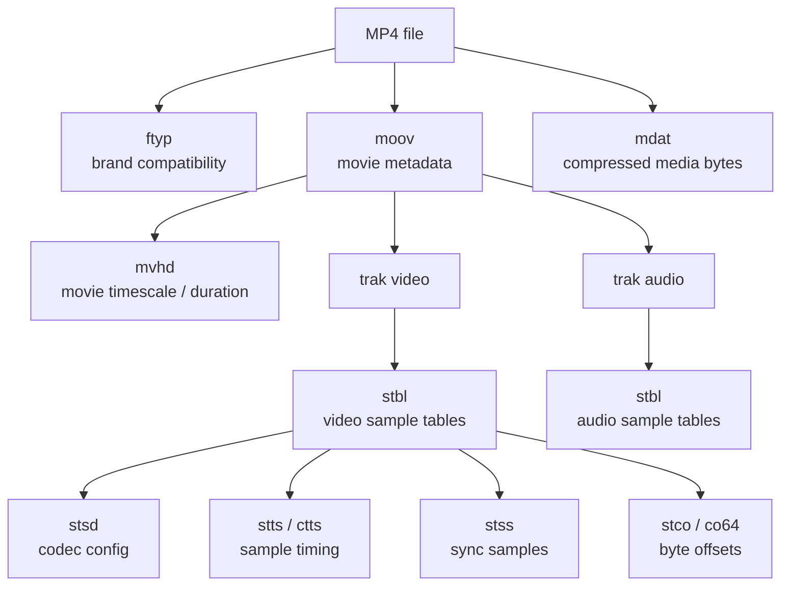
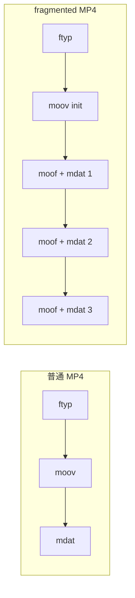
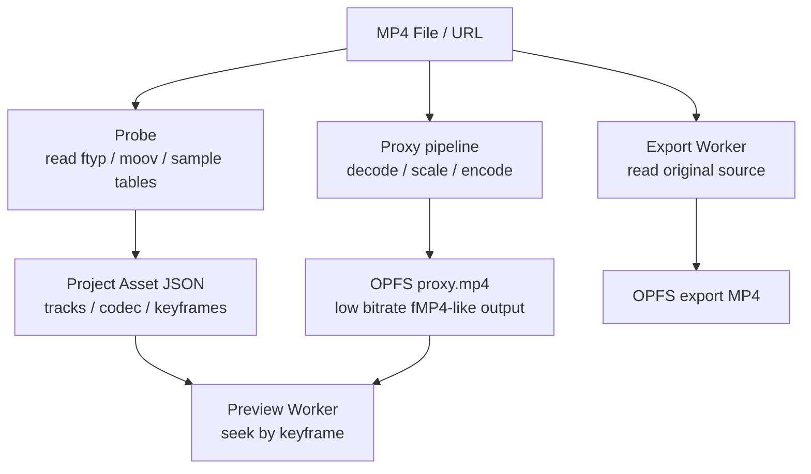

# MP4 文件格式详解：封装、文件头、索引与流式播放

MP4 常被误解为“视频格式”。更准确地说，MP4 是一种**容器格式**：它把视频、音频、字幕、封面、
时间戳、索引、codec 参数和元数据组织到同一个文件里。真正决定画面如何压缩的是 H.264、H.265、
AV1 等视频 codec；决定声音如何压缩的是 AAC、Opus、ALAC 等音频 codec。

本项目当前主要处理浏览器兼容性最稳定的一类文件：

```text
MP4 container
  video track: H.264 / AVC, WebCodecs codec string like avc1.640028
  audio track: AAC, WebCodecs codec string like mp4a.40.2
```

核心结论：

- **MP4 是 box/tree 结构**：文件由一段段 box 组成，每个 box 有大小、类型和载荷。
- **文件头不是单个固定 header**：通常开头是 `ftyp`，真正关键的电影元数据在 `moov`。
- **媒体字节和索引分离**：压缩后的 sample 数据通常在 `mdat`，如何按时间找到这些 sample
  依赖 `moov` 内部的 sample table。
- **能不能边下边播取决于布局**：`moov` 在前适合 progressive playback；`moov` 在文件尾时，
  播放器往往要先额外 Range 请求尾部；fragmented MP4 则用 `moof + mdat` 分段。
- **WebCodecs 不解析 MP4**：浏览器原生 codec 负责解码压缩帧，Mediabunny 负责 MP4 容器、
  轨道、sample 和 mux。

## 1. MP4、ISO BMFF 与 codec 的边界

MP4 基于 ISO Base Media File Format，也就是常说的 ISO BMFF。这个家族还包括 QuickTime MOV、
fragmented MP4、CMAF 等形态。它们共享“box 组成树”的基本思想，但品牌、允许的 box、流媒体约束
和生态兼容性会不同。

可以把边界分成三层：

| 层级 | 负责什么 | 常见对象 | 本项目对应实现 |
| --- | --- | --- | --- |
| 容器层 | 文件结构、轨道、时间轴、sample 索引、元数据 | MP4、MOV、WebM | Mediabunny `Input` / `Output` |
| 编码层 | 压缩视频帧和音频帧的语法 | H.264、AAC、AV1、Opus | WebCodecs / 浏览器媒体栈 |
| 像素与音频层 | 解码后的帧、PCM、合成与渲染 | `VideoFrame`、`AudioData`、Canvas | Preview Worker、PixiJS、Export Worker |

因此“这个文件是 MP4”只说明容器，不等于所有浏览器都能解码里面的轨道。一个 `.mp4` 文件可能包含：

```text
MP4 + H.264 + AAC     -> 浏览器通常兼容较好
MP4 + HEVC + AAC      -> Safari 较常见，其他浏览器不一定可用
MP4 + AV1 + Opus      -> 新一些，取决于浏览器和系统能力
MP4 + MJPEG cover art -> 可能只是封面轨，不应误选为主视频轨
```

这也是项目导入时必须探测主轨、codec 和 `isConfigSupported` 的原因。

## 2. Box 基础：大小、类型和层级

MP4 文件由连续的 box 组成。每个 box 至少包含：

```text
uint32 size
uint32 type
bytes  payload
```

直觉结构如下：

```text
+-------------------------------+
| size = 24                     |
| type = "ftyp"                 |
| payload = major brand...      |
+-------------------------------+
| size = 345678                 |
| type = "moov"                 |
| payload = movie metadata tree |
+-------------------------------+
| size = 123456789              |
| type = "mdat"                 |
| payload = compressed samples  |
+-------------------------------+
```

一些 box 是叶子节点，payload 直接存数据；另一些 box 是容器节点，payload 里继续嵌套子 box。

```text
moov
  mvhd
  trak
    tkhd
    mdia
      mdhd
      hdlr
      minf
        stbl
          stsd
          stts
          stss
          stsc
          stsz
          stco / co64
```

这种设计让 MP4 能把“媒体字节”和“如何解释这些字节”分开。`mdat` 可以很大，只保存压缩数据；
`moov` 内的表告诉播放器每个 sample 在文件哪里、属于哪条轨、对应哪个时间戳、是不是关键帧。

## 3. 顶层结构示例

最常见的非分片 MP4 顶层结构是：

```text
file.mp4
  ftyp
  moov
  mdat
```

也可能是：

```text
file.mp4
  ftyp
  mdat
  moov
```

两者都可以是合法 MP4，但播放体验差异很大。

| 顶层 box | 作用 | 对播放的影响 |
| --- | --- | --- |
| `ftyp` | 声明 major brand、minor version、compatible brands | 帮播放器判断是不是认识这类文件 |
| `moov` | 保存电影级元数据、轨道、时间轴、sample table | 播放、seek、取样前必须解析 |
| `mdat` | 保存压缩后的媒体数据 | 体积最大，实际视频/音频 sample 在这里 |
| `free` / `skip` | 填充或预留空间 | 可用于后续移动 box 或补齐布局 |
| `moof` | fragmented MP4 的 fragment metadata | 分段流式播放时反复出现 |
| `mfra` | fragment random access 信息 | 便于按 fragment seek，通常在文件尾 |

简化的 box 关系可以画成：



## 4. `ftyp`：文件开头的品牌声明

`ftyp` 通常在文件最前面，作用类似“这个文件属于哪些兼容品牌”。它不包含视频宽高、时长、帧率、
关键帧表，也不包含 H.264 SPS/PPS 这类 codec 初始化参数。

一个直观示例：

```text
ftyp
  major_brand: isom
  minor_version: 512
  compatible_brands:
    isom
    iso2
    avc1
    mp41
```

常见 brand 含义：

| brand | 常见含义 |
| --- | --- |
| `isom` | ISO BMFF 通用品牌 |
| `mp41` / `mp42` | MPEG-4 Part 14 相关兼容性 |
| `avc1` | 文件里可能有 AVC/H.264 sample entry |
| `iso6` | 较新的 ISO BMFF 版本能力 |
| `dash` | DASH / fragmented 相关兼容性提示 |
| `cmfc` / `cmfs` | CMAF fragment / segment 相关品牌 |

工程上不能只看扩展名 `.mp4`，也不能只看 MIME `video/mp4`。更可靠的做法是读取容器元数据，
再确认轨道和 codec 参数。

## 5. `moov`：真正关键的电影元数据

`moov` 是 MP4 最重要的元数据容器。没有 `moov`，播放器通常不知道：

- 文件总时长是多少。
- 有几条轨，哪些是视频、音频、字幕或封面。
- 每条轨的 timescale、duration、宽高、旋转、语言。
- 每个 sample 的时间戳、持续时间、大小和文件偏移。
- 哪些 sample 是关键帧。
- codec 初始化参数是什么。

典型 `moov` 结构：

```text
moov
  mvhd                      movie header
  trak                      video track
    tkhd                    track header
    mdia
      mdhd                  media timescale / duration
      hdlr                  handler, for example vide
      minf
        vmhd
        dinf
        stbl                sample table
          stsd              sample description, codec config
          stts              decoding time to sample
          ctts              composition time offset, optional
          stss              sync sample table, keyframes
          stsc              sample to chunk
          stsz / stz2       sample sizes
          stco / co64       chunk byte offsets
  trak                      audio track
    ...
```

`moov` 里保存的是索引和解释规则，不是完整解码后的帧。播放器或 demuxer 会先读这些表，再按需去
`mdat` 读取对应字节。

## 6. `trak`：一条视频轨或音频轨

每个 `trak` 表示一条轨道。一个 MP4 里可以有多条视频轨、多条音频轨、字幕轨、metadata 轨，
甚至封面图轨。常见字段和本项目的关系：

| 信息 | 常见位置 | 用途 |
| --- | --- | --- |
| track id | `tkhd` | 区分不同轨道 |
| handler type | `hdlr` | 判断是 `vide`、`soun`、`text` 还是 metadata |
| duration | `tkhd` / `mdhd` | 显示素材时长、裁剪范围校验 |
| width / height | `tkhd`、sample entry | 项目画布适配、素材卡展示 |
| rotation matrix | `tkhd` matrix | 竖屏视频方向修正 |
| timescale | `mdhd` | 把轨道时间单位换算成秒或微秒 |
| codec config | `stsd` | 配置 WebCodecs decoder / encoder |
| sample table | `stbl` | seek、demux、关键帧定位 |

项目的主轨选择不能简单取“第一条视频轨”。`test_1.mp4`、`test_2.mp4` 存在 MJPEG/JPEG cover
这类附加视频轨，探测逻辑会在有正常主视频轨时排除它们，避免把封面当成主视频。

## 7. `stsd`：codec 参数不只是 codec 名字

`stsd` 是 sample description table。它告诉播放器这条轨的 sample 应该如何交给 decoder。

视频轨里可能出现：

```text
stsd
  avc1
    width: 1920
    height: 1080
    avcC
      profile: High
      level: 4.0
      lengthSizeMinusOne: 3
      SPS: ...
      PPS: ...
```

音频轨里可能出现：

```text
stsd
  mp4a
    channelcount: 2
    samplerate: 48000
    esds
      objectTypeIndication: MPEG-4 Audio
      AudioSpecificConfig: AAC LC, 2ch, 48000Hz
```

对于 H.264 MP4，`avcC` 很关键。MP4 中的 H.264 sample 通常不是 Annex B 字节流，而是
length-prefixed NAL units：

```text
MP4 AVC sample:
  uint32 nal_length
  nal bytes
  uint32 nal_length
  nal bytes

Annex B H.264 stream:
  00 00 00 01
  nal bytes
  00 00 00 01
  nal bytes
```

这就是为什么“MP4 里的 H.264”和“裸 H.264 .h264 文件”不是同一种字节组织。Demuxer 需要读取
`avcC`，并把 codec config 传给解码器。

## 8. Sample、chunk、packet：MP4 如何定位媒体字节

MP4 不要求每帧都独立存在一个文件块。它通常把 sample 组织进 chunk，再由多张表联合描述：

```text
track timeline
  sample 1  sample 2  sample 3  sample 4
      |         |         |         |
      v         v         v         v
chunk layout in mdat
  chunk 1: sample 1, sample 2
  chunk 2: sample 3, sample 4
```

关键 sample table：

| box | 全称 | 说明 |
| --- | --- | --- |
| `stts` | decoding time to sample | 每个 sample 的解码时间和持续时间 |
| `ctts` | composition time to sample | B 帧等场景下展示时间相对解码时间的偏移 |
| `stss` | sync sample | 哪些 sample 是关键帧，可作为随机访问入口 |
| `stsc` | sample to chunk | 每个 chunk 包含哪些 sample |
| `stsz` / `stz2` | sample size | 每个 sample 的字节大小 |
| `stco` / `co64` | chunk offset | chunk 在文件中的字节偏移，超过 4GB 时用 `co64` |

Demuxer 要找“第 12 秒附近的下一帧”，不是直接 `12 * bitrate` 猜偏移，而是：

```text
目标时间
  -> 用 stts / ctts 找 sample 编号
  -> 用 stss 找最近的上一个关键帧
  -> 用 stsc 找 sample 所在 chunk
  -> 用 stco/co64 找 chunk 文件偏移
  -> 用 stsz 累加出 sample 在 chunk 内的位置
  -> 从 mdat 读取压缩 sample bytes
```

这也是 MP4 比“把所有帧顺序拼起来”复杂得多的地方。

## 9. 时间轴：DTS、PTS、timescale 和 B 帧

MP4 里时间通常不是直接用浮点秒，而是使用整数 tick。每条 track 有自己的 `timescale`：

```text
video timescale: 30000
audio timescale: 48000
```

如果视频 sample duration 是 1001 tick：

```text
duration seconds = 1001 / 30000 = 0.033366...
fps ~= 29.97
```

需要区分两个时间：

| 名称 | 含义 | 常见来源 |
| --- | --- | --- |
| DTS | decoding timestamp，解码顺序时间 | `stts` |
| PTS | presentation timestamp，展示顺序时间 | `stts + ctts` |

没有 B 帧时，DTS 和 PTS 往往一致。有 B 帧时，解码顺序和展示顺序可能不同：

```text
display order: I0  B1  B2  P3
decode order:  I0  P3  B1  B2
```

因此播放器和编辑器必须尊重 composition time。否则会出现帧顺序错乱、seek 后短暂倒跳、音视频不同步
等问题。

## 10. 关键帧与 seek：为什么不是任意帧都能直接解码

H.264 这类 inter-frame codec 通常包含：

| 帧类型 | 直觉说明 | 是否适合作为 seek 起点 |
| --- | --- | --- |
| I / IDR | 自包含或刷新参考关系的关键帧 | 是 |
| P | 依赖过去参考帧 | 否 |
| B | 依赖过去或未来参考帧 | 否 |

MP4 的 `stss` 记录 sync samples，也就是可以作为随机访问入口的 sample。seek 到目标时间时，
播放器通常要从目标时间之前最近的关键帧开始解码，丢掉目标时间之前的中间帧，再展示目标帧。

```text
keyframe at 10.0s
target seek 12.3s

decode from 10.0s
  -> decode 10.0s ... 12.3s
  -> drop frames before 12.3s
  -> present target frame
```

关键帧间隔越大，随机 seek 成本越高。项目生成低分辨率 proxy 时会记录 keyframes，预览 Worker
根据关键帧索引选择 `decodeFromUs`，减少长视频频繁拖动时的解码浪费。

## 11. `mdat`：实际媒体数据在哪里

`mdat` 保存的是压缩后的媒体 sample。它可能很大，甚至占据文件绝大部分空间。

```text
mdat
  video sample bytes
  audio sample bytes
  video sample bytes
  audio sample bytes
  ...
```

`mdat` 内部的交错方式会影响读取效率：

| 布局 | 特点 | 影响 |
| --- | --- | --- |
| 音视频交错较好 | 相近时间的视频和音频 bytes 靠得近 | 顺序播放和 Range 读取更友好 |
| 大段视频后大段音频 | 同一时间的音视频相距较远 | 边播边下更容易频繁跳读 |
| sample table 在尾部 | `mdat` 先出现，`moov` 在尾部 | 首播前要先读取尾部元数据 |

MP4 不是只靠 `mdat` 就能播。`mdat` 只是字节仓库，`moov` 的索引决定这些字节如何被解释。

## 12. 文件头与 Fast Start：`moov` 在前为什么重要

网页里直接播放一个 MP4，常见方式是 progressive download。浏览器先下载文件开头，然后逐步请求后续
字节。若 `moov` 在文件前部，播放器很快拿到轨道和索引，可以更早开始解码。

```text
fast start MP4:
  ftyp
  moov
  mdat

request 0-1MB
  -> get ftyp + moov
  -> know tracks / duration / offsets
  -> request needed mdat ranges
  -> start playback
```

如果 `moov` 在文件尾：

```text
tail moov MP4:
  ftyp
  mdat
  moov

request 0-1MB
  -> get ftyp + mdat start
  -> metadata incomplete
  -> request tail range
  -> parse moov
  -> request needed mdat ranges
  -> start playback
```

这就是“fast start”或“web optimized MP4”的本质：不是换 codec，而是把 `moov` 移到前面，并修正
sample offset。很多工具会把这个过程称为 `-movflags +faststart`。

## 13. Range 请求：浏览器如何按需读取 MP4

HTTP Range 允许客户端只请求文件的一段字节：

```http
Range: bytes=0-1048575
```

服务器响应：

```http
HTTP/1.1 206 Partial Content
Content-Range: bytes 0-1048575/911401782
Accept-Ranges: bytes
Content-Type: video/mp4
```

对 MP4 来说，Range 的意义是：

- 先取 `ftyp/moov`。
- 根据 sample table 计算目标时间附近的 `mdat` byte range。
- seek 时直接请求目标关键帧附近的文件区间。
- 长视频不必一次性下载完整文件才能探测和预览。

本项目的测试素材通过 Vite 配置提供 Range 读取。Mediabunny 的 `UrlSource` 能按需读取远端 MP4；
`BlobSource` 也能对用户选择的 File/OPFS File 做局部读取抽象。对 `test_2.mp4` 这类接近 GB 级文件，
这比把整文件读进内存更可控。

## 14. Progressive MP4、fragmented MP4 与 HLS/DASH

MP4 的流式播放大致有三种常见形态。

### Progressive MP4

单个 `.mp4` 文件，通常布局为：

```text
ftyp
moov
mdat
```

浏览器通过 Range 请求按需读取。它适合普通点播、简单下载播放和本地文件预览。

优点：

- 文件形态简单。
- `<video src="file.mp4">` 直接可用。
- 适合本项目的测试素材和 OPFS proxy。

限制：

- 码率自适应、清晰度切换、直播窗口等能力弱。
- 如果文件布局差或关键帧间隔太大，seek 仍可能慢。

### Fragmented MP4

fragmented MP4 把媒体拆成多个 fragment，每段有自己的 metadata：

```text
ftyp
moov
moof
mdat
moof
mdat
moof
mdat
```

其中：

| box | 作用 |
| --- | --- |
| `moov` | 初始化信息，声明 track 和 codec config |
| `moof` | 当前 fragment 的 track fragment metadata |
| `mdat` | 当前 fragment 的 sample bytes |
| `sidx` | segment index，可选，用于定位分段 |

fragmented MP4 更适合边生产边消费。导出或录制时可以不断写出 `moof + mdat`，不必等完整文件结束后
才生成一个巨大的 `moov` sample table。本项目导出面板里的 “MP4 fragmented stream” 指的就是这一类
流式 mux 思路：编码后的 packet 被持续交给 muxer，再通过 stream 写入 OPFS。

### HLS / DASH + fMP4

HLS 和 DASH 通常不是“一个 MP4 文件”，而是：

```text
manifest:
  master.m3u8 / media.mpd

segments:
  init.mp4
  segment-0001.m4s
  segment-0002.m4s
  segment-0003.m4s
```

播放器先读 manifest，选择清晰度和码率，再下载 init segment 和媒体分段。底层分段可以是 fMP4。

这种模式适合 CDN 分发、码率自适应和长视频播放，但编辑器导入本地素材时通常还是先面对单个 File、
Blob、URL 或 OPFS 文件。

## 15. 普通 MP4 与 fragmented MP4 的结构对比

| 维度 | 普通 MP4 | fragmented MP4 |
| --- | --- | --- |
| 顶层结构 | `ftyp + moov + mdat` | `ftyp + moov + moof/mdat...` |
| 索引位置 | 大多集中在 `moov` | 初始化在 `moov`，每段在 `moof` |
| 生成方式 | 常见于完整文件生成后 finalize | 适合边编码边写出 |
| 播放开始 | 依赖 `moov` 可尽早获得 | 依赖 init + 首个 fragment |
| seek | 依赖 sample table / keyframes | 可借助 fragment 边界和索引 |
| 典型场景 | 本地文件、普通上传、下载播放 | MSE、HLS/DASH、长任务流式输出 |

简化流程：



## 16. MP4 中的颜色、旋转和元数据

MP4 不只记录 codec 和 sample。它还可能记录：

| 维度 | 常见位置 | 影响 |
| --- | --- | --- |
| rotation / matrix | `tkhd` matrix | 竖屏视频显示方向 |
| clean aperture | `clap` | 有效画面区域 |
| pixel aspect ratio | `pasp` | 非方形像素显示比例 |
| color primaries | `colr` / codec VUI | 色域解释 |
| transfer characteristics | `colr` / codec VUI | SDR/HDR 曲线 |
| matrix coefficients | `colr` / codec VUI | YCbCr 和 RGB 互转 |
| metadata | `udta` / `meta` | 标题、作者、创建工具、封面等 |
| edit list | `elst` | track 时间偏移、裁剪、空白开头 |

这些信息处理不好会造成工程问题：

- 竖屏素材被当成横屏显示。
- 音频有开头偏移，和视频不同步。
- 颜色发灰、偏色或 HDR/SDR 解释错误。
- 封面轨被误认为主视频轨。

本项目目前主目标是学习浏览器端管线，因此重点覆盖 H.264/AAC MP4、主轨选择、旋转、关键帧、proxy
和导出；更复杂的 HDR、字幕、多音轨和 edit list 语义需要继续扩展测试素材和验证用例。

## 17. 浏览器播放与编辑器取样的区别

`<video>` 播放一个 MP4 时，浏览器内部会做完整的容器解析、解码、缓冲和渲染调度。应用拿到的是一个
高级播放控件。

视频编辑器要做的事情更低层：

```text
MP4 File / URL / OPFS
  -> demux selected track
  -> choose keyframe and sample range
  -> decode to VideoFrame / AudioData
  -> compose with titles / filters / transforms
  -> encode to H.264 / AAC
  -> mux back to MP4
```

对比：

| 维度 | `<video>` | 编辑器管线 |
| --- | --- | --- |
| 控制粒度 | 播放、暂停、seek | sample、frame、timestamp、queue |
| 渲染 | 浏览器内部渲染 | PixiJS / Canvas / OffscreenCanvas 合成 |
| 导出 | 不负责重新编码输出 | 需要 encode + mux |
| 多轨编辑 | 不直接支持工程语义 | 需要 Project JSON、ECS、Command |
| 观测性 | 可见指标有限 | 可记录 probe、decode、drop、export 队列 |

这就是为什么项目不能只靠 `<video>` 完成编辑器核心链路。

## 18. 和本项目导入、代理、预览、导出的关系

项目里的 MP4 处理路径可以拆成四段：



具体对应：

| 阶段 | 读取或写入的 MP4 维度 | 为什么重要 |
| --- | --- | --- |
| Probe | `ftyp/moov`、tracks、codec config、sample table | 不解码全片也能得到素材摘要和主轨 |
| Proxy | 从原 MP4 demux sample，重新编码低分辨率 H.264/AAC | 降低预览 seek、IO 和解码压力 |
| Preview | 读取 OPFS proxy 或 source fallback，按关键帧解码 | 拖动时间线时尽快出目标帧 |
| Export | 重新读取原素材，合成后编码并 mux MP4 | 保证导出不使用低清 proxy |

本项目的 Project JSON 只保存可序列化元数据和引用，不保存 `File`、`ArrayBuffer`、`VideoFrame` 或完整
MP4 字节。真正的二进制对象留在 Worker、Mediabunny、WebCodecs 和 OPFS 所在层。

## 19. 一个简化的 MP4 元数据 JSON 视角

实际 MP4 是二进制 box，不是 JSON。为了理解，可以把探测后需要进入 UI 的信息想象成：

```json
{
  "container": {
    "mimeType": "video/mp4",
    "durationUs": 30000000,
    "size": 2880000
  },
  "videoTrack": {
    "codec": "avc1.64001f",
    "width": 720,
    "height": 720,
    "frameRate": 30,
    "rotation": 0,
    "timescale": 30000,
    "keyframes": [
      { "timeUs": 0, "offset": 123456 },
      { "timeUs": 2000000, "offset": 456789 }
    ]
  },
  "audioTrack": {
    "codec": "mp4a.40.2",
    "sampleRate": 48000,
    "channels": 2
  },
  "excludedVideoTracks": [
    {
      "reason": "jpeg-cover-art",
      "codec": "jpeg"
    }
  ]
}
```

这个 JSON 不是完整 sample table，也不是解码帧。它只是把 UI、调度和诊断需要的信息从 MP4 容器中
提取出来，避免把重二进制对象塞进应用状态。

## 20. 常见问题与排查方向

| 现象 | 可能原因 | 排查方向 |
| --- | --- | --- |
| 首播很慢 | `moov` 在文件尾、服务器不支持 Range、文件太大 | 看 Network 是否有尾部 Range 请求，确认 `Accept-Ranges` |
| seek 很慢 | 关键帧间隔大、原片码率高、sample table 读取慢 | 使用 proxy、观察 keyframe index 和 decodeFromUs |
| 只有声音没有画面 | 视频 codec 不支持或主轨选择错误 | 看 codec string、WebCodecs 能力、excluded tracks |
| 画面方向不对 | rotation matrix 未处理 | 检查 track matrix / rotation 元数据 |
| 音画不同步 | timescale、edit list、DTS/PTS 或音频裁剪处理错误 | 对比 PTS、duration、audio anchor 和 drift 日志 |
| 导出文件打不开 | mux 未 finalize、codec config 缺失、临时文件未提交完整 | 检查 export 完成事件、OPFS `.tmp-` 和 mux 输出 |
| 大文件内存暴涨 | 整文件读入内存、帧未 `close()`、导出聚合 Blob | 检查 Range/OPFS stream、active VideoFrame/AudioData |

## 21. 源码证据

- MP4 探测与主轨选择：[packages/media-runtime/src/probe.ts](/source/packages/media-runtime/src/probe.ts.txt)
- Node 侧按需读取统计：[packages/media-runtime/src/probe-node.ts](/source/packages/media-runtime/src/probe-node.ts.txt)
- 代理生成 `proxy.mp4`：[packages/media-runtime/src/proxy-pipeline.ts](/source/packages/media-runtime/src/proxy-pipeline.ts.txt)
- Preview Worker 读取 OPFS proxy 或 URL source：[apps/editor/src/preview/preview.worker.ts](/source/apps/editor/src/preview/preview.worker.ts.txt)
- 导出 WebCodecs 编码与 MP4 mux：[apps/editor/src/export/export-pipeline.ts](/source/apps/editor/src/export/export-pipeline.ts.txt)
- MP4、sample、VideoFrame 的数据流：[Mediabunny 与 WebCodecs 数据流](/pipeline/mediabunny-webcodecs)
- RGB / YCbCr 与帧内存格式：[帧编码格式 RGB / YUV / YCbCr](/pipeline/frame-formats)
