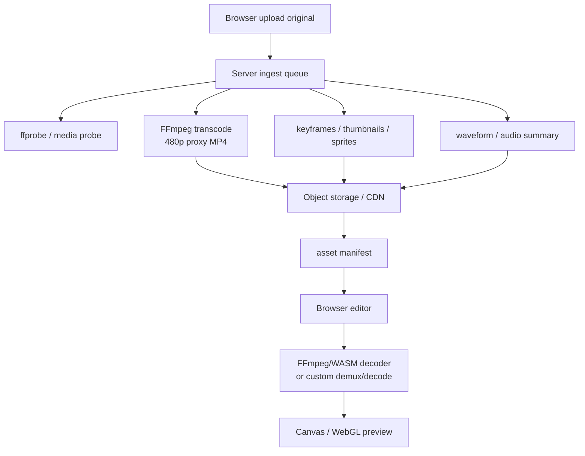
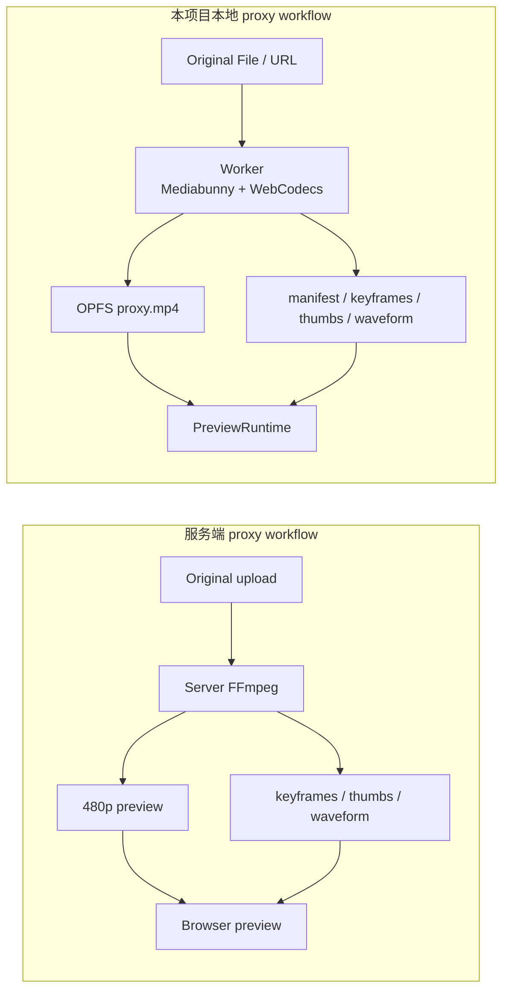

# 预处理为什么让预览流畅：OPFS Proxy 与服务端 480p 转码架构

当 pipeline 完成，并且 OPFS 里已经有 `proxy.mp4`、缩略图、关键帧索引和 `manifest.json` 后，
同一个素材再次添加到时间轴、拖动 seek、暂停和播放会明显顺滑。原因不是“添加 clip 这个动作变快”，
而是交互阶段不再承担原片解码和索引准备的重成本。

你提到的五年前系统：“视频上传后由服务端完成 480p 转码和关键帧等预处理，再返回给浏览器；
浏览器内置 FFmpeg/WASM 解码器，而不是 WebCodecs”，也是一种典型 proxy workflow。它和本项目
的本地 OPFS proxy 属于同一类思想：**先把重活提前做掉，把交互阶段变成读取轻量代理和索引**。

## 1. 核心模式：把重工作从交互路径移出去

视频编辑器的拖动时间轴，本质上是高频随机访问：

```text
用户拖动播放头
  -> 找当前时间对应的 clip
  -> 把工程时间换算成素材时间
  -> 找最近可解码关键帧
  -> 读取压缩 sample
  -> 解码到 VideoFrame
  -> 丢掉目标帧之前的中间帧
  -> 渲染当前帧
```

如果每次都对原始大文件做这些动作，成本会高在四个地方：

| 成本 | 原片路径的问题 | proxy ready 后的变化 |
| --- | --- | --- |
| IO | 原片可能很大，随机 Range 或 File 读取跨度大 | 读取低码率 `proxy.mp4`，字节更少 |
| 索引 | 需要解析容器、轨道、sample table、关键帧 | `manifest.json` 已提交可复用摘要 |
| 解码 | 原片分辨率和码率更高，关键帧间隔可能更大 | proxy 分辨率低、码率低、关键帧间隔可控 |
| 渲染 | 解码帧大，上传纹理和 Canvas/PixiJS 绘制更重 | `VideoFrame` 更小，呈现压力更低 |

因此预处理不是让视频“天然变简单”，而是把复杂度换成了一个可缓存、可复用、可丢弃的轻量预览产物。

## 2. 本项目的本地 OPFS proxy 路径

本项目在浏览器内完成 proxy 生成，并把产物写入 OPFS：

```text
原始 MP4 / URL / File
  -> probe: 轨道、codec、时长、尺寸、fingerprint
  -> proxy pipeline:
       - 低分辨率 H.264/AAC MP4
       - cover / thumbnails.webp
       - keyframes[]
       - waveform.f32
       - manifest.json
  -> OPFS cache directory
  -> PreviewRuntime source 切到 opfs-proxy
```

结构示例：

```text
web-video-editor-media-cache-v1/
  proxy-<hash>/
    proxy.mp4
    manifest.json
    waveform.f32
    cover.webp
    thumbnail-000001.webp
    thumbnail-000002.webp
```

`manifest.json` 不是媒体文件本身，它是运行时快速理解 proxy 的入口：

```json
{
  "cacheKey": "proxy-e7c4...",
  "source": {
    "fingerprint": "sha256-...",
    "durationUs": 120000000
  },
  "proxy": {
    "path": "proxy.mp4",
    "mimeType": "video/mp4",
    "width": 960,
    "height": 540,
    "frameRate": 30
  },
  "keyframes": [
    { "timestampSec": 0, "byteOffset": 48, "size": 53214 },
    { "timestampSec": 2, "byteOffset": 188421, "size": 48120 }
  ],
  "thumbnails": [
    { "timestampSec": 0, "path": "thumbnail-000001.webp" },
    { "timestampSec": 5, "path": "thumbnail-000002.webp" }
  ],
  "waveform": {
    "path": "waveform.f32",
    "buckets": 512
  }
}
```

真实字段以代码类型为准，上面只是解释结构。关键点是：预览 Worker 不需要把完整 MP4 或完整帧序列
塞进 Redux；它只需要根据 source 和 manifest 打开 OPFS 文件，再按目标时间取样。

## 3. 为什么 cache hit 后添加到时间轴会更顺

cache hit 的路径更短：

```text
添加到时间轴
  -> clip 写入 Project JSON
  -> runtime source 已经知道 opfs-proxy
  -> seek 时读取 proxy.mp4
  -> 用 keyframes 找 decodeFromUs
  -> 解码少量低分辨率帧
  -> present
```

而 proxy 未完成时，常见路径是：

```text
添加到时间轴
  -> clip 写入 Project JSON
  -> runtime source 使用 source fallback
  -> seek 时读取原始 File / URL
  -> 可能需要更多容器读取和 warm-up
  -> 从较大的关键帧范围解码高分辨率帧
  -> present
```

所以你看到的流畅性提升，主要来自：

- `proxy.mp4` 更小：码率、分辨率、帧处理成本都下降。
- OPFS 本地读取更稳定：不再依赖远端 Range 或原始大文件冷读。
- `keyframes[]` 已知：seek 可以从附近关键帧开始，而不是盲目扫描。
- 缩略图已生成：时间线和素材面板的视觉反馈不阻塞视频解码。
- 首次解析和生成成本已支付：后续添加、暂停、seek 只走运行时轻路径。

## 4. 服务端 480p 转码 + FFmpeg/WASM 解码是不是标准做法

是，它是视频编辑器和视频生产工具里很常见的一种做法，尤其在 WebCodecs 不成熟或浏览器 codec
能力不稳定的时期更常见。它通常叫：

- proxy media workflow
- preview rendition
- low-resolution proxy
- mezzanine / proxy transcode
- server-side ingest pipeline

典型结构：



这种系统的浏览器端拿到的不是原始重素材，而是服务端准备好的轻量预览包：

```text
asset/<assetId>/
  original.mp4              server side, export or archive
  preview-480p.mp4          browser preview
  thumbnails.vtt / sprites  timeline hover / strip
  keyframes.json            seek index
  waveform.json / f32       audio UI
  manifest.json             all preview metadata
```

manifest 可能类似：

```json
{
  "assetId": "a_123",
  "original": {
    "stored": true,
    "width": 3840,
    "height": 2160,
    "durationSec": 600
  },
  "preview": {
    "url": "https://cdn.example.com/a_123/preview-480p.mp4",
    "codec": "h264",
    "width": 854,
    "height": 480,
    "bitrate": 900000,
    "gopSec": 2
  },
  "keyframes": "https://cdn.example.com/a_123/keyframes.json",
  "thumbnails": "https://cdn.example.com/a_123/sprites.vtt",
  "waveform": "https://cdn.example.com/a_123/waveform.f32"
}
```

它的核心优点是：服务端环境可控，FFmpeg 能吃更多格式，转码参数统一，浏览器只处理轻量代理。

## 5. 为什么当年会在浏览器里放 FFmpeg/WASM 解码器

在 WebCodecs 之前，Web 端想做“帧级编辑”很难只靠 `<video>`。`<video>` 适合播放，但不适合稳定地
暴露 sample、精确控制 decoder 队列、逐帧合成再导出。FFmpeg/WASM 或自研 WASM 解码器能把能力拉到
应用层：

| 诉求 | `<video>` 的限制 | FFmpeg/WASM 的价值 |
| --- | --- | --- |
| 帧级 seek | 浏览器内部缓冲和 seek 策略不可控 | 应用自己 demux/decode |
| 格式兼容 | 取决于浏览器和系统 codec | FFmpeg 支持面更宽 |
| 一致性 | 不同浏览器行为不同 | WASM 逻辑更统一 |
| 离线处理 | `<video>` 不负责转码、滤镜和 mux | 可在浏览器内跑部分媒体处理 |
| 早期 WebCodecs 缺失 | 没有标准低层 codec API | WASM 是可部署方案 |

但 FFmpeg/WASM 解码视频通常也有明显代价：

- 包体大，首次加载慢。
- 软件解码吃 CPU，移动设备耗电和发热更明显。
- 大文件虚拟文件系统和内存峰值不好控制。
- 线程、SharedArrayBuffer、COOP/COEP、取消清理都要额外设计。
- 很难像系统媒体栈那样稳定利用硬件解码能力。

所以它是标准做法之一，但不是今天所有 Web 编辑器的默认最优解。

## 6. 与当前 WebCodecs + Mediabunny + OPFS 的区别

| 维度 | 服务端 480p + FFmpeg/WASM | 本项目 WebCodecs + Mediabunny + OPFS |
| --- | --- | --- |
| 预处理位置 | 服务端 ingest queue | 浏览器 Worker |
| proxy 存储 | 对象存储 / CDN / 服务端缓存 | OPFS，本 origin 私有缓存 |
| 容器处理 | 常见为 FFmpeg/ffprobe | Mediabunny |
| 解码 | 浏览器内 FFmpeg/WASM 软件解码，或自研 WASM | WebCodecs / 浏览器媒体栈硬件优先 |
| 格式兼容 | 服务端 FFmpeg 可统一输入格式 | 当前聚焦浏览器可支持 H.264/AAC MP4 |
| 首次可编辑时间 | 取决于上传和服务端转码队列 | probe 后可 source fallback，proxy 后更顺 |
| 离线能力 | 依赖服务端产物，离线弱 | OPFS cache 命中后本地可复用 |
| 成本 | 服务端 CPU/存储/CDN 成本更高 | 客户端 CPU/电量/浏览器能力约束更明显 |
| 导出 | 常见为服务端用原片导出 | 当前 Export Worker 重新读取原素材导出 |

二者并不是“谁淘汰谁”的关系，而是不同约束下的职责分配。



## 7. 怎么判断该选哪种架构

服务端 proxy 更适合：

- 多人协作、云工程、素材本来就要上传。
- 输入格式很杂，需要 FFmpeg 在服务端统一转成 H.264/AAC proxy。
- 需要服务端统一生成缩略图、波形、字幕、审核、AI 识别等资产。
- 用户设备性能不稳定，不希望把转码压力放到浏览器。
- 导出本来就由服务端使用原素材完成。

本地 OPFS proxy 更适合：

- 本地优先、隐私优先、学习型或轻量编辑器。
- 不希望上传原素材，或希望在浏览器内尽快可交互。
- 目标格式比较收敛，例如 H.264/AAC MP4。
- 希望利用 WebCodecs 的硬件优先解码/编码。
- 可以接受 proxy 生成时占用客户端 CPU，并做好取消和缓存清理。

混合架构也很常见：

```text
本地快速 probe + 首帧/短段 proxy
  -> 立即进入编辑
后台上传原片
  -> 服务端生成全量 proxy / AI / 审核 / 云导出
浏览器 cache 命中
  -> 优先本地 OPFS，否则拉 CDN proxy
```

## 8. 对本项目的设计启发

这类系统证明了一件事：**流畅编辑不是靠实时硬扛原片，而是靠预处理、索引、代理媒体和明确的运行时切换**。

本项目目前选择浏览器内 proxy，是为了学习和验证这些边界：

- Project JSON 不保存重二进制，只保存素材、clip 和 runtime source 引用。
- 原素材仍保留给导出，proxy 只服务预览。
- `manifest.json` 最后提交，确保 cache hit 只发生在产物完整时。
- `source fallback` 保证 proxy 未完成时也能先操作。
- proxy ready 后切到 OPFS，长视频 seek 和暂停恢复更稳定。
- FFmpeg/WASM 暂时只作为未来格式兜底候选，不进入主路径。

如果未来要支持更复杂输入格式，可以考虑两条扩展路线：

| 路线 | 做法 | 风险 |
| --- | --- | --- |
| 本地 FFmpeg/WASM fallback | 不支持 WebCodecs 的格式在浏览器内转 proxy | 包体、CPU、内存、取消清理、license |
| 服务端 ingest proxy | 上传后服务端统一生成 480p/720p proxy 和索引 | 服务端成本、隐私、排队延迟、离线能力 |

## 9. 排查流畅性时看哪些信号

当用户说“proxy 完成后就顺了”，可以按这些信号确认：

| 信号 | 预期 |
| --- | --- |
| Source | 从 `source fallback` 切到 `opfs-proxy` |
| OPFS committed bytes | 有 `proxy.mp4`、manifest、缩略图、波形占用 |
| temporary entries | 完成或取消后为 0 |
| keyframes | manifest 中大于 0，seek 能找到附近关键帧 |
| decoder queue | 停止拖动后回落，不长期堆积 |
| active VideoFrame / AudioData | 呈现后释放，不持续增长 |
| dropped/stale | 高频 seek 时可上升，停止后稳定 |

如果已经是 OPFS proxy 但仍然卡，再去看 OPFS 读取异常、关键帧间隔、音频时钟、`VideoFrame.close()`、
主线程渲染耗时和 GC，而不是只盯 JS heap 一个数字。

## 10. 源码证据

- OPFS proxy 产物与事务：[packages/media-runtime/src/proxy-cache.ts](/source/packages/media-runtime/src/proxy-cache.ts.txt)
- 代理生成、keyframes、waveform：[packages/media-runtime/src/proxy-pipeline.ts](/source/packages/media-runtime/src/proxy-pipeline.ts.txt)
- 代理参数：[packages/media-runtime/src/proxy-types.ts](/source/packages/media-runtime/src/proxy-types.ts.txt)
- source/proxy 切换入口：[apps/editor/src/App.tsx](/source/apps/editor/src/App.tsx.txt)
- Preview Worker 读取 OPFS proxy：[apps/editor/src/preview/preview.worker.ts](/source/apps/editor/src/preview/preview.worker.ts.txt)
- 预览解码链路：[预览 Worker 解码链路](/pipeline/preview-worker-decode)
- 长视频 proxy 策略：[长视频 Proxy 性能策略](/pipeline/long-video-proxy)
- FFmpeg/WASM 边界：[参考实践与本 Demo 边界](/references/boundaries#为什么主路径不是-ffmpegwasm)
