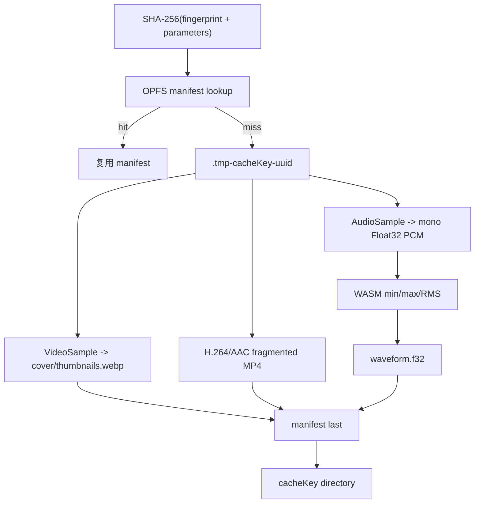
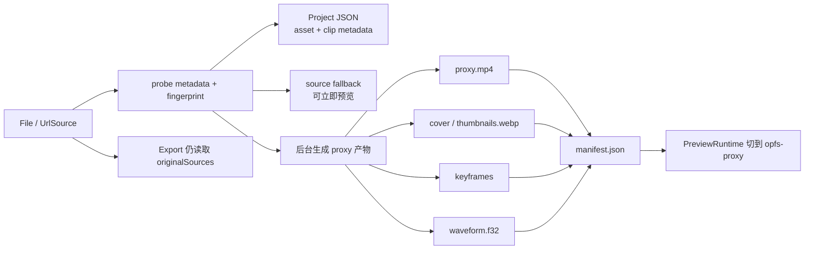

# 540p 代理、OPFS、缩略图与波形

默认参数是 30fps、最大 `960×540`、2 秒关键帧间隔、每 5 秒一张 160px 宽 WebP、
512 个波形桶。尺寸保持比例并取偶数；小于上限的素材不会放大。



缓存事务先写临时目录，所有产物完成后才复制并最后写 manifest。取消或失败调用 abort
删除临时目录；启动 `OpfsProxyCache.create()` 也会 cleanup 遗留 `.tmp-`。cache key 同时
包含素材指纹和全部生成参数，参数改变必然 miss。

代理仅替换 preview/audio runtime source；`originalSources` 独立保留给导出。素材刚完成
探测时可立即用原素材预览，代理完成后切换为 `opfs-proxy`。

长视频不强制等待完整 proxy 完成后才能添加到时间线。小视频可直接添加；长视频允许立即
添加并走 `source` fallback，但频繁 seek 或长时间编辑前推荐等待关键 proxy 可用，或先跑
后台预处理。预处理为何让预览更流畅、以及服务端 480p proxy + FFmpeg/WASM 这类架构对比见
[预处理为什么让预览流畅](/pipeline/preprocess-smooth-preview)；内存、Storage、WASM 和分段策略见
[长视频 Proxy 性能策略](/pipeline/long-video-proxy)。

## 导入前准备工作到底是什么

当前项目没有把素材转换成某种内部“可编辑草稿格式”，也不是只做抽帧。导入准备分成
两层：一层是必须很快完成的探测，另一层是可后台运行的 proxy 预处理。

| 阶段           | 产物                                           | 是否阻塞添加到时间线         | 用途                                                  |
| -------------- | ---------------------------------------------- | ---------------------------- | ----------------------------------------------------- |
| 探测 `probe`   | duration、轨道、codec、尺寸、帧率、fingerprint | 是，完成后才知道素材能否使用 | 建立素材元数据，决定画布比例、proxy 参数和缓存键      |
| 原素材记录     | `BrowserMediaSource` 与 Redux 中的 JSON 元数据 | 是，但只保存引用和元数据     | 导出仍从原素材读取，避免 proxy 影响最终质量           |
| 缩略图/封面    | WebP 图片                                      | 否                           | 素材面板、时间线和快速定位                            |
| 关键帧索引     | `timestampSec` 列表                            | 否                           | 让预览 seek 从附近关键帧解码，而不是盲扫              |
| 低分辨率 proxy | OPFS 中的 H.264/AAC fragmented MP4             | 否                           | 替代原片做实时预览和音频播放，降低解码、IO 和渲染压力 |
| 波形           | `waveform.f32`，Float32 min/max/RMS 桶         | 否                           | 音频波形展示和后续编辑辅助                            |
| manifest       | `manifest.json`                                | 否，且最后提交               | 串起 proxy、缩略图、关键帧、波形和诊断信息            |

所以“准备可编辑形态”的边界是：项目文档和时间线是 JSON；原素材保持不变；proxy 是
可丢弃、可重建的预览缓存。它仍然是 MP4，只是更低分辨率、更适合浏览器实时预览，不是
最终导出的母版，也不是替代原素材的工程文件格式。



## 复现与预期输出

```bash
pnpm test:e2e:core
```

```text
UI: PROXY PIPELINE 显示 cache MISS/HIT、输入→输出尺寸、字节、耗时
UI: 完成后显示 thumbnails / keyframes / 512 waveform buckets
UI: “清理代理缓存”后 OPFS committedBytes 回到 0
Console: [PROXY] cache.miss -> generation.started/progress/completed
CLI: 核心 E2E 可在代理运行时取消，并断言状态 CANCELLED
```

大文件缓存实验不在默认验证中：

```bash
pnpm test:e2e:test2
```

成功时 CLI 输出一行 `[TASK12_TEST2] {...}`，其中数值均为当次机器实测。

## 源码证据

- 默认参数与尺寸算法：[packages/media-runtime/src/proxy-types.ts](/source/packages/media-runtime/src/proxy-types.ts.txt)
- 代理/缩略图/波形管线：[packages/media-runtime/src/proxy-pipeline.ts](/source/packages/media-runtime/src/proxy-pipeline.ts.txt)
- OPFS 事务与清理：[packages/media-runtime/src/proxy-cache.ts](/source/packages/media-runtime/src/proxy-cache.ts.txt)
- UI 阶段与取消：[apps/editor/src/media/ProxyProgress.tsx](/source/apps/editor/src/media/ProxyProgress.tsx.txt)
- 大文件手动场景：[apps/editor/e2e/manual/test2-performance.spec.ts](/source/apps/editor/e2e/manual/test2-performance.spec.ts.txt)
