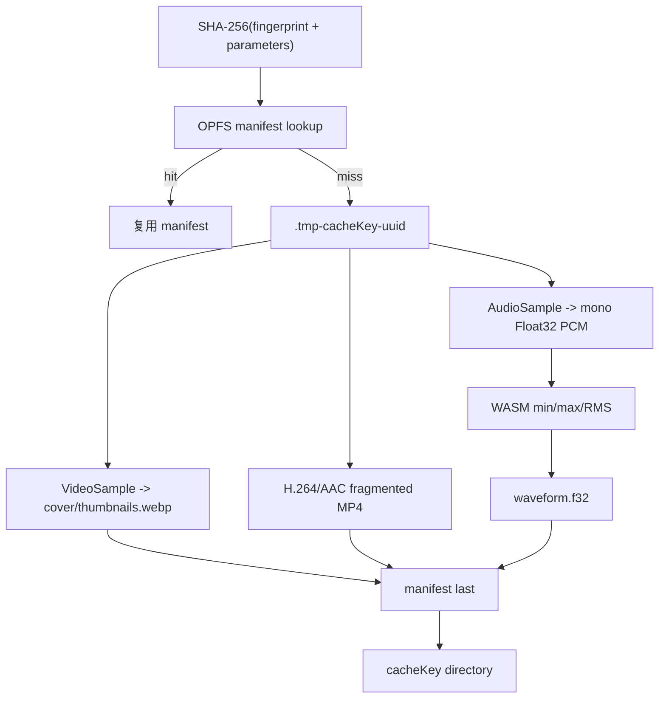

# 540p 代理、OPFS、缩略图与波形

默认参数是 30fps、最大 `960×540`、2 秒关键帧间隔、每 5 秒一张 160px 宽 WebP、
512 个波形桶。尺寸保持比例并取偶数；小于上限的素材不会放大。



缓存事务先写临时目录，所有产物完成后才复制并最后写 manifest。取消或失败调用 abort
删除临时目录；启动 `OpfsProxyCache.create()` 也会 cleanup 遗留 `.tmp-`。cache key 同时
包含素材指纹和全部生成参数，参数改变必然 miss。

代理仅替换 preview/audio runtime source；`originalSources` 独立保留给导出。素材刚完成
探测时可立即用原素材预览，代理完成后切换为 `opfs-proxy`。

## 复现与预期输出

```bash
pnpm test:e2e:core
```

```text
UI: PROXY PIPELINE 显示 cache MISS/HIT、输入→输出尺寸、字节、耗时
UI: 完成后显示 thumbnails / keyframes / 512 waveform buckets
UI: “清理代理缓存”后 OPFS committedBytes 回到 0
Console: [PROXY] cache.miss -> generation.started/progress/completed
CLI: 核心 E2E 可在代理运行时取消，并断言状态 CANCELLED
```

大文件缓存实验不在默认验证中：

```bash
pnpm test:e2e:test2
```

成功时 CLI 输出一行 `[TASK12_TEST2] {...}`，其中数值均为当次机器实测。

## 源码证据

- 默认参数与尺寸算法：[packages/media-runtime/src/proxy-types.ts](/source/packages/media-runtime/src/proxy-types.ts.txt)
- 代理/缩略图/波形管线：[packages/media-runtime/src/proxy-pipeline.ts](/source/packages/media-runtime/src/proxy-pipeline.ts.txt)
- OPFS 事务与清理：[packages/media-runtime/src/proxy-cache.ts](/source/packages/media-runtime/src/proxy-cache.ts.txt)
- UI 阶段与取消：[apps/editor/src/media/ProxyProgress.tsx](/source/apps/editor/src/media/ProxyProgress.tsx.txt)
- 大文件手动场景：[apps/editor/e2e/manual/test2-performance.spec.ts](/source/apps/editor/e2e/manual/test2-performance.spec.ts.txt)
