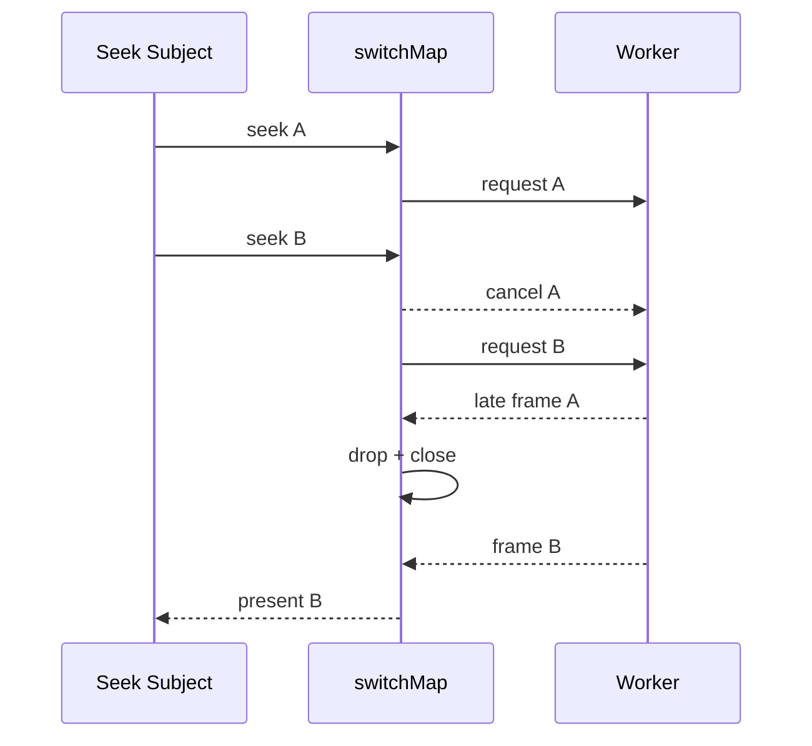

# RxJS Seek、代理与导出调度

## Seek：只保留最新请求

`createSeekStream` 用 `switchMap` 为每个请求创建 AbortController。下一次 Seek 到来时，
上一个订阅被取消并触发 `abort("Seek superseded")`。即使底层 Worker 晚到，客户端仍会
用 requestId、projectRevision、generation 三重检查并关闭过期 VideoFrame。



## 代理：有界并发与水位

`BoundedTaskQueue` 使用 `mergeMap(..., concurrency)`。编辑器代理队列配置
`concurrency=1`、`highWatermark=2`；等待数达到水位后抛
`QueueBackpressureError`，而不是无限累积大任务。队列事件提供 active/queued peak。

## 导出：取消与 codec 背压

导出本身由 WorkerClient 的 AbortSignal 管理；Export Pipeline 逐帧处理并在
`encodeQueueSize >= 8` 时等待 `dequeue`。取消会终止读取、cancel Output、关闭 codec、
删除 `.tmp-<requestId>.mp4`。这里没有把导出帧流实现成 RxJS Observable，RxJS 的作用是
任务生命周期/取消入口；逐帧背压由 WebCodecs 队列事件承担。

## 复现与预期输出

```bash
pnpm test:e2e:core
```

```text
UI: 连续填入 50000/550000/100000/500000/250000 后最终呈现 250000us
UI: Decode Queue 回到 0；VideoFrame active 回到 0
Console: [SEEK] request.cancelled 或 [DECODE] frame.dropped
CLI: task12-core.spec.ts 通过；导出 queue peak <= highWatermark
```

队列单测：

```bash
pnpm test
```

## 源码证据

- `switchMap` 和有界队列：[packages/media-runtime/src/scheduler.ts](/source/packages/media-runtime/src/scheduler.ts.txt)
- Seek 接入预览：[packages/preview-runtime/src/preview-runtime.ts](/source/packages/preview-runtime/src/preview-runtime.ts.txt)
- UI 代理队列参数：[apps/editor/src/media/MediaPanel.tsx](/source/apps/editor/src/media/MediaPanel.tsx.txt)
- 导出 codec 水位：[apps/editor/src/export/export-pipeline.ts](/source/apps/editor/src/export/export-pipeline.ts.txt)
- 调度测试：[packages/media-runtime/src/scheduler.test.ts](/source/packages/media-runtime/src/scheduler.test.ts.txt)
