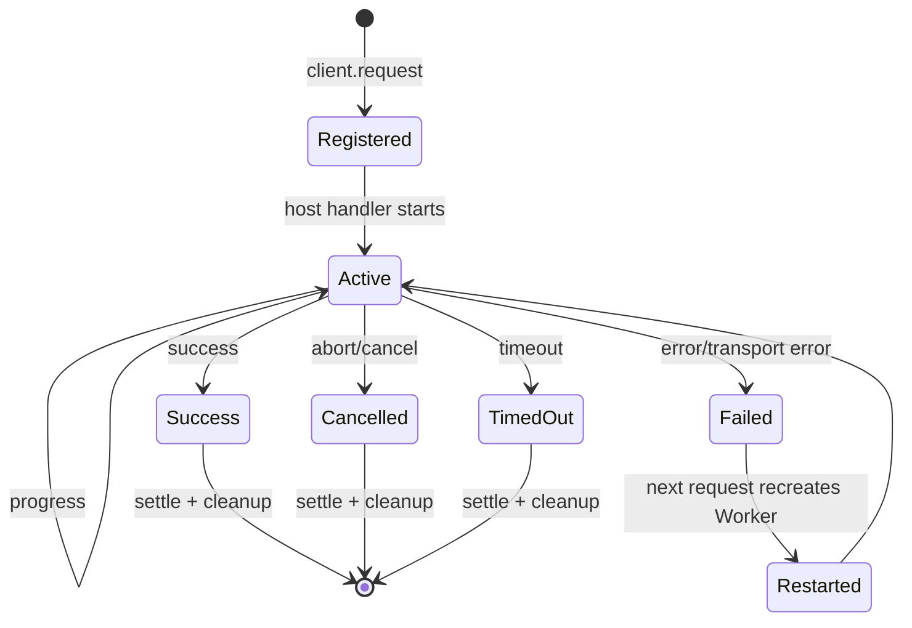

# Worker 协议与任务生命周期

通用媒体协议版本为 `1`，消息是严格判别联合：

| type       | 方向           | 必要字段                        | 终态 |
| ---------- | -------------- | ------------------------------- | ---- |
| `request`  | client -> host | operation、payload              | 否   |
| `progress` | host -> client | completed、ratio、stage         | 否   |
| `success`  | host -> client | payload                         | 是   |
| `cancel`   | 双向           | reason                          | 是   |
| `timeout`  | 双向           | timeoutMs                       | 是   |
| `error`    | host -> client | code、recoverable、序列化 Error | 是   |

所有消息都带 `version`、`requestId`、`projectRevision`。解析器拒绝未知字段、非法
requestId、负 revision 和越界 ratio。Host 用 requestId 注册 AbortController；Client
用 Map 保存 Promise/Progress Subject/超时器，并在终态清除监听。



Worker 脚本异常会拒绝全部 pending task、释放 Worker lease；下一次 request 可创建新
Worker。过期 revision 或未知 requestId 的响应不会解析成业务结果，只增加 stale 计数。
预览解码另有帧专用协议，因为成功载荷包含可转移 VideoFrame 和 generation。

## 复现与预期输出

```bash
pnpm test
```

```text
UI: 正常任务显示 progress；取消后按钮可再次启动
Console: malformed message 只记 warn，不使主线程崩溃
Console: stale response -> [DECODE] frame.dropped
CLI: protocol、worker-client、worker-host、integration 测试通过
```

## 源码证据

- 协议和严格解析：[packages/media-runtime/src/protocol.ts](/source/packages/media-runtime/src/protocol.ts.txt)
- Client 注册、超时、重启：[packages/media-runtime/src/worker-client.ts](/source/packages/media-runtime/src/worker-client.ts.txt)
- Host registry 与 AbortController：[packages/media-runtime/src/worker-host.ts](/source/packages/media-runtime/src/worker-host.ts.txt)
- Media Worker 任务注册：[apps/editor/src/media/media.worker.ts](/source/apps/editor/src/media/media.worker.ts.txt)
- PreviewFrame 专用协议：[packages/preview-runtime/src/decoder.ts](/source/packages/preview-runtime/src/decoder.ts.txt)
- 集成测试：[packages/media-runtime/src/worker-integration.test.ts](/source/packages/media-runtime/src/worker-integration.test.ts.txt)
