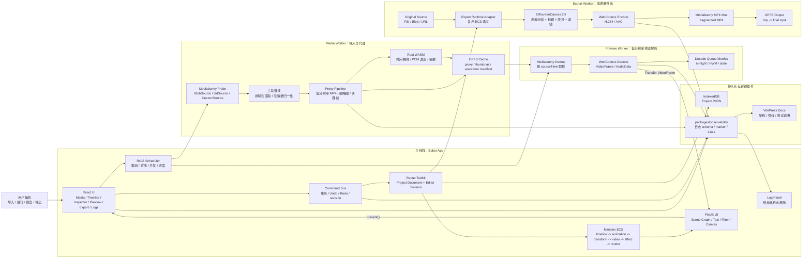
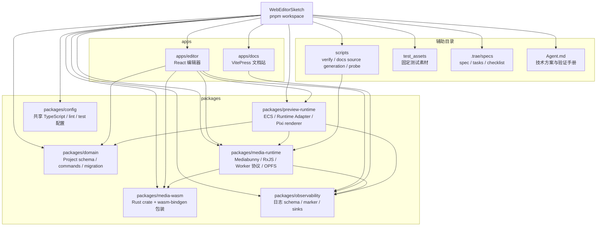
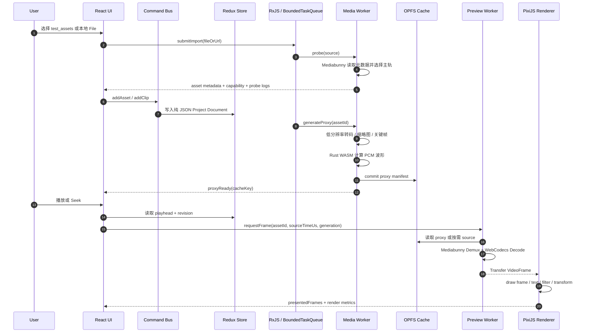
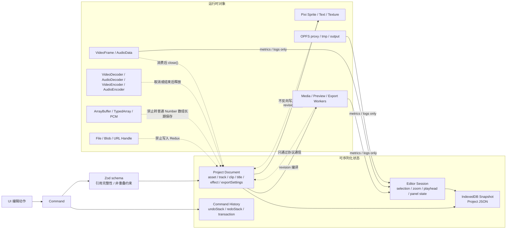
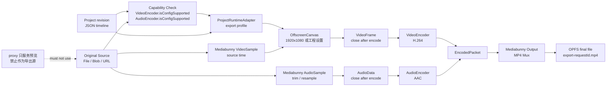
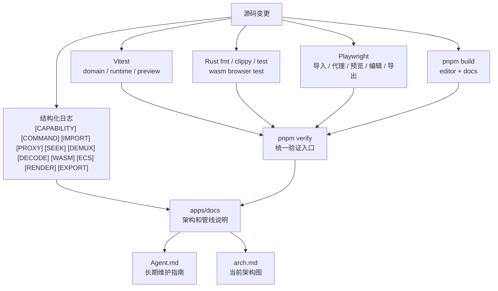

# WebEditorSketch 项目框架结构图

本文用 Mermaid 描述整个学习型 Web 视频编辑器 Demo 的架构。核心边界是：`Project Document` 保持纯 JSON，媒体运行对象和二进制资源留在 Runtime、Worker、OPFS、WebCodecs 和 PixiJS 所在层。

## 1. 总体架构

## 2. Monorepo 模块依赖

## 3. 导入、代理与预览管线

## 4. 编辑与状态所有权

## 5. 高质量导出管线

## 6. 日志、验证与文档反馈闭环

