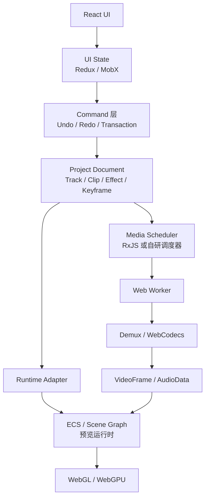

对于 Web/桌面视频编辑器，我更推荐这种混合架构：

```text
Project Document：传统领域模型，作为工程唯一事实来源
Editor UI State：Redux 或 MobX
Async Media Pipeline：RxJS 或自研调度器
Preview/Effect Runtime：ECS 或 Scene Graph
Worker 内媒体处理：WebCodecs + TypedArray/ArrayBuffer
```



# 一、ECS 还是 Redux、MobX、RxJS

## 1. ECS 和 Redux/MobX 不是同一种东西

ECS 是一种运行时数据组织方式：

- Entity：对象 ID
- Component：纯数据
- System：批量处理具有某些 Component 的对象

例如：

```ts
type Entity = number;

interface TransformComponent {
  x: number;
  y: number;
  scaleX: number;
  scaleY: number;
  rotation: number;
}

interface VideoComponent {
  resourceId: string;
  sourceTime: number;
}

interface EffectComponent {
  graphId: string;
  intensity: number;
}

interface VisibilityComponent {
  visible: boolean;
  opacity: number;
}
```

系统每一帧执行：

```ts
timelineSystem.update(time);
animationSystem.update(time);
transformSystem.update();
videoSystem.update();
effectSystem.update();
renderSystem.render();
```

Redux/MobX 主要解决的是：

- UI 状态变化
- 数据响应式更新
- 组件重新渲染
- 操作记录
- 调试
- 数据流约束

RxJS 主要解决的是：

- 异步事件流
- 播放、拖动、解码请求的调度
- 取消过期任务
- 限流、合并、背压
- 多路事件组合

所以它们可以同时存在。

---

# 二、为什么不建议用 ECS 直接管理整个前端工程

视频工程通常有明确的业务结构：

```text
Project
├── Sequence
│   ├── VideoTrack
│   │   ├── Clip
│   │   └── Clip
│   ├── AudioTrack
│   └── SubtitleTrack
├── Assets
├── Fonts
├── Effects
└── ExportSettings
```

这种数据需要：

- 保存成 JSON 或二进制工程文件
- 版本升级
- Undo/Redo
- 跨端同步
- 模板覆盖
- 多选编辑
- 事务操作
- 引用完整性
- 协作编辑

传统领域模型更容易表达：

```ts
interface Project {
  id: string;
  version: number;
  canvas: CanvasSettings;
  assets: Record<string, Asset>;
  tracks: Track[];
}

interface Track {
  id: string;
  type: "video" | "audio" | "text";
  clips: Clip[];
}

interface Clip {
  id: string;
  assetId: string;
  timelineStart: number;
  timelineDuration: number;
  sourceIn: number;
  playbackRate: number;
  effects: EffectInstance[];
}
```

如果全部变成 ECS：

```text
Entity 328 有 TrackComponent
Entity 447 有 ClipComponent
Entity 447 通过 ParentComponent 指向 328
Entity 592 有 EffectComponent
Entity 592 通过 OwnerComponent 指向 447
```

运行时遍历很方便，但做以下事情会变得更绕：

- 找到某个 Track 的所有 Clip
- 删除 Track 时级联处理
- 把 Clip 复制到其他项目
- 把一组编辑动作作为一个 Undo Transaction
- 模板版本升级
- 输出对人友好的工程数据
- 校验“转场必须绑定两个相邻 Clip”

所以建议：

> 工程模型使用传统领域模型；播放和渲染运行时可以把工程编译成 ECS。

这与游戏开发里的做法类似：

```text
编辑器工程数据 / Prefab
       ↓ 编译
运行时 ECS World
```

---

# 三、Redux、MobX、RxJS 分别适合什么

## Redux

适合：

- 工程数据需要严格、可预测的数据流
- 所有修改都通过 Action/Command
- 需要日志、回放、撤销重做
- 多团队协作，希望修改路径清晰
- 可能需要多人协作或操作审计

例如：

```ts
dispatch({
  type: "clip/move",
  payload: {
    clipId: "clip-1",
    newStart: 12.5,
  },
});
```

优点：

- 修改路径明确
- 容易调试
- 与 Command、Undo/Redo 很契合
- 适合做确定性的 Project Model 更新

问题：

- 视频工程很大时，直接对巨型 State 做不可变拷贝成本较高
- 如果把播放头每一帧的位置都 dispatch，React 和 Redux 会承担大量无意义更新
- VideoFrame、AudioData、纹理等运行时对象不应该存进 Redux

建议只存：

- 工程描述数据
- UI 选择状态
- 面板状态
- 操作历史

不要存：

- 解码帧
- GPU Texture
- WebGL 对象
- WebCodecs Decoder
- Worker 实例
- 高频播放时钟

## MobX

适合：

- 对象模型较复杂
- 属性面板很多
- 希望属性级响应更新
- 团队更偏向面向对象模型
- 希望减少 Redux 样板代码

例如：

```ts
class ClipModel {
  id = "";
  timelineStart = 0;
  opacity = 1;

  constructor() {
    makeAutoObservable(this);
  }

  moveTo(time: number) {
    this.timelineStart = time;
  }
}
```

优点：

- 属性面板开发方便
- 细粒度响应
- 对复杂编辑器对象较自然
- 大量 Inspector 控件不用手工写 Selector

问题：

- 修改来源可能较隐式
- 如果允许任意对象直接改属性，Undo/Redo 会变得困难
- 序列化和运行时对象容易混在一起
- 异步操作的边界可能不清晰

如果选择 MobX，仍建议所有工程修改经过 Command：

```ts
commandBus.execute(new MoveClipCommand(project, clipId, newStart));
```

不要让任意 React 组件直接写：

```ts
clip.timelineStart = newStart;
```

## RxJS

RxJS 更像异步管道，不适合单独充当工程数据库。

它特别适合视频编辑器里的这些场景：

### 拖动播放头

用户连续产生：

```text
seek(1.01)
seek(1.05)
seek(1.12)
seek(2.31)
seek(5.18)
```

前面四个解码任务可能已经过期。可以取消旧请求，只保留最新请求：

```ts
seek$
  .pipe(
    distinctUntilChanged(),
    switchMap((time) => decodePreviewFrame(time)),
  )
  .subscribe((frame) => render(frame));
```

### 输入搜索素材

```ts
keyword$.pipe(
  debounceTime(300),
  distinctUntilChanged(),
  switchMap(searchAssets),
);
```

### 合并播放状态

```ts
combineLatest([playbackTime$, projectRevision$, previewQuality$]);
```

### 控制任务并发

- 同时最多解码几个视频
- 同时最多生成几个缩略图
- 导入新项目时取消旧项目任务
- 在预览落后时丢掉过期帧

RxJS 适合描述这些流，但不建议把整个 Project Model 仅保存成一大堆 Subject。

---

# 四、推荐的数据模型分层

实际工程可以拆成四类状态。

## 1. Project Document：需要保存的状态

包括：

- Track
- Clip
- Asset 引用
- Effect 参数
- Keyframe
- Canvas
- 字体
- 导出设置
- 模板 Slot 覆盖

特点：

- 可序列化
- 有版本号
- 支持迁移
- 支持 Undo/Redo
- 不含浏览器和 GPU 对象

适合 Redux、MobX 或自研 Document Model。

## 2. Editor Session：只属于当前编辑会话

包括：

- 当前选中对象
- 时间线缩放
- 滚动位置
- 打开的面板
- 多选框
- 当前工具
- Hover 状态
- 吸附参考线
- 播放头显示位置

适合 Redux、MobX、Zustand 等。

## 3. Media Runtime：不可序列化的运行对象

包括：

- VideoDecoder
- AudioDecoder
- VideoFrame
- AudioData
- GPU Texture
- WebGLProgram
- Worker
- 解码缓存
- 音频 Ring Buffer

应该放在独立 Service、Runtime 或 Worker 中，通过句柄管理。

## 4. Render World：当前帧运行时状态

包括：

- 当前可见 Entity
- Transform
- Texture
- Material
- Effect Pass
- Camera
- 粒子状态

适合 ECS 或 Scene Graph。

---

# 五、WebCodecs 是什么，为什么要用

WebCodecs 提供低层级的音视频编解码接口。

核心对象通常包括：

- `VideoDecoder`
- `VideoEncoder`
- `AudioDecoder`
- `AudioEncoder`
- `EncodedVideoChunk`
- `EncodedAudioChunk`
- `VideoFrame`
- `AudioData`

它解决的是：

> 把压缩后的音视频数据解码成帧，或者把原始帧编码成压缩数据。

但它通常不负责：

- 解析 MP4/MOV/WebM 容器
- 生成完整 MP4 文件
- 时间线
- 特效
- 轨道
- 转场
- 音频混音

因此完整流程是：

```text
MP4 文件
→ Demuxer 解析容器
→ EncodedVideoChunk
→ VideoDecoder
→ VideoFrame
→ WebGL/WebGPU 特效
→ VideoFrame
→ VideoEncoder
→ EncodedVideoChunk
→ Muxer
→ 输出 MP4
```

## 1. 在导入阶段解决什么问题

导入一个视频时，需要知道：

- 编码格式
- 宽高
- 时长
- 帧率
- 音轨信息
- 关键帧位置
- 旋转信息
- 色彩信息
- 音频采样率

WebCodecs 自己不是 Demuxer，所以通常先通过 MP4/WebM 解析器取得编码 Packet。

然后可以用 WebCodecs：

- 解码封面帧
- 抽取缩略图
- 生成时间线预览帧
- 解码音频生成波形
- 判断浏览器能否解码该编码
- 转码为统一的代理格式

例如导入 4K HEVC 视频后，可以生成：

```text
原始文件：4K HEVC，用于最终导出
代理文件：540p H.264，用于编辑预览
缩略图索引：每 1 秒一张
音频峰值：每 10ms 或 20ms 一个采样块
```

## 2. 在低分辨率预览中解决什么问题

WebCodecs 比直接依赖 `<video>` 更容易做精确控制：

- 主动喂入指定 Packet
- 精确获得 `VideoFrame`
- 对帧执行 WebGL/WebGPU 特效
- 管理解码队列
- 控制 Seek
- 对多条视频轨分别解码
- 丢弃过期帧
- 将帧交给 OffscreenCanvas

但要注意：

> WebCodecs 不能自动把 4K 原视频“按低分辨率解码”。

低分辨率预览一般有三种做法：

### 方法 A：生成代理文件

```text
导入 4K 视频
→ 后台转成 540p/720p Proxy
→ 预览时解码 Proxy
→ 导出时切回原片
```

这是最可靠的方式。

### 方法 B：解码原片后缩小

```text
解码 4K
→ GPU 缩放为 540p
```

显示成本降低了，但 4K 解码成本仍然存在。

### 方法 C：使用编码中的低分辨率层

只有源编码本身支持并包含对应能力时才可能利用，不能作为通用方案。

预览调度还要设置背压：

```ts
if (decoder.decodeQueueSize > MAX_QUEUE_SIZE) {
  // 暂停继续喂帧，或丢弃过期任务
}
```

否则拖动时间线后，解码器可能还在处理几百毫秒前的请求。

## 3. 在高分辨率渲染中解决什么问题

导出阶段可以：

1. 解码原始分辨率视频
2. 对每一个输出时间求值
3. 执行高质量 GPU 特效
4. 得到最终 VideoFrame
5. 使用 VideoEncoder 编码
6. 使用 Muxer 封装

此时可以把预览质量策略切换为导出质量：

```text
预览：
540p
阴影 8 次采样
粒子减半
允许丢帧

导出：
4K
阴影 32 次采样
完整粒子
禁止丢帧
```

WebCodecs 的价值是避免完全依赖 Wasm 软件编解码器，并为帧级处理提供接口。

## 4. WebCodecs 最常见的坑

### 必须及时关闭帧

```ts
const frame = ...
try {
  render(frame)
} finally {
  frame.close()
}
```

`VideoFrame` 可能持有显存、解码器缓冲区或系统资源。不关闭很容易快速耗尽内存。

### WebCodecs 不等于 FFmpeg

WebCodecs 擅长编解码，但没有完整提供：

- 容器解析
- Mux
- 滤镜系统
- 格式转换全集
- 各种异常文件兼容

真实系统常见组合是：

```text
JS/Wasm Demuxer + WebCodecs
```

或者：

```text
FFmpeg Wasm 负责兼容性兜底
WebCodecs 负责主要实时路径
```

---

# 六、Web Worker 是什么，为什么要用

浏览器主线程负责：

- React
- DOM
- 鼠标和键盘事件
- 时间线拖拽
- 菜单
- 画布交互
- 页面布局

60fps 下，每帧总预算约为：

```text
1000ms / 60 ≈ 16.67ms
```

如果主线程花 30ms 解析 MP4、生成波形或处理像素，用户就会感觉：

- 拖动不跟手
- 播放头卡顿
- 菜单延迟
- 页面掉帧
- 输入框卡顿

Web Worker 的核心作用是：

> 把媒体解析、调度和计算移出 UI 主线程。

它不会让任务凭空变少，但可以避免阻塞界面。

## 1. 导入阶段

Worker 可以负责：

- 分块读取文件
- 解析 MP4/WebM
- 建立关键帧索引
- 读取媒体 Metadata
- 计算文件 Hash
- 生成缩略图
- 解码音频
- 计算波形
- 生成代理文件
- 上传分片和断点续传

主线程只接收小型结果：

```ts
{
  duration: 120.5,
  width: 3840,
  height: 2160,
  thumbnailUrls: [...],
  waveformPeaks: ...
}
```

## 2. 预览阶段

Worker 可以负责：

- 播放时钟和请求调度
- 解码队列
- Seek 取消
- 多视频轨解码
- Frame Cache
- 低分辨率预览
- OffscreenCanvas 渲染
- 音频缓冲区填充

一种常见架构是：

```text
主线程
  React、时间线、用户交互
          ↓ Command/Message
媒体 Worker
  Demux、WebCodecs、缓存、调度
          ↓ VideoFrame
渲染 Worker
  OffscreenCanvas、WebGL/WebGPU
```

也可以把媒体和渲染放在同一个 Worker，减少 `VideoFrame` 跨线程传输。

## 3. 高分辨率渲染阶段

Worker 可以负责：

- 离线逐帧求值
- 解码
- GPU 渲染
- 编码
- Mux
- 写入输出文件
- 上报进度

主线程只显示：

```text
导出进度 68%
预计剩余 32 秒
```

用户仍然可以操作页面，甚至打开其他项目。

## 4. Worker 的限制

Worker 不能直接操作普通 DOM：

```text
不能直接修改 React 组件
不能 querySelector 后更新页面
```

线程之间通过消息通信：

```ts
worker.postMessage(message);
```

如果发送巨大数据时发生复制，性能可能非常差。所以 Worker 必须和 ArrayBuffer、Transferable、SharedArrayBuffer 一起设计。

---

# 七、ArrayBuffer、TypedArray 是什么

## 1. ArrayBuffer

`ArrayBuffer` 是一块原始连续内存。

```ts
const buffer = new ArrayBuffer(1024);
```

它只表示：

```text
这里有 1024 字节
```

它不知道这些字节代表：

- 视频 Packet
- PCM 音频
- RGBA 像素
- Float32
- MP4 Box
- 顶点坐标

## 2. TypedArray

TypedArray 是对 ArrayBuffer 的类型化视图：

```ts
const buffer = new ArrayBuffer(1024);

const bytes = new Uint8Array(buffer);
const samples = new Int16Array(buffer);
const floats = new Float32Array(buffer);
```

常见类型：

- `Uint8Array`：文件字节、压缩数据
- `Uint16Array`：16 位无符号数据
- `Int16Array`：PCM 音频
- `Uint32Array`：索引、偏移
- `Float32Array`：音频浮点采样、顶点、矩阵
- `Float64Array`：高精度计算
- `DataView`：按不同字节序读取结构体字段

它们可以指向同一块内存：

```ts
const buffer = new ArrayBuffer(8);

const bytes = new Uint8Array(buffer);
const ints = new Uint32Array(buffer);
const view = new DataView(buffer);
```

这叫 View，不一定发生复制。

---

# 八、为什么媒体系统离不开二进制数据

浏览器拿到的视频文件，本质上不是“视频对象”，而是一串字节：

```text
ftyp box
moov box
mdat box
压缩视频 Packet
压缩音频 Packet
索引和时间戳
```

媒体解析器必须读取这些字节。

例如读取大端整数：

```ts
function readUint32BE(view: DataView, offset: number): number {
  return view.getUint32(offset, false);
}
```

或者截取一个视频 Packet：

```ts
const packet = fileBytes.subarray(offset, offset + size);
```

`subarray()` 通常只是建立新视图，不复制底层内存；`slice()` 则往往会创建新数据。

这类差别对视频编辑器非常重要。

---

# 九、在三个阶段分别解决什么问题

## 导入阶段

二进制数据用于：

- 分块读取大文件
- 解析容器 Header
- 找出视频和音频 Track
- 提取压缩 Packet
- 读取时间戳
- 建立关键帧索引
- 计算 Hash
- 生成波形
- 上传文件分片

不应该把整个文件转成 Base64。Base64：

- 体积通常膨胀
- 需要额外编码和解码
- 产生大字符串
- 增加内存和 GC 压力

更适合使用：

- `Blob`
- `File`
- `ArrayBuffer`
- `ReadableStream`
- `Uint8Array`

## 预览阶段

二进制数据用于：

- 把压缩 Packet 送给 WebCodecs
- 保存解码缓存索引
- 储存 PCM 音频
- 生成波形
- GPU 顶点与参数上传
- Worker 间传递数据
- 音频 Ring Buffer

例如音频解码后可能得到 Float32 PCM：

```ts
const pcm = new Float32Array(sampleCount);
audioData.copyTo(pcm, {
  planeIndex: 0,
});
```

然后写入音频环形缓冲区。

## 高分辨率渲染阶段

用于：

- 读取源文件 Packet
- 保存渲染中间数据
- 取得编码器输出
- 构造 MP4 Box
- 写入文件流
- 计算校验值
- 分片上传云端

编码器输出的仍然是压缩二进制：

```ts
output: (chunk) => {
  const bytes = new Uint8Array(chunk.byteLength);
  chunk.copyTo(bytes);
  muxer.addVideoChunk(bytes, chunk.timestamp);
};
```

最终 Muxer 把视频、音频和元数据组织成 MP4 等容器。

---

# 十、为什么“零拷贝”特别重要

一帧 4K RGBA 的大小约为：

```text
3840 × 2160 × 4
≈ 33,177,600 字节
≈ 31.6 MiB
```

30fps 时，如果每帧都复制一次：

```text
31.6 MiB × 30
≈ 948 MiB/s
```

如果经过：

```text
解码器
→ Worker
→ 主线程
→ Canvas
→ GPU
```

每一步都复制一次，内存带宽和垃圾回收很快就会成为瓶颈。

所以应优先使用：

- `VideoFrame` 直接传递
- Transferable ArrayBuffer
- SharedArrayBuffer
- GPU Texture
- OffscreenCanvas
- 流式处理
- Buffer Pool
- 对象复用

不要轻易把视频帧转成巨大的普通 JS 数组：

```ts
// 非常糟糕
const pixels = [...uint8Array];
```

这会产生大量 JS Number，每个元素的实际内存成本远高于一个字节。

---

# 十一、Worker 之间怎样传数据

## 1. Structured Clone

```ts
worker.postMessage({
  data: uint8Array,
});
```

使用方便，但某些数据可能发生复制，具体行为取决于对象类型。

## 2. Transferable

可以转移 ArrayBuffer 所有权：

```ts
worker.postMessage({ buffer }, [buffer]);
```

发送后，原线程中的 `buffer` 会失效，也就是被 detach。

这不是复制，而是转移所有权。

适合：

- 文件分片
- 视频 Packet
- 编码器输出
- 波形数据

## 3. SharedArrayBuffer

多个线程共享同一块内存：

```ts
const shared = new SharedArrayBuffer(1024 * 1024);
const data = new Uint8Array(shared);
const control = new Int32Array(shared, 0, 4);
```

配合 `Atomics` 可以构建：

- 音频 Ring Buffer
- 视频 Packet Queue
- Worker 任务队列
- 共享播放时钟
- 状态标志

但共享内存容易引入：

- 数据竞争
- 写入覆盖
- 可见性问题
- 死锁
- 环形队列边界错误

通常只在高频、大数据、性能敏感路径使用，不要用它代替普通业务状态管理。

---

# 十二、三者组合后的实际管线

## 导入

```text
主线程选择 File
    ↓
把 File/流交给媒体 Worker
    ↓
Worker 使用 ArrayBuffer 分块读取
    ↓
Demuxer 解析 MP4
    ↓
WebCodecs 解码少量帧
    ↓
生成封面、缩略图、波形
    ↓
将小型元数据发回 Redux/MobX
```

## 低分辨率预览

```text
用户拖动播放头
    ↓
Redux/MobX 更新 session playhead
    ↓
RxJS switchMap 取消旧 Seek
    ↓
Worker 根据关键帧索引读取 Proxy Packet
    ↓
WebCodecs 解码 VideoFrame
    ↓
WebGL/WebGPU 执行低质量特效
    ↓
OffscreenCanvas 或画布显示
```

## 高分辨率导出

```text
Worker 加载原始素材
    ↓
对每个输出帧求值 Project Model
    ↓
WebCodecs 解码原始视频
    ↓
GPU 执行完整特效
    ↓
VideoEncoder 高质量编码
    ↓
Muxer 写入 MP4
    ↓
输出 Blob/File
```

---

# 十三、一个比较稳妥的技术选型

如果是从零开发 Web 视频编辑器，我会倾向：

```text
React
  负责页面、面板、属性编辑

Redux Toolkit 或 MobX
  管理 Project Document 与 Editor Session

Command Bus
  管理所有工程修改、Undo/Redo、事务

RxJS
  管理 Seek、播放、解码请求、资源加载和取消

Web Worker
  运行 Demux、Decode、缩略图、波形、编码、Mux

WebCodecs
  执行主要音视频编解码

WebGL/WebGPU
  执行画面合成与特效

ECS/Scene Graph
  管理当前帧运行时对象

ArrayBuffer/TypedArray
  贯穿文件解析、Packet、PCM、GPU 和编码结果
```

最终最关键的边界是：

```text
Redux/MobX 中保存“描述”
Worker/ECS 中保存“运行对象”
ArrayBuffer 中保存“二进制”
WebCodecs 负责“帧与编码”
RxJS 负责“异步调度”
```

如果把所有东西都塞进 Redux，会被高频更新和大对象拖垮；如果全部塞进 ECS，工程编辑、版本迁移和撤销重做会变复杂；如果全部做成 RxJS 流，又会失去稳定、可查询的工程数据模型。混合分层更适合真正的音视频编辑器。
